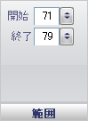

////

|metadata|
{
    "name": "wingauge-tickmark-extent-pane",
    "controlName": ["WinGauge"],
    "tags": ["Charting"],
    "guid": "{7B139E54-E755-42A1-9792-535C25CEB815}",  
    "buildFlags": [],
    "createdOn": "0001-01-01T00:00:00Z"
}
|metadata|
////

= 範囲ペイン

[範囲] ペインは、スケールの目盛の開始点と終了点を決定します。これは目盛の長さを設定します。ラジアル ゲージでは開始値と終了値は中心から測定され、リニア ゲージでは開始値と終了値はゲージの左側から測定されます。

pick:[win-forms="link:{ApiPlatform}win.ultrawingauge{ApiVersion}~infragistics.ultragauge.resources.gaugescaletickmarkappearance~startextent.html[開始]"]  -- この値を 0 から 100 の整数に設定します。この値は目盛の開始位置を設定します。

pick:[win-forms="link:{ApiPlatform}win.ultrawingauge{ApiVersion}~infragistics.ultragauge.resources.gaugescaletickmarkappearance~endextent.html[終了]"]  -- この値を 0 から 100 の整数に設定します。この値は目盛の終了位置を設定します。

== 関連トピック

link:wingauge-tickmark-layout-tab.html[目盛レイアウト タブ]