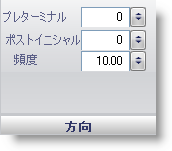

////

|metadata|
{
    "name": "wingauge-tickmark-orientation-pane",
    "controlName": ["WinGauge"],
    "tags": ["Charting"],
    "guid": "{11EB40AE-A736-425B-8A27-912E6EE0FC48}",  
    "buildFlags": [],
    "createdOn": "0001-01-01T00:00:00Z"
}
|metadata|
////

= 方向ペイン

[方向] ペインによって、ラジアル ゲージまたはリニア ゲージで目盛の間隔、開始点、および終了点を設定することができます。

pick:[win-forms="link:{ApiPlatform}win.ultrawingauge{ApiVersion}~infragistics.ultragauge.resources.gaugescaletickmarkappearance~preterminal.html[プリターミナル]"]  -- この値を 0 から 100 の整数に設定します。この値は、目盛の終了値を設定するために使用されます。反時計回りの方向に回転し、 link:wingauge-formatting-pane.html[[フォーマッティング]] ペインの [頻度] 値で指定された間隔だけ減っていきます。

pick:[win-forms="link:{ApiPlatform}win.ultrawingauge{ApiVersion}~infragistics.ultragauge.resources.gaugescaletickmarkappearance~postinitial.html[ポストイニシャル]"]  -- この値を 0 から 100 の整数に設定します。この値は目盛の開始値を決定し、時計回りの方向に回転して、 link:wingauge-formatting-pane.html[[フォーマッティング] ペイン]の [頻度] 値で指定された間隔だけ増えていきます。

pick:[win-forms="link:{ApiPlatform}win.ultrawingauge{ApiVersion}~infragistics.ultragauge.resources.gaugescaletickmarkappearance~frequency.html[頻度]"]  -- この値を 0 から 100 の整数に設定します。この値はスケール上の目盛間の間隔を決定します。

== 関連トピック

link:wingauge-tickmark-layout-tab.html[目盛レイアウト タブ]