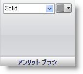

////

|metadata|
{
    "name": "wingauge-unlit-brush-pane",
    "controlName": ["WinGauge"],
    "tags": ["Charting"],
    "guid": "{5CC6294C-A8EF-463D-BE17-0AD64597B350}",  
    "buildFlags": [],
    "createdOn": "0001-01-01T00:00:00Z"
}
|metadata|
////

= アンリット ブラシ ペイン

[アンリット] ブラシは、値を表示するために使用されないセグメントのブラシ タイプと色を設定します。使用されないセグメントの詳細は、 link:wingauge-working-with-digital-gauges.html[「デジタル ゲージでの作業」]を参照してください。

pick:[win-forms="link:{ApiPlatform}win.ultrawingauge{ApiVersion}~infragistics.ultragauge.resources.segmenteddigitalgauge~unlitbrushelement.html[ブラシ タイプ]"]  -- このドロップダウン リストによって、デジタル ゲージ上の未使用のセグメントのブラシ タイプを変更することができます。

pick:[win-forms="link:{ApiPlatform}win.ultrawingauge{ApiVersion}~infragistics.ultragauge.resources.segmenteddigitalgauge~unlitbrushelement.html[ブラシの色]"]  -- 選択するブラシのタイプによって、ブラシの色のリストにそのブラシ タイプで使用可能な色が格納されます。

== 関連トピック

link:wingauge-digit-appearance-tab.html[数字外観タブ]