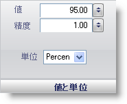

////

|metadata|
{
    "name": "wingauge-value-and-units",
    "controlName": ["WinGauge"],
    "tags": ["Charting"],
    "guid": "{22E1CAC8-02AA-42BE-B07A-FF186F7E5B43}",  
    "buildFlags": [],
    "createdOn": "0001-01-01T00:00:00Z"
}
|metadata|
////

= 値と単位

[値と単位] ペインによって、ゲージの針が指し示す値を設定することができます。

pick:[win-forms="link:{ApiPlatform}win.ultrawingauge{ApiVersion}~infragistics.ultragauge.resources.gaugemarker~value.html[値]"]  -- この値を 0 から 100 の整数に設定します。この値は、針がスケールのどこを指し示すのかを決定します。

pick:[win-forms="link:{ApiPlatform}win.ultrawingauge{ApiVersion}~infragistics.ultragauge.resources.gaugemarker~precision.html[精度]"]  -- 項目の値を 0.00 から 100.00 の値に設定します。この値はマーカーの「丸めの」数です。たとえば、精度値が 0.5 に設定されると、マーカーの値は常に 0.5 の倍数にスナップします。

pick:[win-forms="link:{ApiPlatform}win.ultrawingauge{ApiVersion}~infragistics.ultragauge.resources.radialgaugeneedle~widthmeasure.html[単位]"]  -- この値は、針の測定の単位を指定します。この値は、リニア ゲージで針を作成している場合には使用できません。

== 関連トピック

link:wingauge-needle-marker-layout-tab.html[針マーカー レイアウト タブ]