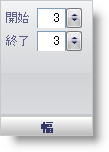

////

|metadata|
{
    "name": "wingauge-widths-pane",
    "controlName": ["WinGauge"],
    "tags": ["Charting"],
    "guid": "{A0074001-1F37-4052-A656-6B57E4C6224E}",  
    "buildFlags": [],
    "createdOn": "0001-01-01T00:00:00Z"
}
|metadata|
////

= 幅ペイン

[幅] ペインは、ラジアル ゲージまたはリニア ゲージ上の各目盛の太さを決定します。

pick:[win-forms="link:{ApiPlatform}win.ultrawingauge{ApiVersion}~infragistics.ultragauge.resources.radialgaugescaletickmarkappearance~startwidth.html[開始]"]  -- この値を 0 から 100 の整数に設定します。この値は目盛の開始点の幅を設定します。

pick:[win-forms="link:{ApiPlatform}win.ultrawingauge{ApiVersion}~infragistics.ultragauge.resources.radialgaugescaletickmarkappearance~endwidth.html[終了]"]  -- この値を 0 から 100 の整数に設定します。この値は目盛の終了点の幅を設定します。

== 関連トピック

link:wingauge-tickmark-layout-tab.html[目盛レイアウト タブ]