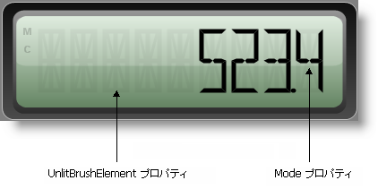

////
|metadata|
{
    "name": "wingauge-working-with-digital-gauges",
    "controlName": ["WinGauge"],
    "tags": ["Charting"],
    "guid": "{E0A5E42B-E52B-45D2-BB8A-D6D23527F8E9}",
    "buildFlags": [],
    "createdOn": "0001-01-01T00:00:00Z"
}
|metadata|
////

= デジタル ゲージでの作業

デジタル ゲージでより効率的に作業をするために、理解する必要がある一組のプロパティがあります（pick:[win-forms="link:{ApiPlatform}win.ultrawingauge{ApiVersion}~infragistics.ultragauge.resources.segmenteddigitalgauge~mode.html[Mode]"]  と pick:[win-forms="link:{ApiPlatform}win.ultrawingauge{ApiVersion}~infragistics.ultragauge.resources.segmenteddigitalgauge~unlitbrushelement.html[UnlitBrushElement]"] ）。

上記のスクリーンショットで、UnlitBrush プロパティは部分的に透明の黒の SolidFillBrushElements に設定されています。Mode プロパティは FourteenSegment に設定されています。

===== 数字と文字を表示するためのセグメント

デジタル ゲージは 7 セグメント表示、または 14 セグメント表示で表すことができます。

7 セグメント表示は 7 つのセグメントで構成されています。7 つのセグメントは、上、中央、下にあるひとつの水平セグメントと、両側にある 2 つの垂直セグメントで構成される矩形として配置されます。この表示は数字のみを表示するために通常使用されます。たとえば、基本的な計算機は 7 セグメント表示を使用します。

以下の画像は、7 セグメント表示のセグメントを示しています。

image::images/Gauge_Working_with_Digital_Gauges_02.png[]

14 セグメント表示は、14 のセグメントから構成されます。この表示は 7 セグメント表示の拡張で、4 つの追加の対角セグメント、中心を通過する 2 つの垂直セグメント、そして半分に分割されている中央の水平セグメントが追加されています。14 セグメント表示は数字だけでなく文字を表します。たとえば、カー ステレオは 14 セグメント表示を使用します。

以下の画像は、14 セグメント表示のセグメントを示しています。

image::images/Gauge_Working_with_Digital_Gauges_03.png[]

デジタル ゲージの Mode プロパティは使用されるセグメントの数を指定します。ゲージが数だけでなく文字を表示するようにしたい場合には、モードを「FourteenSegment」に設定する必要があります。デジタル ゲージが数字のみを表示するようにしたい場合には、モードを「SevenSegment」に設定します。

===== 点灯していないセグメントの色

UnlitBrushElement プロパティは、値を表示するために使用されないセグメントのブラシ タイプと色を設定します。このプロパティを設定することによって、デジタル LED 画面の外観をゲージに与えることができます。