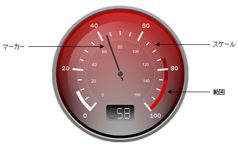

////

|metadata|
{
    "name": "wingauge-working-with-radial-gauges",
    "controlName": ["WinGauge"],
    "tags": ["Charting","Getting Started"],
    "guid": "{E09C7003-E9B9-4B5C-833E-95579757A8F7}",  
    "buildFlags": [],
    "createdOn": "0001-01-01T00:00:00Z"
}
|metadata|
////

= ラジアル ゲージでの作業

ラジアル ゲージは、多くの個別でありながら関連を持ったパーツから構成されます。これらのパーツ（pick:[win-forms="link:{ApiPlatform}win.ultrawingauge{ApiVersion}~infragistics.ultragauge.resources.radialgaugescale~ranges.html[範囲]"] 、pick:[win-forms="link:{ApiPlatform}win.ultrawingauge{ApiVersion}~infragistics.ultragauge.resources.radialgaugescale~markers.html[マーカー]"] 、pick:[win-forms="link:{ApiPlatform}win.ultrawingauge{ApiVersion}~infragistics.ultragauge.resources.radialgauge~scales.html[スケール]"] など）は詳細にカスタマイズできます。しかし、個々に取り扱う前に、ラジアル ゲージを作成するためにこれらすべてのパーツがどのように一緒に機能するのかを理解することが重要です。

== 目盛盤

ラジアル ゲージ目盛盤は、その形状を与えるものです。デフォルトで、目盛盤は 360 度を描くため、円として表示されます。目盛盤のプロパティを使用して、pick:[win-forms="link:{ApiPlatform}win.ultrawingauge{ApiVersion}~infragistics.ultragauge.resources.radialgaugescale~startangle.html[StartAngle]"]  と pick:[win-forms="link:{ApiPlatform}win.ultrawingauge{ApiVersion}~infragistics.ultragauge.resources.radialgaugescale~endangle.html[EndAngle]"]  を変更することも可能です。その上、目盛盤は形状をカスタマイズするための InnerExtent などその他のいくつかのプロパティを提供します。

image::images/Gauge_Working_with_Radial_Gauges_02.png[]

== スケール

ラジアル ゲージ スケールは、ラベル、目盛、およびゲージ上に値の範囲を表示することに関係するすべてを含む要素です。スケールは、マーカー（針など）の役割も果たしますが、スケールあたりひとつ以上配置することができます。スケールで最も重要なパーツは軸で、ラベルや目盛のようなオブジェクトをどの程度の頻度で描画するかだけでなく、開始値と終了値を決定します。

ほとんどのゲージに含むことができるスケールはひとつだけです。ただし、ゲージが互いに独立した複数のスケールを持つことは可能です。代わりに各スケールに固有のマーカーをひとつまたは複数持つことができます。ただしマーカーは複数のスケールを横切ることはできません。

image::images/Gauge_Working_with_Radial_Gauges_03.png[]

== マーカー

マーカーはスケール上の値を指し示す要素です。ラジアル ゲージで最も一般的なマーカーの形式は針です。各マーカーには pick:[win-forms="link:{ApiPlatform}win.ultrawingauge{ApiVersion}~infragistics.ultragauge.resources.gaugemarker~value.html[Value]"]  プロパティが設定されており、スケール上でマーカーがどこを指し示すのかを指示します。

image::images/Gauge_Working_with_Radial_Gauges_04.png[]

== 範囲

各スケールはひとつまたは複数の範囲を表示することができます。範囲は、スケール内の指定された値で開始および終了する視覚的要素です。範囲の最も一般的な実際の例は、自動車のタコメータの high-RPM ゾーンで（通常黄色と赤またはオレンジと赤）、最適なロードよりも高くエンジンが稼働していることを示します。

ラジアル ゲージのその他の多くの要素と同じように、範囲は Extent プロパティを使用して配置されます。pick:[win-forms="link:{ApiPlatform}win.ultrawingauge{ApiVersion}~infragistics.ultragauge.resources.gaugerange~startvalue.html[StartValue]"]  および pick:[win-forms="link:{ApiPlatform}win.ultrawingauge{ApiVersion}~infragistics.ultragauge.resources.gaugerange~endvalue.html[EndValue]"]  プロパティに加えて、pick:[win-forms="link:{ApiPlatform}win.ultrawingauge{ApiVersion}~infragistics.ultragauge.resources.radialgaugerange~outerextent.html[OuterExtent]"] 、pick:[win-forms="link:{ApiPlatform}win.ultrawingauge{ApiVersion}~infragistics.ultragauge.resources.radialgaugerange~innerextentstart.html[InnerExtentStart]"] 、および pick:[win-forms="link:{ApiPlatform}win.ultrawingauge{ApiVersion}~infragistics.ultragauge.resources.radialgaugerange~innerextentend.html[InnerExtentEnd]"]  は範囲の位置と形状を指定するために使用されます。

image::images/Gauge_Working_with_Radial_Gauges_05.png[]