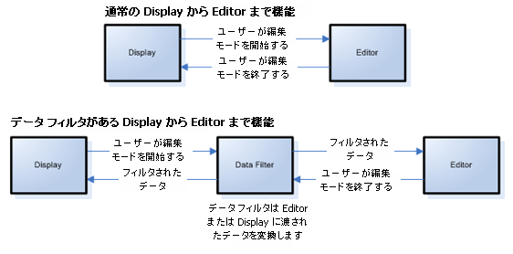

////

|metadata|
{
    "name": "wingrid-about-data-filters",
    "controlName": ["WinGrid"],
    "tags": ["Grids"],
    "guid": "{19967892-471C-45A5-9386-0268CB343D34}",  
    "buildFlags": [],
    "createdOn": "0001-01-01T00:00:00Z"
}
|metadata|
////

= データ フィルタについて

すべての埋め込みエディタは、データ フィルター機能をサポートします。カスタマイズしたデータの翻訳、あるいは、アプリケーションとデータ ソースの間を移動するようにデータのコンテンツと形式を操作できます。 複数の一般的なシナリオでデータ フィルターの使用ができます:

* データ モデルを変更せずに、ひとつのフォームから別のフォームへ (またはその逆) 変換する
* 外部キー フィールドの 「Lookup」 値を表示する
* ネストされたプロパティ付きの複雑なオブジェクトを 「平らにする」

データ フィルターの作業に参加するコントロール内に の3 つポイントがあります:

* オーナー
* エディタ
* 表示

その 3 つのポイントでは、1 つのポイントから他のポイントまでの通過中のデータに割り込みができ、必要に応じてデータを変換できます。

Owner は、コントロールがバインドされている単一オブジェクト プロパティです。 バインドされているデータが Customer のタイプのカスタム ビジネス オブジェクを含み、Customer の名前をを表すために特定なエディタを使用する場合は、Owner は FirstName プロパティになります。

Editor は、コントロール自身にプロパティの値を格納するために使用される実際のオブジェクトを表します。 Editor は、Numeric Editor、CheckBoxeditor、DateTimeEditor および標準的なエディタ コントロールにある全ての関連プロパティです。

Display は完成した製品です。 ユーザー インターフェイスに表示されている値の塗りつぶしおよび描画の最終版です。

Data の変換ができる通過中のポイントは:

* Data Source から塗りつぶし描画された画面まで移動する Data:

** Owner から Editor まで
** Editor から Display まで

* 塗りつぶし描画された画面から Data Source まで戻る Data:

** Display から Editor まで
** Editor から Owner まで

下記の例はデータの通常の機能です: セルの Display と Editor モードの間を移動して、パイプラインに Data Filter を挿入することによって、データをフォーマットします。

データ フィルターはデータ変換の 4 つの基本タイプがあります:

[options="header", cols="a,a"]
|====
|変換|説明

|Display から Editor まで
|たとえば、「+1」の文字列は明日の日付に交換できます。

|Editor から Display まで
|たとえば、明日の日付は 「明日」 の文字列に変換できます。

|Owner から Editor まで
|たとえば、CustomUserAppointment は DateTime に変換できます。

|Editor から Owner まで
|たとえば、DateTime は、CustomUserAppointment に変換できます。

|====