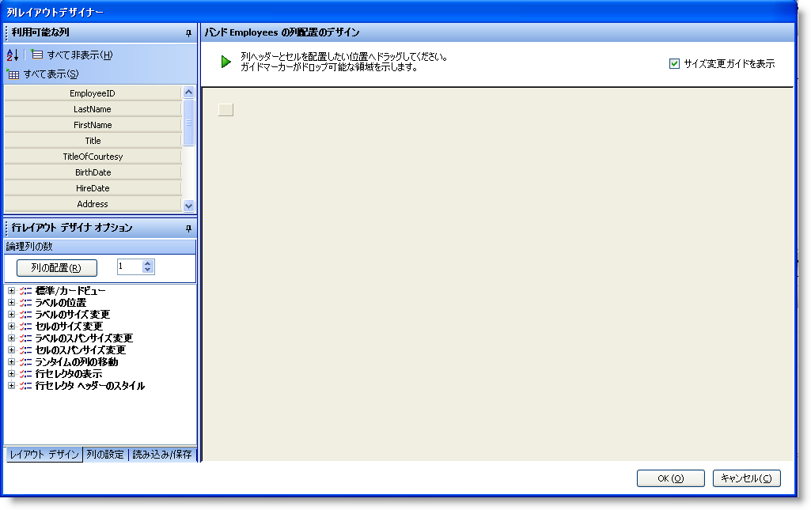
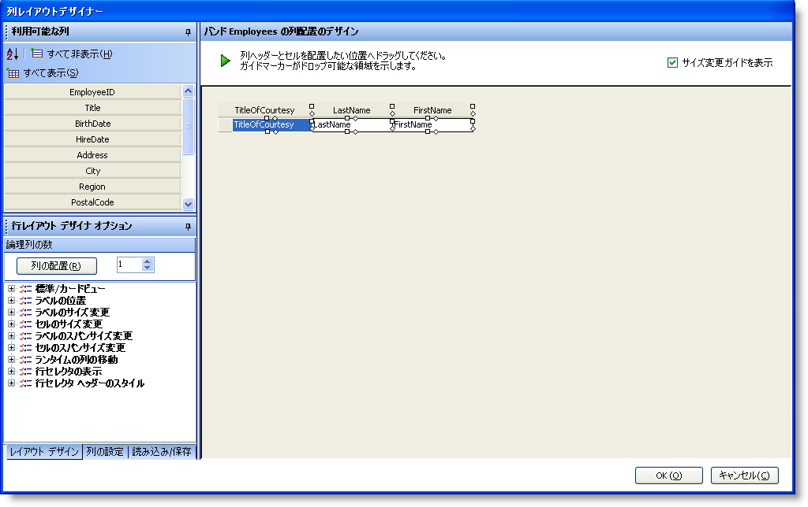
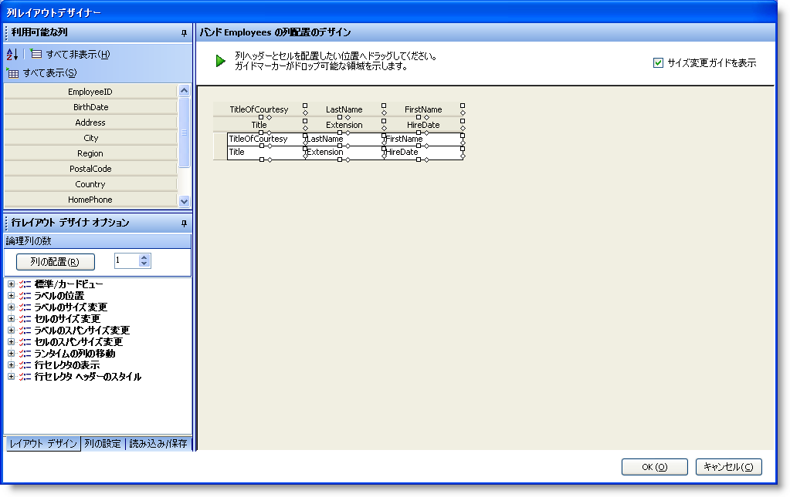
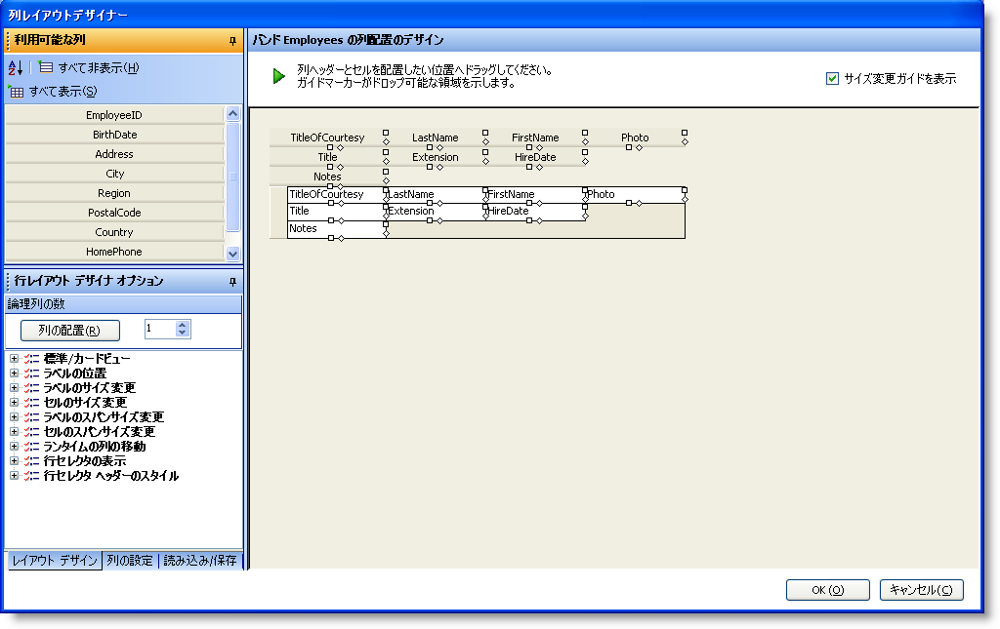
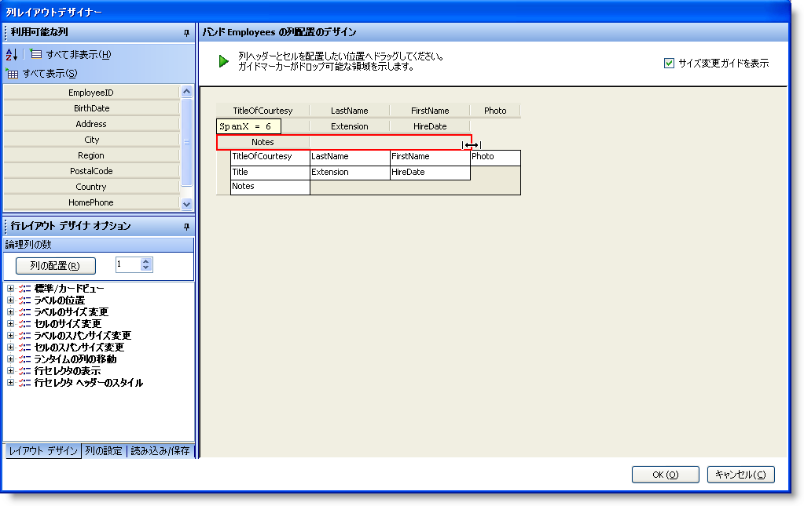
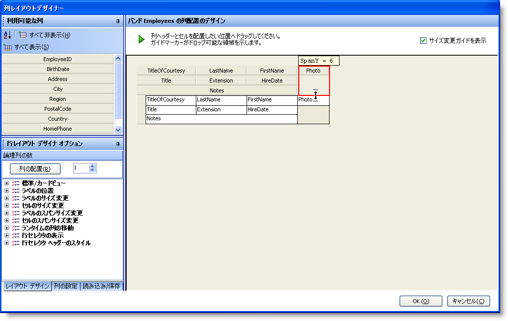
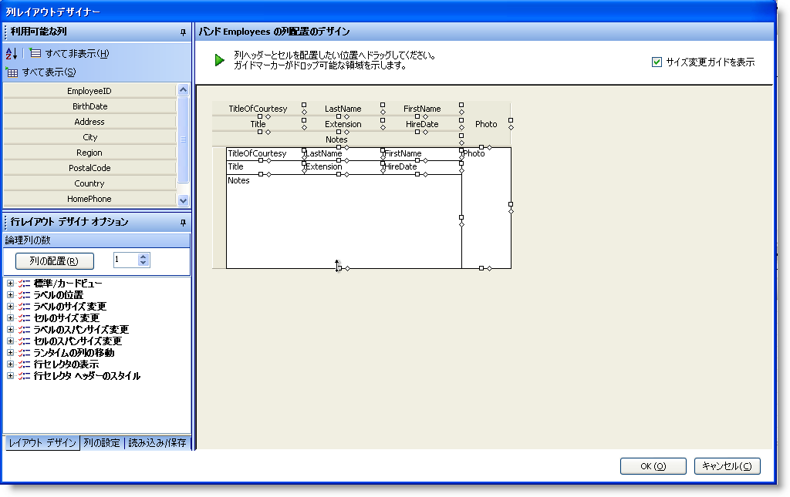
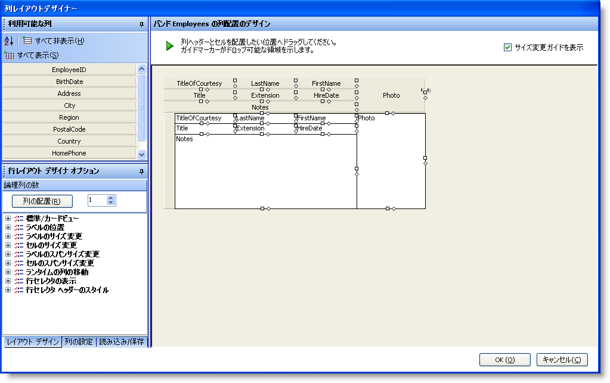

////

|metadata|
{
    "name": "wingrid-advanced-row-layouts-part-1-of-2",
    "controlName": ["WinGrid"],
    "tags": ["Application Scenarios","Grids","Layouts"],
    "guid": "{4F0821A0-7F14-4E73-8C34-F9F9D74B0800}",  
    "buildFlags": [],
    "createdOn": "0001-01-01T00:00:00Z"
}
|metadata|
////

= 高度な行レイアウト (パート 1/2)

以下に Row レイアウトについて学習したことを詳しく説明します。より高度なレイアウトを作成する方法を示すより高度な概念を探索します。以下の手順は、Employee という名前のエンティティを含むデザインタイムに使用できるデータ ソースにバインドされる WinGrid と共に Windows Form が存在することを前提とします。

[start=1]
. WinGrid で [スタート] ボタンをクリックしてデザイナを起動します。
[start=2]
. [バンドおよび列の設定] で [列の配置について] をクリックします。
[start=3]
. [行レイアウトを使用] オプション ボタンを選択して、次に [列の配置をデザインする] ボタンをクリックします。
[start=4]
. すべての列ヘッダをダブルクリックすると、利用可能な列の領域にすべてが移動します。
[start=5]
. この時点で、[行レイアウト デザイナ] は次のように見えます。

[start=6]
. 以下の画像に示すように、TitleOfCourtesy、LastName および FirstName 列ヘッダをデザイン画面にドラッグ アンド ドロップします。

[start=7]
. Title、Extension、および HireDate 列をドラッグして、以下に示すように配列します。

[start=8]
. 次に Notes と Photo の列をドラッグし、以下に示すように配置します。

[start=9]
. この時点で、これらのセルの一部を垂直方向および水平方向にスパンできます。Notes の列ヘッダの右側にダイヤモンドのアイコンを配置して開始します。これをクリックして右にドラッグすると、Extension および HireDate 列の直下の領域が埋められます。HireDate 列の境界を越えないでください。

[start=10]
. 次に、Photo の列ヘッダを垂直方向にスパンします。Photo の列ヘッダの下に配置されているダイアモンドのアイコンを指定します。これをクリックして下にドラッグすると、残りの空き領域が完全に埋められます。

[start=11]
. WinGrid がほぼ完成します。Notes セルと Photo セルのリサイズなどの一部の小さな調整をすることができます。Notes セルの下に配置されている四角形のアイコンを指定します。テキストのパラグラフの編集を許可するために適切なサイズとなるまで、これをクリックして下にドラッグします。

[start=12]
. 次に、Photo 列の幅をリサイズすることができるので、このセルに表示される実際の画像はクリアで適切なサイズとなります。Photo の列ヘッダの右側の四角形のアイコンを指定します。このアイコンををクリックして、画像をはっきりと表示するために適切なサイズになるまで右にドラッグします。

[start=13]
. グリッドは従業員データを表示する準備がほぼ整いました。Notes の列で一部のプロパティを直接設定できるので、テキストは折り返されてセルのコンテンツ全体が収まり、使用可能な場合には多くのテキストをスクロールするためにスクロールバーを表示できます。
[start=14]
. [OK] ボタンをクリックして行レイアウト デザイナを閉じます。
[start=15]
. Band[0] 'Employees' ノードを展開して列ノードをクリックします。これによって各列のプロパティを設定できます。
[start=16]
. Notes の列を指定し、その列をクリックしてプロパティを公開します。
[start=17]
. CellMultiLine プロパティを指定し、その値を True に設定します。
[start=18]
. VertScrollBar プロパティを指定し、その値を True に設定します。
[start=19]
. Photo の列を指定し、その列をクリックしてプロパティを公開します。
[start=20]
. Photo の列は画像である基礎のデータ モデル プロパティを実際的には表します。通常、Visual Studio を使用して自動的に生成される DataTable を使用する場合、画像プロパティは通常、バイト配列で公開されます。このバイト配列が画像である場合、WinGrid はそのセルで実際の画像を表示できます。画像が表示されるように列でプロパティを設定する必要があります。Style プロパティを指定し、それを Image または ImageWithShadow に設定します。
[start=21]
. [適用] ボタン、次に [OK] ボタンをクリックし、UltraWinGrid デザイナを閉じます。
[start=22]
. これでアプリケーションを実行でき、Data を取得するためのコードがあることを前提として、結果のフォームは以下のようになります。

フィールドのすべてが同時に画面でどのように表示できるかに注意してください。一目で、エンド ユーザーは水平方向にスクロールせずに各エンティティのすべての情報を表示できます。また、メモ フィールドのテキストがどのように折り返されているかや、ユーザーが編集モードに入り、テキストがセル サイズよりも大きい時には必ずスクロールバーが表示されることにも注意してください。

image::images/WinGrid_Advanced_Row_Layouts_Part_1_of_2_09.png[]