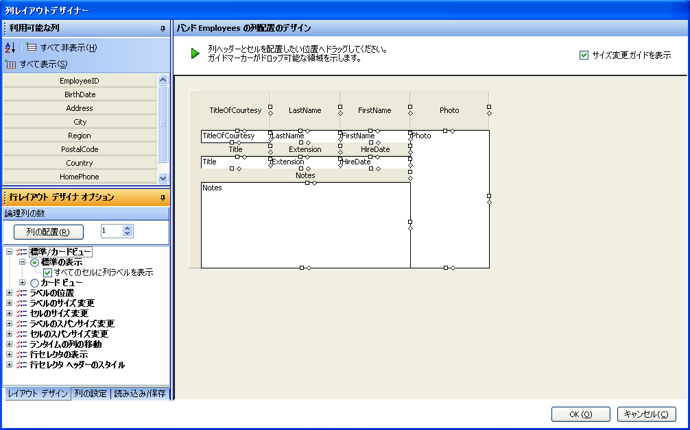
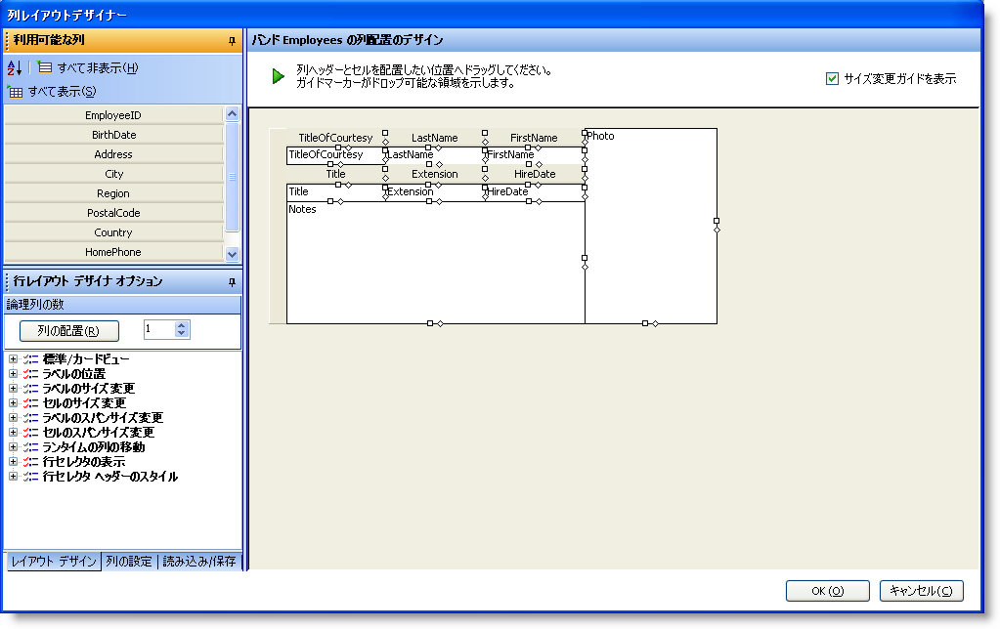

////

|metadata|
{
    "name": "wingrid-advanced-row-layouts-part-2-of-2",
    "controlName": ["WinGrid"],
    "tags": ["Application Scenarios","Grids","Layouts"],
    "guid": "{B63AF8F3-0FF3-4EA4-BFF8-1973C7F55E05}",  
    "buildFlags": [],
    "createdOn": "0001-01-01T00:00:00Z"
}
|metadata|
////

= 高度な行レイアウト (パート 2/2)

これまで、より高度な行レイアウトを検討してきました。この例をさらに調整して他に何ができるかについてもう少し学習を継続することができます。

[start=1]
. 同じ WinGrid で行レイアウト デザイナを起動し、[行レイアウト デザイン オプション] 領域（UI の左側下）を指定して標準/カード表示ノードを展開します。次に標準表示ノードを展開します。
[start=2]
. [すべてのセルに列ラベルを表示] チェックボックスをチェックします。これによって、すべての列ヘッダが対応する各セルのすぐ上に配置されます。

この新しい表示に入ると、設定をさらに調整できます。たとえば、写真の列の列ヘッダが不要な場合があるとします。写真は見ただけで分かります。列ヘッダの高さが少し高すぎるので縮小することもできます。メモの列ヘッダを削除することもできます。

[start=1]
. 開始するには、[OK] ボタンをクリックして行レイアウト デザイナを閉じます。
[start=2]
. UltraWinGrid デザイナで、バンドおよび列設定ノードをクリックして展開し、Band[0] 'Employees' ノードを展開し、列ノードをクリックします。これで Employee バンドのすべての列が表示します。
[start=3]
. 写真の列を指定してクリックします。
[start=4]
. RowLayoutColumnInfo プロパティを指定して、これも展開します。このプロパティには、行レイアウトを使用する時にグリッドによって厳格に使用される情報が含まれます。
[start=5]
. LabelPositon プロパティを指定し、その値を None に設定します。
[start=6]
. 同じことをメモの列に行います。メモの列をクリックし、RowLayoutColumnInfo プロパティを展開し、LabelPosition プロパティの値も none に設定します。
[start=7]
. [適用] をクリックして設定を保存します。
[start=8]
. 行レイアウト デザイナを再起動して、グリッドがどのように見えるかを確認します。

[start=9]
. この時点で、すべては良好に見えます。[OK] をクリックして行レイアウト デザイナを閉じ、次に [OK] をクリックして UltraWinGrid デザイナを閉じ、アプリケーションを実行します。フォームは次のようになります。

行レイアウトを使用してさまざまなことを達成できることを学習してきました。ユーザーは、ユーザー インターフェイスの作成に時間を費やすことなく優れたユーザー インターフェイスを提供するためにアプリケーション要件と組み合わされて創造性を活用することもできます。

image::images/WinGrid_Advanced_Row_Layouts_Part_2_of_2_03.png[]