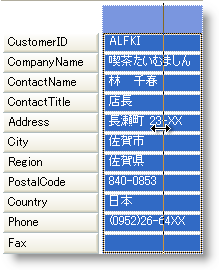

////

|metadata|
{
    "name": "wingrid-allowing-to-resize-card-labels",
    "controlName": ["WinGrid"],
    "tags": ["Grids","How Do I"],
    "guid": "{BB08EE19-1E05-4F57-BC5B-07B505002815}",  
    "buildFlags": [],
    "createdOn": "2008-10-04T16:10:17Z"
}
|metadata|
////

= エンド ユーザーがラベルのサイズを変更できる

カード内でラベルおよびデータ セルをユーザーがリサイズする方法を設定できます。これを制御する 2 つのプロパティ、 link:{ApiPlatform}win.ultrawingrid{ApiVersion}~infragistics.win.ultrawingrid.ultragridcardsettings~allowlabelsizing.html[AllowLabelSizing] および link:{ApiPlatform}win.ultrawingrid{ApiVersion}~infragistics.win.ultrawingrid.ultragridcardsettings~allowsizing.html[AllowSizing] があります。

True に設定すると、AllowLabelSizing によってエンド ユーザーはカード ラベルの右側にマウス ポインタをホーバーし、クリック アンド ドラッグしてそれをリサイズできます。

同様の動作は AllowSizing で発生します。True に設定すれば、ユーザーは、データ セルの右側をクリック アンド ドラッグして実際のデータ セルをリサイズできます。

以下のコードはこれらの 2 つプロパティの設定方法を示します。

*Visual Basic の場合：*

----
Me.UltraGrid1.DisplayLayout.Bands(0).CardSettings.AllowLabelSizing = True
Me.UltraGrid1.DisplayLayout.Bands(0).CardSettings.AllowSizing = True
----

*C# の場合：*

----
this.ultraGrid1.DisplayLayout.Bands[0].CardSettings.AllowLabelSizing = true;
this.ultraGrid1.DisplayLayout.Bands[0].CardSettings.AllowSizing = true;
----