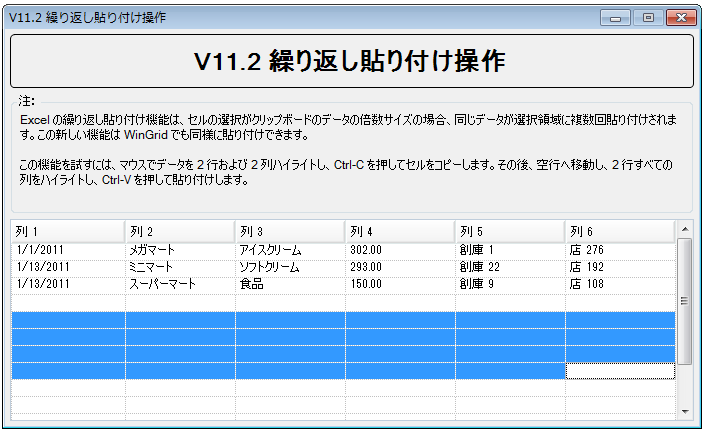
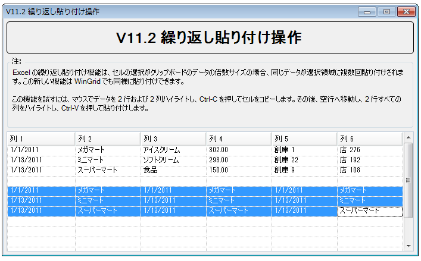

////

|metadata|
{
    "name": "wingrid-automatic-repetitive-paste-in-grids",
    "controlName": ["WinGrid"],
    "tags": ["Application Scenarios","Grids","How Do I"],
    "guid": "1d9fb7a1-a6ee-44e5-aa7c-b0bdfc6e161b",  
    "buildFlags": [],
    "createdOn": "2011-08-31T17:59:48.9555827Z"
}
|metadata|
////

= グリッドで自動繰り返し貼り付け

このトピックは、WinGrid™ の自動繰り返し貼り付け機能を説明し、この機能がどのように動作するのかのクイック デモの事例を提供します。

トピックは以下のとおりです。

* <<One,はじめに>>
* <<Two,自動繰り返し貼り付け - 概念的説明>>
* <<Three,例>>
* <<Four,制限>>
* <<Five,関連トピック>>

[[One]]
== はじめに

WinGrid は基本的なコピー/貼り付け/元に戻す機能が組み込まれています。これらの組み込み機能のひとつは、コピー元の選択対象よりも広いセルの選択対象にデータを貼り付ける時の Microsoft Excel® の動作を真似ています。「繰り返し貼り付け」と呼ばれる、この動作は、セルの元の (コピーされた) 選択対象がコピー先の (貼り付け) 選択対象に収まる回数だけ貼り付けられたデータを繰り返します (図 1) 。

image::images/WinGrid_Automatic_Repetitive_Paste_in_Grids_01.png[]

image::images/WinGrid_Automatic_Repetitive_Paste_in_Grids_02.png[]

図 1: 繰り返し貼り付けられたデータを含むセルの選択

[[Two]]
== 自動繰り返し貼り付け - 概念的説明

WinGrid の自動繰り返し貼り付け機能は、セル選択のサイズを使用して、選択が正確な倍数(クリップボードの行および列データの量に関して) であるかどうかを判断します。選択が正確な倍数の場合には、貼り付け操作は図 1 に示すように、選択全体に同じデータを繰り返します。そうでない場合には、コピーされたコンテンツの 1 コピーだけが貼り付けられます (通常の貼り付け) 。

この動作は MS Excel によって提供されている動作とまったく同じです。

[[Three]]
== 例

クリップボード操作を有効にして、図 1 に示すように、WinGrid で同じデータを使用しましょう(クリップボード操作を有効にする方法の詳細は、 link:wingrid-turning-on-clipboard-operations.html[「クリップボード操作をオンにする」]を参照してください)。コピー元の領域よりも、3 倍大きいコピー先の選択範囲に、水平方向に貼り付けます。(下の図 3)。

[start=1]
. コピーしたい*領域*セル*をドラッグして強調表示します* 。
[start=2]
. 値をコピーするには *Ctrl-C を押します* 。
[start=3]
. グリッドの別の領域、または別の WinGrid を使用して、*以前にコピーされたセルの倍数であるセルの選択を*ドラッグして*強調表示します* 。この例では、2 列 3 行をコピーした場合、選択の倍数であるため、6 列 ３ 行の選択を使用できます。

図 2: 貼り付け操作のためにコピー先領域を選択
[start=4]
. *Ctrl-Vを押します* 。値は繰り返し貼り付けられます。

図 3: コピー先の選択領域に繰り返し貼り付けられたコピー元のコンテンツ

[[Four]]
== 制限

自動繰り返し貼り付け機能は _行セレクター_ にで選択されたデータの行全体で動作しますが、 _列ヘッダー_  による列全体の選択は動作しません。WinGrid は選択されてもセルを認識しないためです。したがって、後者の事例で発生する貼り付け操作は、アクティブ行に貼り付けられたセル値になります。

[[Five]]
== 関連トピック

* link:wingrid-turning-on-clipboard-operations.html[クリップボード操作の起動]
* link:wingrid-editing-data.html[データの編集]