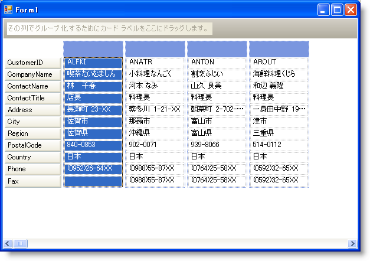
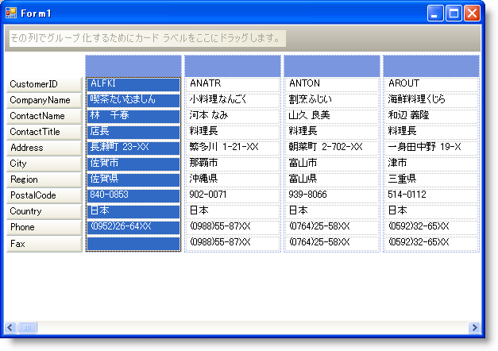

////

|metadata|
{
    "name": "wingrid-automatically-fit-cards-in-the-available-space",
    "controlName": ["WinGrid"],
    "tags": ["Grids","How Do I"],
    "guid": "{0784763D-0051-4E49-B303-46F2F48B9315}",  
    "buildFlags": [],
    "createdOn": "2008-10-04T16:10:58Z"
}
|metadata|
////

= 使用可能な領域にカードを自動的に埋めます

pick:[win-forms="link:{ApiPlatform}win.ultrawingrid{ApiVersion}~infragistics.win.ultrawingrid.ultragridcardsettings~autofit.html[AutoFit]"]  プロパティで WinGrid™ 内でカードがサイズ設定される方法を制御できます。True に設定されると、すべてのカードの幅は、WinGrid のカード領域を完全に埋めるために拡大または縮小されます。言い換えると、AutoFit を有効にすると、これを完全に被うためにカードが拡大されるため、カードの右にカード領域は表示されなくなります。埋められていないカード列がある場合（つまり、レコードの最後）、空のカード領域を表示できます。

以下のコードは、使用可能な領域にカードを自動的に埋めます。

AutoFit = False

AutoFit = True

*Visual Basic の場合：*

----
Me.UltraGrid1.DisplayLayout.Bands(0).CardSettings.AutoFit = True
----

*C# の場合：*

----
this.ultraGrid1.DisplayLayout.Bands[0].CardSettings.AutoFit = true;
----