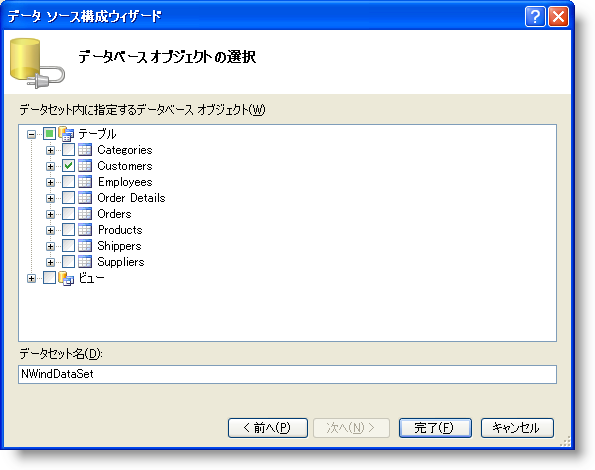

////
|metadata|
{
    "name": "wingrid-binding-wingrid-to-a-flat-data-source-clr2",
    "controlName": ["WinGrid"],
    "tags": ["Grids","How Do I","Sample Data Source"],
    "guid": "{DC7A65CA-988C-4698-882B-511F4C2A9D49}",
    "buildFlags": ["win-forms"],
    "createdOn": "0001-01-01T00:00:00Z"
}
|metadata|
////

= WinGrid をフラット データ ソースにバインドする

このトピックではユーザーができるだけ早く操作に慣れることができるよう、WinGrid を Visual Studio .NET のフォームに追加するために最低限必要な基本手順について説明します。この手順では WinGrid コントロールを Visual Studio .NET プロジェクトに追加し、それをフラット データ ソースにバインドする方法について説明します。

*WinGrid コントロールをフラット データ ソースにバインドする*

[start=1]
. 新しい Windows アプリケーションを作成します。
[start=2]
. ツールボックスで UltraGrid コントロールを選択し、フォームにコントロールを描画します。UltraGrid デザイナが表示されます。[完了] をクリックしてダイアログ ボックスを閉じます。
[start=3]
. [プロパティ] ウィンドウで、WinGrid の DataSource プロパティを選択してドロップダウン リストを表示します。ドロップダウン リストで、[プロジェクト データ ソースの追加...] リンクをクリックします。

image::images/WinGrid_Bind_WinGrid_to_a_Flat_Data_Source_CLR2_01.png[]

[start=4]
. [データ ソース構成] ウィザードが表示します。このウィザードは、Database、Web Service、または Object に接続するときに役立ちます。Database を選択して [次へ] をクリックします。
[start=5]
. [データ接続を選択] ダイアログ ボックスで、[新しい接続] をクリックします。[接続を追加] ダイアログ ボックスが表示します。これによってデータベースの位置にナビゲートできます。この例では、Northwind データベース（NWind.mdb）を使用します。これは Infragistics SDK インストールの一部として使用できます。デフォルトで、NWind.mdb ファイルは、オペレーティング システムによって、以下のインストール フォルダに配置されています。

** Windows 7 -- C:\Users\Public\Documents\Infragistics\20{ProductVersion}\Windows Forms\Samples\Legacy\Data
** XP -- C:\Documents and Settings\All Users\Documents\Infragistics\20{ProductVersion}\Windows Forms\Samples\Legacy\Data
** Vista -- C:\Users\Public\Documents\Infragistics\20{ProductVersion}\Windows Forms\Samples\Legacy\Data

[参照...] をクリックしてインストール パスを指定し、NWind.mdb ファイルを選択します。[接続を追加] ダイアログ ボックスは以下のように表示されます。接続が構築されたら [OK] をクリックします。

image::images/WinGrid_Bind_WinGrid_to_a_Flat_Data_Source_CLR2_02.png[]

[start=6]
. [データ接続を選択] ダイアログ ボックスで、[次へ] をクリックします。選択したデータ ファイルが現在のプロジェクトにないことを説明するメッセージ ボックスが表示して、データ ファイルをプロジェクトにコピーするオプションを提供します。[はい] をクリックします。
[start=7]
. 次に表示するダイアログがアプリケーション構成ファイル内のデータ ファイルにアクセスするために使用される接続文字列を保存するかどうかを尋ねます。[はい] をクリックします。NWind.mdb ファイルに接続しているだけなのでセキュリティはここでは問題ではありません。
[start=8]
. [データベース オブジェクトを選択] ダイアログ ボックスで、Tables ノードを展開し Customers テーブルを選択します。次に [完了] をクリックします。

[start=9]
. データセット、BindingSource および TableAdapter が生成され、フォームのコンポーネントとして追加されます。WinGrid は WinGrid 描画される時に表示される列を表示します。
[start=10]
. コード ビハインド ファイルに移動すると、フォームの Load イベントが接続されており、以下のコードがイベント内にあることを確認します。このコードは、生成された TableAdapter を使用してデータセットを埋めます。

*Visual Basic の場合：*

----
Me.CustomersTableAdapter.Fill(Me.NWindDataSet2.Customers)
----

*C# の場合:*

----
this.customersTableAdapter.Fill(this.nWindDataSet2.Customers);
----

[start=11]
. アプリケーションを実行します。顧客のテーブルからのデータで埋められたフォームに WinGrid コントロールが確認できます。