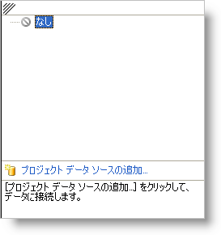
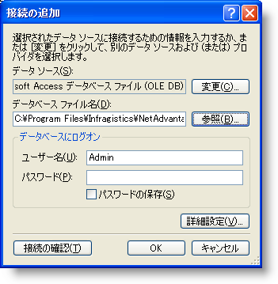
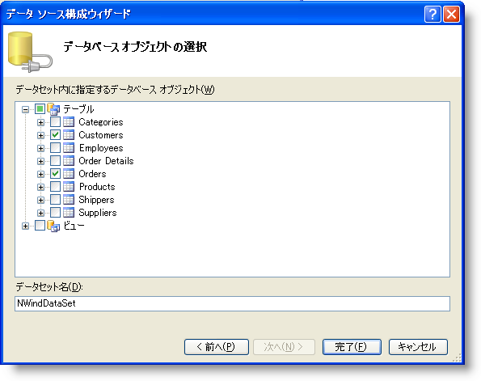
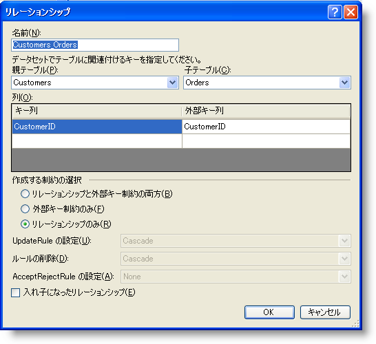

////
|metadata|
{
    "name": "wingrid-binding-wingrid-to-a-hierarchical-data-source-clr2",
    "controlName": ["WinGrid"],
    "tags": ["Grids","How Do I","Sample Data Source"],
    "guid": "{7E801D10-FA96-401C-8FFE-5B89D97D223A}",
    "buildFlags": ["win-forms"],
    "createdOn": "0001-01-01T00:00:00Z"
}
|metadata|
////

= WinGrid を階層データ ソースにバインドする

このトピックではユーザーができるだけ早く操作に慣れることができるよう、WinGrid を Visual Studio .NET のフォームに追加するために最低限必要な基本手順について説明します。この手順では WinGrid コントロールを Visual Studio .NET プロジェクトに追加し、それを階層的なデータ ソースにバインドする方法について説明します。

== WinGrid コントロールを階層データ ソースにバインドする

[start=1]
. 新しい Windows アプリケーションを作成します。
[start=2]
. ツールボックスで UltraGrid コントロールを選択し、フォームにコントロールを描画します。UltraGrid デザイナが表示されます。[完了] をクリックしてダイアログ ボックスを閉じます。
[start=3]
. [プロパティ] ウィンドウで、WinGrid の DataSource プロパティを選択してドロップダウン リストを表示します。ドロップダウン リストで、[プロジェクト データ ソースの追加...] リンクをクリックします。

[start=4]
. [データ ソース構成] ウィザードが表示します。このウィザードは、Database、Web Service、または Object に接続するときに役立ちます。Database を選択して [次へ] をクリックします。
[start=5]
. [データ接続を選択] ダイアログで、[新しい接続] ボタンを選択します。これによって [接続を追加] ダイアログが表示します。これによってデータベースの位置にナビゲートできます。この例では、Northwind データベース（NWind.mdb）を使用します。これは Infragistics SDK インストールの一部として使用できます。デフォルトで、NWind.mdb ファイルは以下のインストール フォルダに配置されています。
C:\Users\Public\Documents\Infragistics\20{ProductVersion}\Windows Forms\Samples\Legacy\Data
+
[参照...] をクリックしてインストール パスを指定し、NWind.mdb ファイルを選択します。[接続を追加] ダイアログ ボックスは以下のように表示されます。接続が構築されたら [OK] をクリックします。
+

[start=6]
. [データ接続を選択] ダイアログで、[次へ] をクリックします。選択したデータ ファイルが現在のプロジェクトにないことを説明するダイアログが表示して、データ ファイルをプロジェクトにコピーするオプションを提供します。[はい] を選択します。
[start=7]
. 次に表示するダイアログがアプリケーション構成ファイル内のデータ ファイルにアクセスするために使用される接続文字列を保存するかどうかを尋ねます。[はい] をクリックします。Northwind.mdb ファイルに接続しているだけなのでセキュリティはここでは問題ではありません。
[start=8]
. [データベース オブジェクトを選択] ダイアログで、Tables ノードを展開し Customers テーブルと Orders テーブルを選択します。この選択が終わったら、[完了] を選択します。

[start=9]
. これが完了したら、DataSource プロパティに戻り、再度ダイアログをドロップダウンして、表示した [その他のデータ ソース] セクションを展開します。展開して、NWindDataSet と関連付けられた Customers テーブルを選択します。

image::images/WinGrid_Bind_WinGrid_to_a_Hierarchical_Data_Source_CLR2_02.png[]

[start=10]
. データセット、BindingSource および TableAdapter が生成され、フォームのコンポーネントとして追加されます。WinGrid は WinGrid 描画される時に表示される列を表示します。
[start=11]
. ソリューション エクスプローラでダブルクリックして、データセットに関連付けられた XSD ファイルを開きます。XSD のデザイナで、Customers テーブルを右クリックして、[追加] を選択し、次にサブメニューから [リレーション] を選択します。[リレーション] ダイアログが表示します。親テーブルとして Customers テーブルを選択し、子テーブルとして Orders テーブルを選択します。[リレーション] ダイアログが以下のスクリーンショットにように表示されます。

[start=12]
. [リレーション] ダイアログで [OK] を選択します。2 つのテーブル間のリレーション ラインで XSD の更新を確認します。プロジェクトをビルドし、WinGrid でフォームに戻る場合には、WinGrid は 2 つのテーブル間のリレーションをすでにピックアップしていることがわかります。
[start=13]
. フォーム固有のコンポーネントの下のツールボックスで、ordersTableAdapter を見つけて、フォームにドラッグします。このアダプタは、データでデータセットを埋めるためにフォーム上にすでにある customersTableAdapter とともに必要です。
[start=14]
. コード ビハインド ファイルに移動すると、フォームの Load イベントが接続されており、データ セットの Customers テーブルを埋めるために customersTableAdapter がすでに設定されていることを確認します。コードの以下の行を追加して、データ セットの Orders テーブルを埋めます。

*Visual Basic の場合：*

----
Me.OrdersTableAdapter1.Fill(Me.NWindDataSet.Orders)
----

*C# の場合：*

----
this.ordersTableAdapter1.Fill(this.nWindDataSet.Orders);
----

[start=15]
. アプリケーションを実行します。Customers テーブルからのデータで埋められたフォーム上にある WinGrid コントロールを確認します。行を展開すると、Orders テーブルからの関連している顧客のデータが確認できます。