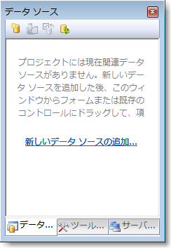
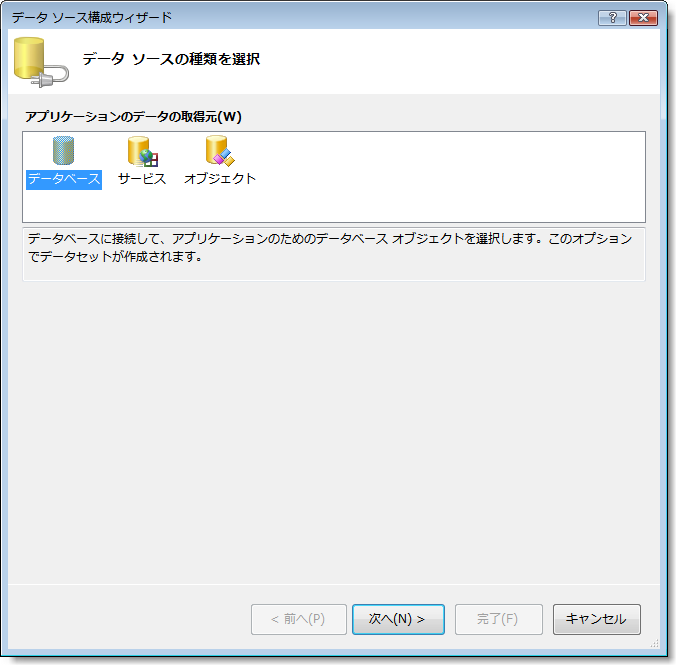
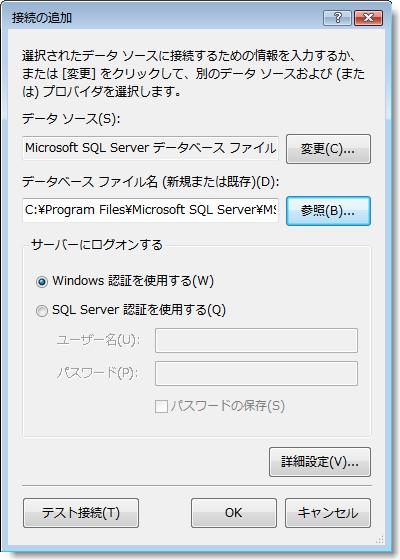
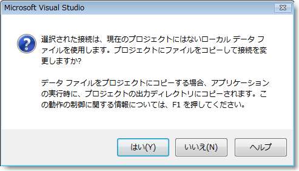
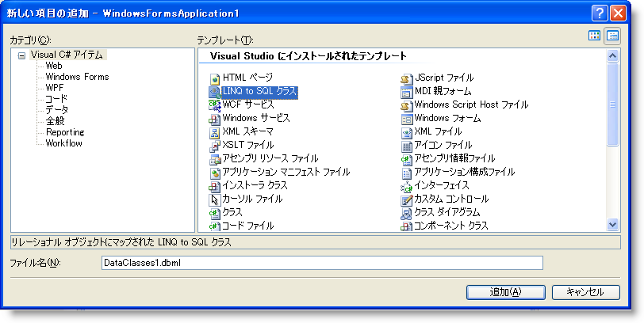
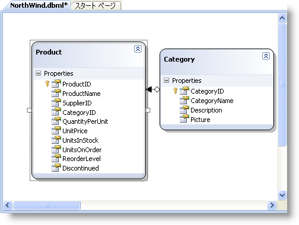

////

|metadata|
{
    "name": "wingrid-binding-wingrid-to-data-using-linq-to-sql",
    "controlName": ["WinGrid"],
    "tags": ["Application Scenarios","Grids","Sample Data Source"],
    "guid": "{9C2F503E-CB13-43FE-86EE-8880C664F1F7}",  
    "buildFlags": [],
    "createdOn": "0001-01-01T00:00:00Z"
}
|metadata|
////

= LINQ to SQL を使用して WinGrid をデータにバインド

$$.NET$$ Language Integrated Query (LINQ) は、データ ソースで使用できるクエリ プログラミング モデルです。

データを取得して結果を簡単に扱うために C# などのプログラミング言語で LINQ を使用することができます。LINQ to SQL は、.NET クラスを使用してリレーショナル データベースをモデル化することができるオブジェクト リレーショナル モデル実装です。

このトピックは、LINQ to SQL を使用して WinGrid をデータにバインドするプロセスを説明します。

*始める前に*

Visual Studio 2008 をコンピュータにインストールする必要があります。

*達成すること*

このトピックは、Visual Studio 2008 で使用できる LINQ to SQL 技術を使用して WinGrid コントロールをデータにバインドする方法を示します。

*次の手順を実行します*

[start=1]
. ツールボックスから、UltraGrid コントロールをフォームにドラッグします。
[start=2]
. [クイック スタート デザイナ] から [終了] をクリックします。
[start=3]
. [データ ソース] タブから [新しいデータ ソースを追加] を選択します。

[start=4]
. [データ ソース構成] ウィザードが表示します。
[start=5]
. Database を選択して [次へ] をクリックします。

[start=6]
. [データ接続を選択] ダイアログ ボックスで、[新しい接続] をクリックします。[接続を追加] ダイアログ ボックスが表示します。LINQ to SQL 機能を使用するには、SQL Server データベースを使用する必要があります。
[start=7]
. [データ ソース] を [Microsoft SQL Server データベース ファイル] に変更します。
[start=8]
. SQL Server データベースを参照します。
[start=9]
. [OK] をクリックします。

[start=10]
. [接続文字列をアプリケーション構成ファイルに保存] で [次へ] をクリックします。
[start=11]
. 表示するメッセージ ボックスで [はい] をクリックします。

[start=12]
. [テーブル] ノードを選択し、[終了] をクリックします。
[start=13]
. [プロジェクト] メニューで、[新しい項目の追加] をクリックします。
[start=14]
. [新しい項目の追加] ダイアログで、[テンプレート] ウィンドウから [LINQ to SQL クラス] を選択します。
[start=15]
. NorthWind.dbml に名前を設定します。

[start=16]
. サーバー エクスプローラから以下の項目をデザイン画面にドラッグします。

** 製品

[start=17]
. [ファイル] メニューで、[保存] をクリックします。これは作成したエンティティおよびデータベースの関係を表す .NET クラスを保持します。
[start=18]
. Form1_Load イベントで次のコードを入力します。

*Visual Basic の場合：*

----
// NorthWindDataContext のインスタンスを作成します。
Dim db As New Dim NorthWindDataContext 
//カタログ名が Beverages であるデータベースですべての製品を選択します。 
Dim products = From p In db.Products Where p.Category.CategoryName = "Beverages" Select p 
//WinGrid を結果にバインドします。
Me.UltraGrid1.DataSource = products
----

*C# の場合：*

----
// NorthWindDataContext のインスタンスを作成します。 
NorthWindDataContext db = new NorthWindDataContext(); 
//カタログ名が Beverages であるデータベースですべての製品を選択します。 
var products = from p in db.Products where p.Category.CategoryName == "Beverages" Select p; 
//WinGrid を結果にバインドします。
this.UltraGrid1.DataSource = products;
----