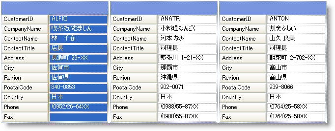
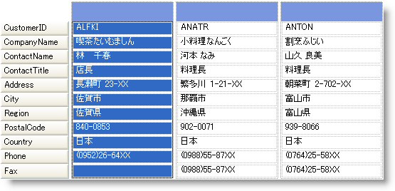
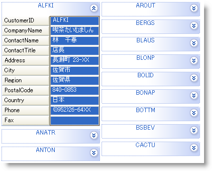

////

|metadata|
{
    "name": "wingrid-changing-card-view-style",
    "controlName": ["WinGrid"],
    "tags": ["Grids","Layouts"],
    "guid": "{1C7C8B86-58E1-4AE4-BE74-A54319D96DB9}",  
    "buildFlags": [],
    "createdOn": "2008-10-04T16:09:02Z"
}
|metadata|
////

= カード ビューのスタイルを変更

カード表示を設定すると、さまざまなバリエーションでデータを表示できます。表示は、pick:[win-forms="link:{ApiPlatform}win.ultrawingrid{ApiVersion}~infragistics.win.ultrawingrid.ultragridcardsettings~style.html[Style]"]  を介してカスタマイズできます。pick:[win-forms="link:{ApiPlatform}win.ultrawingrid{ApiVersion}~infragistics.win.ultrawingrid.cardstyle.html[CardStyle]"]  列挙型によって表示される以下 4 つの値のうち 1 つにスタイル プロパティを設定すると、さまざまな外観や動作を実現できます。

[NOTE]
====
*注：* WinGrid™ が link:wingrid-row-layouts.html[行レイアウト]を使用するように設定されている場合、これらのスタイルの一部は、グリッドに適用されずに無視される場合があります。
====

* *標準ラベル* -- 全ての表示列を表示し、各カードがデータ セルの左に設定された独自のラベル セットを持ちます。各カードは、お互いの関連で同じサイズです。

* *結合されたラベル* -- 列ヘッダーまたはフィールド キャプションの 1 セットのみがグリッドの一番左に表示します。グリッドで全てのカード ラベルを繰り返して領域を無駄にせずに、画面により多くのカードを表示できます。

* *変更可能な高さ* -- 表示を変更して、データを含むセルのみが表示されます。つまり、各カードが作成され、データを持たないセルは表示に含まれません。各カードをお互いに異なるサイズにできます。これは全て各レコードのデータの存在に基づきます。この設定を使用するデータ エントリーを許可するかどうかを確実にする必要があります。ユーザーは、このデザインの動作が原因で表示されないフィールドにはアクセスできません。

image::images/WinGrid_Change_Card_Views_Style_03.png[カード ビューの変更可能な高さのスタイル]

* *圧縮モード* すべてのカードが、実際のカードのタイトルである一列にロール アップされます。全てのカードが利用できる領域を消費するよりも、各カードが圧縮状態で初期化して、キャプションは通常エンド ユーザーに意味を成すフィールドを示すように設定されます。ユーザーが興味のあるレコードを見つけたら、[展開] アイコンをクリックしてカードを圧縮します。カードが [展開済み] になり、全ての列と詳細が表示されます。

以下のコードを使用して WinGrid のカード ビュー スタイル を StandardLabels に設定:

*Visual Basic の場合：*

----
Me.UltraGrid1.DisplayLayout.Bands(0).CardSettings.Style = _     Infragistics.Win.UltraWinGrid.CardStyle.StandardLabels
----

*C# の場合：*

----
this.ultraGrid1.DisplayLayout.Bands[0].CardSettings.Style =     Infragistics.Win.UltraWinGrid.CardStyle.StandardLabels;
----