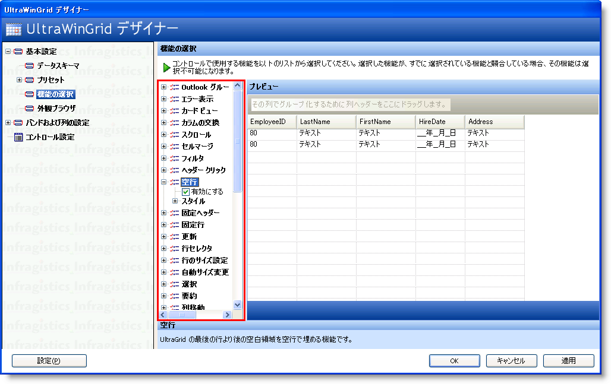
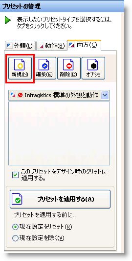
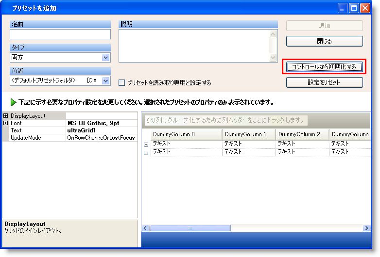
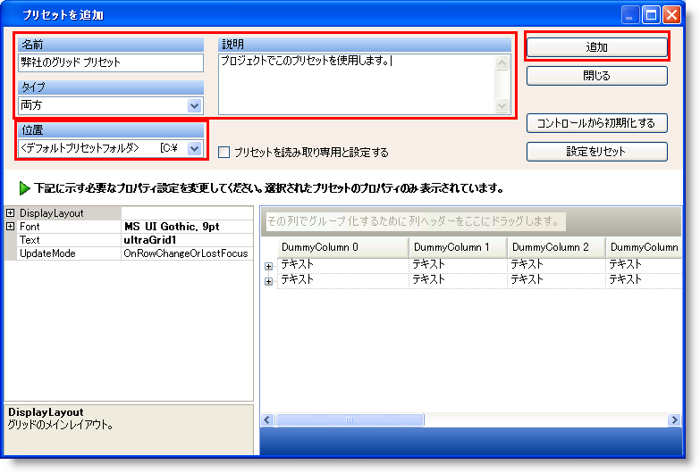
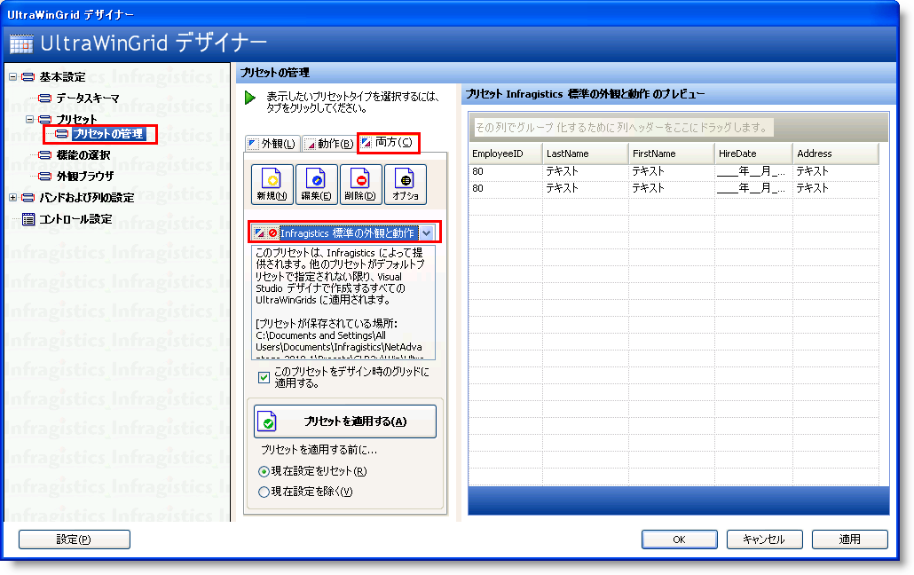
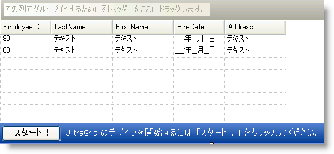

////

|metadata|
{
    "name": "wingrid-creating,-saving,-and-loading-a-layout",
    "controlName": ["WinGrid"],
    "tags": ["Grids","How Do I","Layouts"],
    "guid": "{0B54EEF3-B940-44A2-A9B3-601A8304899C}",  
    "buildFlags": [],
    "createdOn": "2009-08-12T10:23:54Z"
}
|metadata|
////

= レイアウトの作成、保存およびロード

== 始める前に

WinGrid™ コントロールは動作プロパティの設定、または外観およびスタイル ベースのプロパティの設定で構成されるレイアウトを作成、保存およびロードする方法を提供します。 WinGrid デザイナーによってさまざまな機能を有効または無効にできます。

== 達成すること:

WinGrid デザイナーを使用して WinGrid レイアウトを作成、保存およびロードする方法を学習します。 このトピックは、動作ベースの設定を構成してレイアウトとして保存し、コントロールがロードされる時に将来同じレイアウトを使用できる方法を示します。

== 以下の手順を実行します。

== レイアウトの作成および保存

1. Microsoft® Visual Studio® ツールボックスから、UltraGrid コントロールを指定しフォームにドラッグ アンド ドロップします。

2. WinGrid で [スタート] ボタンをクリックして WinGrid デザイナーを起動します。

3. WinGrid デザイナーの左側にあるナビゲーション ツリーで Feature Picker ノードを指定し、クリックします。 これは右側に特性と機能のリストをロードします。 さまざまな特性をここで有効または無効にできます。

[NOTE]
====
*注：* 機能ピッカーは動作ベースのプロパティ設定を表します。 WinGrid デザイナーの外観ブラウザー セクションは外観およびスタイリング ベースのプロパティ設定を表します。
====

4. さまざまな機能設定で WinGrid コントロールを構成して、この構成をプリセットに保存できます。 WinGrid デザイナーの左側にあるナビゲーション ツリーの [プリセットの管理] ボタンを指定してクリックします。

image::images/WinGrid_Creating_Saving_and_Loading_a_Layout_02.png[]

5. [新規] ボタンをクリックして、[プリセットを追加] ダイアログを起動します。

6. [プリセットを追加] ダイアログで、[コントロールから初期化する] ボタンをクリックします。これはプリセットを作成するために WinGrid が使用されるこのシミュレーションに構成したばかりのプロパティ設定を適用します。

7. [コントロールから初期化する] ボタンをクリックすると、WinGrid デザイナーによって構成したプロパティ設定を WinGrid が取得するシミュレーションが表示されるはずです。 この時点で、Name を入力し、オプションで Description を入力できます。 これが表すプリセットの Type を選択することも必要です。 以下の 3 つのオプションから選択できます:

* Look – 外観ベースおよびスタイル ベースのプロパティのみがプリセットに保存されます。
* Behavior – 動作ベースのプロパティのみがこのプリセットに保存されます（例えば並べ替え、固定列、フィルタリング）。
* Both – 外観ベースと動作ベースのプロパティがこのプリセットに保存されます。

8. [追加] ボタンをクリックして、新しいプリセットを追加します。 保存操作に成功した場合には、プリセットが保存されましたというメッセージ ボックスが表示します。

== レイアウトのロード

1. Microsoft® Visual Studio® ツールボックスから、UltraGrid コントロールを指定しフォームにドラッグ アンド ドロップします。

2. WinGrid で [スタート] ボタンをクリックして WinGrid デザイナーを起動します。

3. 左手のナビゲーション ツリーで、[プリセットの管理] ノードを指定およびクリックします。

4. WinGrid デザイナーの右手に配置されている [プリセットの管理] セクションで、Combined タブを指定およびクリックします。

5. ドロップダウン矢印をクリックして、前述のチュートリアル（Engineering Grid Preset）で作成したプリセットを選択します。

6. フォームで WinGrid インスタンスにこれらの設定を適用するためには [プリセットを適用] ボタンをクリックします。

7. [適用] をクリックし、[OK] ボタンをクリックして WinGrid デザイナーを閉じます。

8. WinGrid ではロードしたレイアウトにすべてのプロパティ設定が定義されているはずです。 データ ソースにバインドすることによって WinGrid のカスタマイズを続行できます。

以下の画像は Engineering WinGrid Layout をロードすることによって構成された WinGrid を示します。

