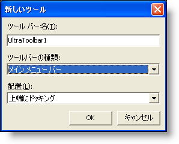
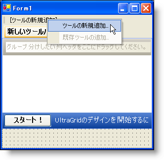
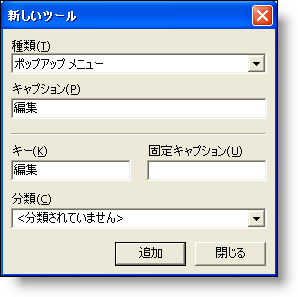
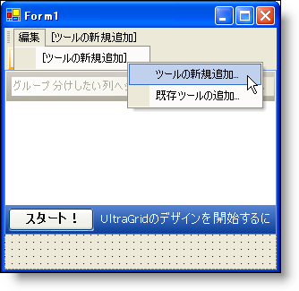
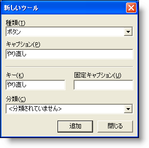
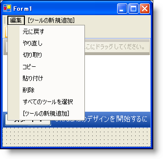

////
|metadata|
{
    "name": "wingrid-creating-edit-menu-with-clipboard-operations-for-wingrid",
    "controlName": ["WinGrid"],
    "tags": ["Application Scenarios","Grids","How Do I"],
    "guid": "{2955E97C-6A7C-4297-B4C2-160FD7830033}",
    "buildFlags": [],
    "createdOn": "0001-01-01T00:00:00Z"
}
|metadata|
////

= WinGrid のクリップボード操作付きの編集メニューの作成

== 始める前に

WinGrid コントロールでは、クリップボード操作を非常に簡単かつ迅速に実行できます。この概念は、WinGrid に特に変更を加えることなく適用されました。クリップボード機能は、WinGrid に動作として組み込まれています。このチュートリアルでは、クリップボード操作の PerformAction メソッドを使用します。

このメソッドでは、1 行のコードを記述するだけでいくつかのタスクを実行できます。この詳細なガイドでは、WinToolbarsManager コンポーネントを使用して編集メニューを作成します。また、WinGrid コントロールを使用してグリッドを作成します。作成したグリッドは、WinDataSource コンポーネントにより作成されたデータ ソースにバインドします。この編集メニューには、[コピー]、[貼り付け]、[切り取り] などのクリップボード操作がいくつか含まれます。ツールのキーに基づいて特定の動作を行うには switch ステートメントを記述します。

== 次の手順を実行します。

. *必要なコントロールを備えた新しい Windows Forms を作成します。*

.. 新しいプロジェクトを作成します。
.. ツールボックスから UltraToolbarsManager コンポーネントをフォームにドラッグします。[UltraToolbarsManager 初期化] ダイアログボックスが開きます。[はい] をクリックします。
.. UltraDataSource コンポーネントをフォームにドラッグします。
.. UltraGrid コントロールをフォームにドラッグします。[UltraWinGrid クイックスタート] ダイアログ ボックスが開きます。[完了] をクリックします。
.. [プロパティ] ウィンドウで、WinGrid の DataSource プロパティを ultraDataSource1 に設定します。
.. DisplayLayout、次に Override を展開します。AllowMultiCellOperations プロパティを "All" に設定します。
.. 見やすいようにグリッドのサイズを変更します（たとえば、Dock プロパティを "Fill" に設定します）。
+
この時点で、フォームは次のようになります。
+
image::images/WinGrid_Walkthrough_Creating_an_Edit_Menu_with_Clipboard_Operations_for_WinGrid_01.png[]

. *ツールバー上で [編集] メニューを作成します。*

.. コンポーネント トレイで ultraToolbarsManager1 コンポーネントを選択します。[新規ツールバー…] ボタンがフォームの上部に表示されます。
.. [新規ツールバー...] ボタンをクリックします。[新規ツールバー] ダイアログ ボックスが開きます。[ツールバーの種類] ドロップダウン リストで [メイン メニュー バー] を選択します。
+

.. [OK] をクリックします。
.. フォームの上部にある [ツールの新規追加] をクリックします。
+

.. [新規ツール] ダイアログ ボックスが開きます。
+

.. [ツールの種類] ドロップダウン リストで [ポップアップ メニュー] を選択します。[キャプション] フィールドで、編集 と入力します（[キー] フィールドのテキストとして、自動的に [キャプション] フィールドのテキストが移植されます）。
.. [追加] をクリックして、終了します。
.. 新たに追加された [編集] ツールをクリックします。[新規ツールの挿入]、次に [新規ツールの挿入...] をクリックします。
+

.. [新規ツール] ダイアログ ボックスが開きます。[キャプション] フィールドで [ツールの種類] ドロップダウン リストを [ボタン] に変更し、"元に戻す" と入力します（[キー] フィールドのテキストとして、[キャプション] フィールドのテキストが自動的に移植されます）。
+

.. [追加] をクリックします。ツールがツールバーに追加されます。ツールバーに、さらに別のツールを追加できます。
.. 'i' から 'j' までの手順を繰り返して [やり直し]、[切り取り]、[コピー]、[貼り付け]、[削除]、および [すべてのツールを選択] を作成し、キャプションをツール名に合わせて変更します。すべてのツールを追加したら、[閉じる] をクリックします。[編集] メニューは次のようになります。
+

. *コード ビハインドを作成します。*

.. コンポーネント トレイで ultraToolbarsManager コンポーネントが選択されていることを確認します。
.. [プロパティ] ウィンドウで [イベント] ボタンをクリックします。
.. ToolClick イベントをダブルクリックします。ToolClick イベントが作成されます。
.. このイベントに次のコードを入力します。
+
*Visual Basic の場合：*
[source, vb]
Imports Infragistics.Win.UltraWinGrid
...
Private Sub ultraToolbarsManager1_ToolClick(sender As Object, _
  e As Infragistics.Win.UltraWinToolbars.ToolClickEventArgs)
   Select Case e.Tool.Key
      Case "Undo"
         Me.ultraGrid1.PerformAction(UltraGridAction.Undo)
      Case "Redo"
         Me.ultraGrid1.PerformAction(UltraGridAction.Redo)
      Case "Copy"
         Me.ultraGrid1.PerformAction(UltraGridAction.Copy)
      Case "Paste"
         Me.ultraGrid1.PerformAction(UltraGridAction.Paste)
      Case "Cut"
         Me.ultraGrid1.PerformAction(UltraGridAction.Cut)
      Case "Delete"
         Me.ultraGrid1.PerformAction(UltraGridAction.DeleteCells)
      Case "Select All"
         Dim row As UltraGridRow
         For Each row In  Me.ultraGrid1.Rows.GetRowEnumerator(GridRowType.DataRow, Nothing, Nothing)
            row.Selected = True
         Next row
   End Select
End Sub
+
*C# の場合：*
[source, csharp]
using Infragistics.Win.UltraWinGrid;
...
private void ultraToolbarsManager1_ToolClick(object sender, 
  Infragistics.Win.UltraWinToolbars.ToolClickEventArgs e)
{
	switch (e.Tool.Key)
	{
	case "Undo":
		this.ultraGrid1.PerformAction(UltraGridAction.Undo);
		break;
	case "Redo":
		this.ultraGrid1.PerformAction(UltraGridAction.Redo);
		break;
	case "Copy":
		this.ultraGrid1.PerformAction(UltraGridAction.Copy);
		break;
	case "Paste":
		this.ultraGrid1.PerformAction(UltraGridAction.Paste);
		break;
	case "Cut":
		this.ultraGrid1.PerformAction(UltraGridAction.Cut);
		break;
	case "Delete":
		this.ultraGrid1.PerformAction(UltraGridAction.DeleteCells);
		break;
	case "Select All":
		foreach (UltraGridRow row in this.ultraGrid1.Rows.GetRowEnumerator(GridRowType.DataRow, null, null))
		{
			row.Selected = true;
		}
		break;
	}
}

. *アプリケーションを実行します。*
+
いずれかのセルでクリックして、[編集] メニューからクリップボード操作を選択します。この操作はセルレベルでのみ行います。CellClickAction プロパティを RowSelect に変更した場合は、クリップボード操作は行レベルで行います。[削除] メニュー項目を起動すると、行全体を削除します。switch ステートメント内のコードは、DeleteRows 動作ではなく DeleteCells 動作を実行するように変更できます。[すべてを選択] メニュー項目は、{ProductName} 2006 Volume 1 リリースでは新しいメソッドを使用します。GetRowEnumerator メソッドについての詳しい説明は、 link:wingrid-looping-through-the-entire-grid.html[「グリッド全体のループ処理」]を参照してください。
+
image::images/WinGrid_Creating_an_Edit_Menu_with_Clipboard_Operations_for_WinGrid_01.png[]