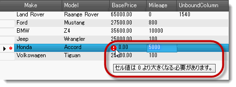
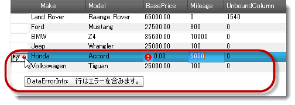

////
|metadata|
{
    "name": "wingrid-dataerrorinfo-support",
    "controlName": ["WinGrid"],
    "tags": ["Error Handling","Grids"],
    "guid": "7d55d255-5d79-4ed5-a617-346c974de165",
    "buildFlags": [],
    "createdOn": "2013-02-05T03:00:43.5042981Z"
}
|metadata|
////

= DataErrorInfo サポート

== トピックの概要

=== 目的

このトピックは、 _WinGrid_™ コントロールの拡張されたデータ検証機能を紹介し、構成例を提供します。既存の IDataErrorInfo とは異なります。

=== 前提条件

このトピックを理解するためには、以下のトピックを理解しておく必要があります。

[options="header", cols="a,a"]
|====
|トピック|目的

| link:wingrid-displaying-row-cell-errors-using-idataerrorinfo.html[IDataErrorInfo を使用して行/セル エラーを表示]
|このトピックは、データ バインドされるコントロールの行およびセル エラーのために使用される `IDataErrorInfo` (.NET) インターフェイスについての前提情報を提供します。

|====

=== このトピックの内容

このトピックは、以下のセクションで構成されます。

* <<_Ref347085242,セルと行の DataErrorInfo の構成>>

** <<_Ref341518673,はじめに>>
** <<_Ref347151160,DataErrorInfo の有効化>>
** <<_Ref347085261,セルにデータ エラーの適用>>
** <<_Ref347085268,行にデータ エラーの適用>>

* <<_Ref341518687,関連コンテンツ>>

[[_Ref347085242]]
== セルと行の DataErrorInfo の構成

[[_Ref341518673]]

=== はじめに

_WinGrid_   コントロールは、グリッドのデータ ソースが `IDataErrorInfo` インターフェイスによって情報を返す場合に行およびセルにエラー、画像、ツールチップの表示をサポートします。データ エラーをデータ ソースに設定し、データソースから取得されるため、非バインド列とセルにデータ検証が利用不可です。

link:{ApiPlatform}win.ultrawingrid{ApiVersion}~infragistics.win.ultrawingrid.ultragridrow+ultragridrowdataerrorinfo_methods.html[UltraGridRow.UltraGridRowDataErrorInfo] プロパティは行または行のセルにエラー情報の取得と設定を許可します。この情報はデータ ソースの IDataErrorInfo 実装から返されたエラー情報とは関係ありません。`UltraGridRow.DataErrorInfo` にエラーを適用すると、基本データ ソースのエラーに影響しません。

`IDataErrorInfo` インターフェイスを使用しなかった非バインド列のセルおよび行にデータ エラーを表示できます。 _UltraGridRow_   オブジェクトで直接にデータ ソースから取得されたエラー テキストをオーバーライドできます。

.注:
[NOTE]
====
_UltraGridRow_   に適用された `DataErrorInfo` を使用して DataSource のエラー テキストをオーバーライドすることが可能ですが、テキストを非表示にするか、削除するために DataSource に表示されるエラーを空の文字列と置き換えることはできません。オーバーライドしようとすると、DataSource のエラー テキストを表示します。
====

[[_Ref347151160]]

=== DataErrorInfo の有効化

機能をサポートするには、グリッドにエラーを適用するか取得する前に link:{ApiPlatform}win.ultrawingrid{ApiVersion}~infragistics.win.ultrawingrid.supportdataerrorinfo.html[SupportDataErrorInfo] を有効にする必要があります。

利用可能な `SupportDataErrorInfo` 列挙体オプションは以下です:

*  _CellsOnly_  
*  _Default_   (サポートなし)
*  _None_  
*  _RowsAndCells_  
*  _RowsOnly_  

*C# の場合:*

[source,csharp]
----
ultraGrid1.DisplayLayout.Override.SupportDataErrorInfo = SupportDataErrorInfo.RowsAndCells;
----

*Visual Basic の場合:*

[source,vb]
----
ultraGrid1.DisplayLayout.Override.SupportDataErrorInfo = SupportDataErrorInfo.RowsAndCells
----

[[_Ref341518679]]

=== セルにデータ エラーの適用

_InitializeRow_   イベントでセルをデータ エラー情報に設定するには、 link:{ApiPlatform}win.ultrawingrid{ApiVersion}~infragistics.win.ultrawingrid.ultragridrow+ultragridrowdataerrorinfo~setcolumnerror.html[SetColumnError] メソッドを使用します。

*C# の場合:*

[source,csharp]
----
if ((double)e.Row.Cells["BasePrice"].Value == 0)
    e.Row.DataErrorInfo.SetColumnError("BasePrice", "Cell Error: Zero in invalid.");
----

*Visual Basic の場合:*

[source,vb]
----
If CDbl(e.Row.Cells("BasePrice").Value) = 0 Then
      e.Row.DataErrorInfo.SetColumnError("BasePrice", "Cell Error: Zero in invalid.")
End If
----

セルのデータ エラー情報を取得するには、 link:{ApiPlatform}win.ultrawingrid{ApiVersion}~infragistics.win.ultrawingrid.ultragridrow+resolvedultragridrowdataerrorinfo~getcolumnerror.html[GetColumnError] メソッドを使用します。

*C# の場合:*

[source,csharp]
----
string columnError = e.Row.DataErrorInfo.GetColumnError("BasePrice");
----

*Visual Basic の場合:*

[source,vb]
----
Dim columnError As String = e.Row.DataErrorInfo.GetColumnError("BasePrice")
----

[[_Ref347085268]]

=== 行にデータ エラーの適用

以下のコード例は link:{ApiPlatform}win.ultrawingrid{ApiVersion}~infragistics.win.ultrawingrid.ultragridrow+ultragridrowdataerrorinfo~rowerror.html[RowError] プロパティを使用すると、 _InitializeRow_   イベントで行にデータ エラー情報を適用します。

*C# の場合:*

[source,csharp]
----
if ((double)e.Row.Cells["BasePrice"].Value == 0)
    e.Row.DataErrorInfo.RowError = "Row contains invalid cell values...";
----

*Visual Basic の場合:*

[source,vb]
----
If CDbl(e.Row.Cells("BasePrice").Value) = 0 Then
      e.Row.DataErrorInfo.RowError = "Row contains invalid cell values..."
End If
----

データ ソースおよびグリッド行から解決されたエラー情報を返す link:{ApiPlatform}win.ultrawingrid{ApiVersion}~infragistics.win.ultrawingrid.ultragridrow~dataerrorinforesolved.html[DataErrorInfoResolved] プロパティを使用して解決されたエラーを取得できます。

[[_Ref341518687]]
== 関連コンテンツ

=== トピック

以下のトピックでは、このトピックに関連する追加情報を提供しています。

[options="header", cols="a,a"]
|====
|トピック|目的

| link:wingrid-using-wingrid.html[WinGrid の使用]
|このセクションでは、 _WinGrid_ コントロールに関連する特定のタスクを実行する方法を簡潔に説明するタスク ベースのトピックを紹介します。

|====