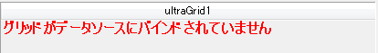

////

|metadata|
{
    "name": "wingrid-displaying-empty-message-in-wingrid",
    "controlName": ["WinGrid"],
    "tags": ["Error Handling","Grids"],
    "guid": "a51cfca5-316b-4e86-8817-6df0cf1ba6a7",  
    "buildFlags": [],
    "createdOn": "2012-03-26T17:27:06.8320303Z"
}
|metadata|
////

= WinGrid に空メッセージを表示します

== トピックの概要

=== 目的

WinGrid™ では、ランタイムにメッセージを表示し、グリッドにデータソースがバインドされていない、バインドされているデータ ソースに行が含まれていない、またはすべての行がフィルターによって除外されていることを示すことができます。

=== 本トピックの内容

このトピックには次のセクションがあります。

* <<_Ref319929269,コントロールの構成の概要>>
* <<_Ref319929935,データ ソース メッセージなし>>
* <<_Ref319929940,行メッセージなし>>
* <<_Ref319929944,表示対象の行メッセージはありません>>
* <<_Ref319929275,関連コンテンツ>>

[[_Ref319929269]]
== コントロールの構成の概要

=== コントロール構成集計チャート

以下の表では、WinGrid コントロールの空データ メッセージ関連設定項目を示しています。

[options="header", cols="a,a,a"]
|====
|構成可能な項目|詳細|プロパティ

|データ ソース メッセージなし
|WinGrid にデータ ソースが定義されていない場合、メッセージを表示してユーザーに通知します
|
* link:{ApiPlatform}win.ultrawingrid{ApiVersion}~infragistics.win.ultrawingrid.ultragridlayout~nodatasourcemessageenabled.html[NoDataSourceMessageEnabled] 

* link:{ApiPlatform}win.ultrawingrid{ApiVersion}~infragistics.win.ultrawingrid.ultragridlayout~nodatasourcemessagetext.html[NoDataSourceMessageText] 

* link:{ApiPlatform}win.ultrawingrid{ApiVersion}~infragistics.win.ultrawingrid.ultragridlayout~nodatasourcemessageappearance.html[NoDataSourceMessageAppearance] 

|行メッセージなし
|データ ソースが定義されていても、データ ソースに行が含まれていない場合にはメッセージを表示してユーザーに通知します 

.注： 

[NOTE] 

==== 

表示対象行なしメッセージ有効時にグリッド内のすべての行が削除されると、行なしメッセージが表示されます。 

====
|
* link:{ApiPlatform}win.ultrawingrid{ApiVersion}~infragistics.win.ultrawingrid.ultragridoverride~norowsindatasourcemessageenabled.html[NoRowsInDataSourceMessageEnabled] 

* link:{ApiPlatform}win.ultrawingrid{ApiVersion}~infragistics.win.ultrawingrid.ultragridoverride~norowsindatasourcemessagetext.html[NoRowsInDataSourceMessageText] 

* link:{ApiPlatform}win.ultrawingrid{ApiVersion}~infragistics.win.ultrawingrid.ultragridoverride~norowsindatasourcemessageappearance.html[NoRowsInDataSourceMessageAppearance] 

|表示対象の行メッセージはありません
|WinGrid に対してデータ ソースが定義されていて、データ ソースには行が含まれていても、すべての行がフィルターによって除外されている場合に通知メッセージを表示します
|
* link:{ApiPlatform}win.ultrawingrid{ApiVersion}~infragistics.win.ultrawingrid.ultragridoverride~novisiblerowsmessageenabled.html[NoVisibleRowsMessageEnabled] 

* link:{ApiPlatform}win.ultrawingrid{ApiVersion}~infragistics.win.ultrawingrid.ultragridoverride~novisiblerowsmessagetext.html[NoVisibleRowsMessageText] 

* link:{ApiPlatform}win.ultrawingrid{ApiVersion}~infragistics.win.ultrawingrid.ultragridoverride~novisiblerowsmessageappearance.html[NoVisibleRowsMessageAppearance] 

|====

link:{ApiPlatform}win{ApiVersion}~infragistics.win.appearance_members.html[Appearance] 関連プロパティの link:{ApiPlatform}win.ultrawingrid{ApiVersion}~infragistics.win.ultrawingrid.ultragridlayout~nodatasourcemessageappearance.html[NoDataSourceMessageAppearance]、 link:{ApiPlatform}win.ultrawingrid{ApiVersion}~infragistics.win.ultrawingrid.ultragridoverride~norowsindatasourcemessageappearance.html[NoRowsInDataSourceMessageAppearance] および link:{ApiPlatform}win.ultrawingrid{ApiVersion}~infragistics.win.ultrawingrid.ultragridoverride~novisiblerowsmessageappearance.html[NoVisibleRowsMessageAppearance] を使用することにより、テキスト配置、背景色、文字色、フォント、画像などをさらにカスタマイズできます。

[[_Ref319929745]]
[[_Ref319929935]]
== データ ソース メッセージなし

=== 概要

WinGrid コントロールにデータ ソースが定義されていない場合、カスタム メッセージを表示してユーザーに通知します。

=== 例

以下のスクリーンショットは、以下の設定を行った後に WinGrid がどのようになるかを示しています。

[options="header", cols="a,a"]
|====
|プロパティ|値

| link:{ApiPlatform}win.ultrawingrid{ApiVersion}~infragistics.win.ultrawingrid.ultragridlayout~nodatasourcemessageenabled.html[NoDataSourceMessageEnabled]
|True

| link:{ApiPlatform}win.ultrawingrid{ApiVersion}~infragistics.win.ultrawingrid.ultragridlayout~nodatasourcemessagetext.html[NoDataSourceMessageText]
|グリッドはデータ ソースにはバインドされていません

|====

[[_Ref319929750]]
[[_Ref319929940]]
== 行メッセージなし

=== 概要

データ ソースが定義されているが、行が含まれていない場合、カスタム通知メッセージを表示してユーザーに通知します。

=== 例

以下のスクリーンショットは、以下の設定を行った後に WinGrid がどのようになるかを示しています。

[options="header", cols="a,a"]
|====
|プロパティ|値

| link:{ApiPlatform}win.ultrawingrid{ApiVersion}~infragistics.win.ultrawingrid.ultragridoverride~norowsindatasourcemessageenabled.html[NoRowsInDataSourceMessageEnabled]
|True

| link:{ApiPlatform}win.ultrawingrid{ApiVersion}~infragistics.win.ultrawingrid.ultragridoverride~norowsindatasourcemessagetext.html[NoRowsInDataSourceMessageText]
|データ ソースには行が含まれていません

|====

image::images/WinGrid_-_Display_Empty_Message_in_WinGrid_2.png[]

[[_Ref319929759]]
[[_Ref319929944]]
== 表示対象の行メッセージはありません

=== 概要

データ ソースが定義されていて、データ ソースには行が含まれているが、すべての行がフィルターによって除外されている場合、カスタム通知メッセージを表示してユーザーに通知します。

=== 例

以下のスクリーンショットは、以下の設定を行った後に WinGrid がどのようになるかを示しています。

[options="header", cols="a,a"]
|====
|プロパティ|値

| link:{ApiPlatform}win.ultrawingrid{ApiVersion}~infragistics.win.ultrawingrid.ultragridoverride~novisiblerowsmessageenabled.html[NoVisibleRowsMessageEnabled]
|True

| link:{ApiPlatform}win.ultrawingrid{ApiVersion}~infragistics.win.ultrawingrid.ultragridoverride~novisiblerowsmessagetext.html[NoVisibleRowsMessageText]
|すべての行がフィルターによって除外されました

|====

image::images/WinGrid_-_Display_Empty_Message_in_WinGrid_3.png[]

[[_Ref319929275]]

== 関連コンテンツ

=== トピック

以下のトピックでは、このトピックに関連する情報を提供しています。

[options="header", cols="a,a"]
|====
|トピック|目的

| link:wingrid-binding-wingrid-to-a-flat-data-source-clr2.html[WinGrid をフラット データ ソースにバインドする]
|このトピックでは、WinGrid コントロールを Visual Studio .NET プロジェクトに追加し、それをフラット データ ソース (子の行を含まない) にバインドする方法について説明します。

| link:wingrid-binding-wingrid-to-a-hierarchical-data-source-clr2.html[WinGrid を階層データ ソースにバインドする]
|このトピックでは、WinGrid コントロールを Visual Studio .NET プロジェクトに追加し、それを階層的なデータ ソース (子の行を含む) にバインドする方法について説明します。

|====