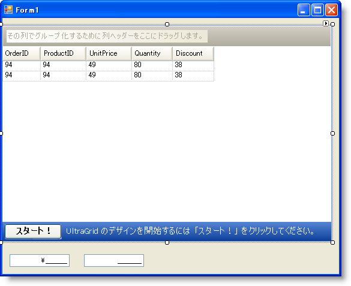
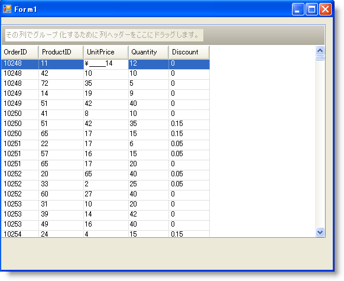

////

|metadata|
{
    "name": "wingrid-embeddable-column-editors",
    "controlName": ["WinGrid"],
    "tags": ["Application Scenarios","Extending","Grids"],
    "guid": "{3F520377-52F3-46C8-9002-B0D14C1E8B7B}",  
    "buildFlags": [],
    "createdOn": "0001-01-01T00:00:00Z"
}
|metadata|
////

= 組み込み可能な列エディタ

== 始める前に

埋め込みエディターは WinGrid™ だけでなくその他の Infragistics Window Forms コントロールへの主要な構造的拡張を表します。 簡単に言うと、埋め込みエディターはコードを書かずに確実なデータ入力ポイントを提供することを可能にするすべての特性と機能を具体化します。 これらのエディターをスタンドアローンのフォーム コントロールとして使用することも、WinGrid にシームレスに統合することもできます。

WinGrid のコンテキスト内で、埋め込みエディターは pick:[win-forms="link:{ApiPlatform}win.ultrawingrid{ApiVersion}~infragistics.win.ultrawingrid.ultragridcolumn.html[UltraGridColumn]"]  オブジェクトと関連づけられます。 埋め込みエディターを WinGrid 列に指定する時には常に、データが編集されると必ずそのエディターのインスタンスが使用されます。

WinGrid で、UltraGridColumn オブジェクトに関連づけられたデータ型に基づいて埋め込みエディターが自動的に使用されます。 ただし、スタンドアローンの要素を使用して異なるタイプのエディターを指定することもできます。 たとえば、WinGrid 内の列が数値データを表示するとします。 デフォルトで、コントロールは数値の埋め込みエディターを使用してその列にデータを表示および編集します。 ただし、プログラマーがたとえばプログレス バーなどの異なるタイプのエディターを表示したい場合には、Progress Bar 要素をフォームにスタンドアローンの要素として追加し、UltraGridColumn オブジェクトと関連づけることによってこの作業を実行できます。

これは、pick:[win-forms="link:{ApiPlatform}win.ultrawingrid{ApiVersion}~infragistics.win.ultrawingrid.ultragridcolumn~editorcomponent.html[EditorComponent]"]  と呼ばれる UltraGridColumn オブジェクトのプロパティを使用して実行されます。 このプロパティはすべての WinEditors™ が実行するように pick:[win-forms="link:{ApiPlatform}win{ApiVersion}~infragistics.win.iprovidesembeddableeditor.html[IProvidesEmbeddableEditor]"]  インターフェイスを実装する任意の要素に UltraGridColumn を添付できます。

== 達成すること

以下の手順はエディターを WinGrid 列に指定する方法を示します。 以下の手順は、WinGrid が Northwind データベースから Order_Details DataTable にバインドされていることが前提となっています。

== 次の手順を実行します

[start=1]
. UltraCurrencyEditor を指定して、Windows Form にドラッグ アンド ドロップします。
[start=2]
. Visible プロパティを False に設定します。
[start=3]
. UltraNumericEditor を指定して、Windows Form にドラッグ アンド ドロップします。
[start=4]
. Visible プロパティを False に設定します。
[start=5]
. UltraNumericEditor の NumericType プロパティを指定して Integer に設定します。
[start=6]
. その MinValue プロパティを 1 に設定します。
[start=7]
. その Value を 1 に設定します。
[start=8]
. この時点でフォームは次のようになります。

[start=9]
. WinGrid で [スタート] ボタンをクリックして UltraWinGrid デザイナーを起動することによって続行します。
[start=10]
. [バンドおよび列の設定] で、[バンド[0] - 'Order Details'] の順にノードを展開し、[列] ノードをクリックします。
[start=11]
. 列リストで、UnitPrice 列をクリックしてプロパティを公開します。 EditorComponent プロパティをクリックして、ドロップダウン リストから UltraCurrencyEditor1 を選択します。
[start=12]
. Quantity 列をクリックして同じ手順を繰り返し、EditorComponent プロパティのドロップダウン リストから UltraNumericEditor1 を選択します。
[start=13]
. [適用] と [OK] をクリックして設定を保存し、UltraWinGrid デザイナー フォームを閉じます。
[start=14]
. アプリケーションを保存して実行します。 WinGrid は以下のスクリーンショットのようになります。

UnitPrice セルをクリックすると、テキスト編集に通貨エディターが使用されることが通知されます。 Currency の値のみ入力できるように正しくマスクされます。 Quantity 列をクリックしても数値エディターが使用されることが表示されます。 いずれのエディターでも数以外任意のものを入力する場合、テキストは変わりません。 数値エディターに 1 未満の値を入力しようとすると、入力できなくなります。 整数値しか入力できません。 この例では、いくつかのプロパティ設定が設定されて、WinGrid 内にフル機能のデータ入力ポイントができることを示します。

