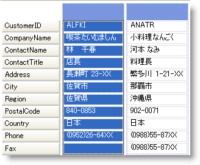

////

|metadata|
{
    "name": "wingrid-enabling-card-view",
    "controlName": ["WinGrid"],
    "tags": ["Grids","How Do I"],
    "guid": "{8C310FD9-48A5-4D9D-B5E9-C29F7F8BE884}",  
    "buildFlags": [],
    "createdOn": "2008-10-04T16:04:43Z"
}
|metadata|
////

= カード ビューを有効にする

カード ビューを有効にするには、 link:{ApiPlatform}win.ultrawingrid{ApiVersion}~infragistics.win.ultrawingrid.ultragridband~cardview.html[CardView] プロパティを True に設定するだけです。カード ビューに設定したいバンドは、CardView プロパティに設定する必要があるバンドです。以下のコードは、Band 0 をカード ビューに設定します。繰り返しますが、カード ビューにどのようなバンドを設定しても、WinGrid™ コントロールの階層で最後に表示できるバンドとなることに注意してください。より下層のバンドがある場合、それらは表示可能になりません。

*Visual Basic の場合：*

----
Me.ultraGrid1.DisplayLayout.Bands(0).CardView = True
----

*C# の場合：*

----
this.ultraGrid1.DisplayLayout.Bands[0].CardView = true;
----