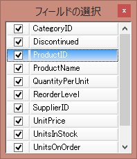
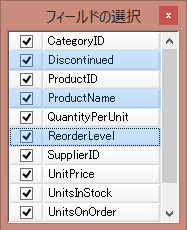

////
|metadata|
{
    "name": "wingrid-enabling-multiple-row-selection",
    "controlName": [],
    "tags": [],
    "guid": "5a58f37c-5511-4920-b13d-87fc8a99ff8e",
    "buildFlags": [],
    "createdOn": "2015-02-27T19:34:32.4420836Z"
}
|metadata|
////

= 複数行選択の有効化

=== 目的

このトピックでは、 _WinGrid_™ ColumnChooser で複数行選択を有効にする方法を説明します。この機能は、多数の列の表示状態および位置を変更する必要のあるシナリオで便利になります。

=== 前提条件

このトピックを理解するために、以下のトピックを参照することをお勧めします。

[options="header", cols="a,a"]
|====
|トピック|目的

| link:wingrid-using-the-column-chooser-feature.html[列チューザー機能の使用]
|_WinGrid_™ 列チューザー機能に関する概要を提供します。

|====

=== このトピックの内容

このトピックは、以下のセクションで構成されます。

* <<EnablingMultipleRowSelectionOverview,複数行選択の有効化の概要>>

** <<Overview,概要>>
** <<Preview,プレビュー>>

* <<UltraGridColumnChooserClass,UltraGridColumnChooser クラス>>

** <<UltraGridColumnChooserSummary,UltraGridColumnChooser 概要>>

* <<Configuringthecolumnchooserformultiplerowselection,列チューザーの複数列選択機能の構成>>

** <<Example,例>>

* <<RelatedContent,関連コンテンツ>>

[[EnablingMultipleRowSelectionOverview]]
== 複数行選択の有効化の概要

[[Overview]]

=== 概要

_WinGrid_™ ColumnChooser では、グリッド列の表示状態、または位置を変更するためのフロント エンドを提供します。チューザーは、さまざまな方法で表示できます。たとえば、グリッドのボタンをクリックすると表示されるダイアログで、またはフォーム上のスタンドアロン コントロールとしても使用できます。

以下のスクリーンショットでは、グリッドのボタンをクリックすると表示されるディアログでの列チューザーの外観を示します:

各行のチェックボックスは、該当する列ヘッダーの表示状態を表します。行をチェック解除すると該当する列は非表示されます。以前のバージョンでは、単一列の選択のみでした。したがって、一度に単一列の表示状態のみ変更可能でした。列チューザーは、ドラッグ アンド ドロップで列の位置変更も可能にします。この操作も同様に一度に 1 列に制限されていました。UltraGridColumnChooser コントロールに MultiSelectEnabled という新しいプロパティを追加しました。このプロパティは、複数行選択時に有効化され、単一の操作で多数列の表示状態および位置の変更が可能になります。

[[Preview]]

=== プレビュー

以下のスクリーンショットでは、コントロール キーを押したまま、'Discontinued’、‘ProductName’ および ‘ReorderLevel' をクリックして、UltraGridColumnChooser コントロールの link:{ApiPlatform}win.ultrawingrid{ApiVersion}~infragistics.win.ultrawingrid.ultragridcolumnchooser~multiselectenabled.html[MultiSelectEnabled] プロパティを True に設定した時の ColumnChooser を示します。通常の拡張選択です。

任意の選択行のチェックボックスをクリックするとすべての行がチェックされ、新規の値は選択領域の最初の行の現在の状態の反対に設定されます。たとえば、最初の行が選択済みの場合、選択領域のすべてのチェック状態は Unchecked になり、関連付けられた 3 つの列が非表示になります。Space キーを押すと同じ結果になります。すなわち、現在のアクティブ行だけではなく、すべての選択行のチェック状態が影響を受けます。さらに、選択行からドラッグ操作を開始するとすべての選択行がドラッグされます。

[[UltraGridColumnChooserClass]]
== UltraGridColumnChooser クラス

[[UltraGridColumnChooserSummary]]

=== UltraGridColumnChooser 概要

以下の表では、複数行選択をサポートするために UltraGridColumnChooser に追加されたプロパティをリストします:

[options="header", cols="a,a,a"]
|====
|プロパティ名|プロパティ タイプ|説明

| link:{ApiPlatform}win.ultrawingrid{ApiVersion}~infragistics.win.ultrawingrid.ultragridcolumnchooser~multiselectenabled.html[MultiSelectEnabled]
|Bool
|行の複数選択がサポートされるかどうかを示すブール値を返すか、設定します。このプロパティを True に設定すると単一の操作で多数列の表示状態および位置の変更が可能になります。

|====

[[Configuringthecolumnchooserformultiplerowselection]]
== 列チューザーの複数列選択機能の構成

[[Example]]

=== 例

以下のコード例では、UltraGridColumnChooser クラスのプロパティ設定を使用して列チューザーの複数行選択を有効化する方法を示します。

[options="header", cols="a,a"]
|====
|プロパティ|値

| link:{ApiPlatform}win.ultrawingrid{ApiVersion}~infragistics.win.ultrawingrid.ultragridcolumnchooser~multiselectenabled.html[MultiSelectEnabled]
|true

|====

複数列選択がサポートされる列チューザーを設定します。

*C# の場合:* 

[source, csharp]
---- 
using Infragistics.Win.UltraWinGrid; 
// グリッドに列チューザーボタンを表示 
this.ultraGrid1.DisplayLayout.Override.RowSelectorHeaderStyle = RowSelectorHeaderStyle.ColumnChooserButton; 
// ColumnChooser ダイアログが表示される直前に発生する 
// BeforeColumnChooserDisplayed イベントを処理します 
this.ultraGrid1.BeforeColumnChooserDisplayed += new BeforeColumnChooserDisplayedEventHandler(ultraGrid1_BeforeColumnChooserDisplayed); 
private void ultraGrid1_BeforeColumnChooserDisplayed(object sender, BeforeColumnChooserDisplayedEventArgs e) 
{ 
 // Set MultiSelectEnabled を true に設定します 
 e.Dialog.ColumnChooserControl.MultiSelectEnabled = true; 
}
---- 

*Visual Basic の場合:* 

[source, vb]
---- 
Imports Infragistics.Win.UltraWinGrid 
' グリッドに列チューザーボタンを表示 
Me.ultraGrid1.DisplayLayout.Override.RowSelectorHeaderStyle = RowSelectorHeaderStyle.ColumnChooserButton 
' ColumnChooser ダイアログが表示される直前に発生する 
' BeforeColumnChooserDisplayed イベントを処理します 
AddHandler ultraGrid1.BeforeColumnChooserDisplayed, AddressOf Me.ultraGrid1_BeforeColumnChooserDisplayed 
Private Sub ultraGrid1_BeforeColumnChooserDisplayed(sender As Object, e As BeforeColumnChooserDisplayedEventArgs) Handles ultraGrid1.BeforeColumnChooserDisplayed 
 ' Set MultiSelectEnabled を true に設定します 
 e.Dialog.ColumnChooserControl.MultiSelectEnabled = True 
End Sub
---- 

[[RelatedContent]]
== 関連コンテンツ

=== トピック

このトピックの追加情報については、以下のトピックも合わせてご参照ください。

[options="header", cols="a,a"]
|====
|トピック|目的

| link:wingrid-using-the-column-chooser-feature.html[列チューザー機能の使用]
|_WinGrid_™ 列チューザー機能に関する概要を提供します。

|====