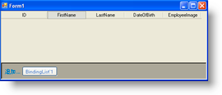

////

|metadata|
{
    "name": "wingrid-generic-lists",
    "controlName": ["WinGrid"],
    "tags": ["Application Scenarios","Grids","Sample Data Source"],
    "guid": "{3ED86426-E16B-4EC4-B7F2-C42D87B55A4B}",  
    "buildFlags": [],
    "createdOn": "0001-01-01T00:00:00Z"
}
|metadata|
////

= 汎用的なリスト

$$.NET$$ Framework 2.0 機能は Generics をサポートします。System.ComponentModel.BindingList は Type を指定することができる Generic コレクションで、伝統的な IBindingList 実装で一般的に見つかる複雑なデータ バインディングの組み込みサポートを提供します。カスタム オブジェクトの BindingList の実装は非常に簡単で、維持も容易にできます。

以下のコード例は、WinGrid™ にバインドされるタイプ Customer の Generic BindingList の作成を示します。

*Visual Basic の場合：*

----
Private Sub Form1_Load( _
   ByVal sender As System.Object, _
   ByVal e As System.EventArgs) Handles MyBase.Load
   Dim theEmployeeList As BindingList(Of Employee) = _
      New BindingList(Of Employee)
   Me.UltraGrid1.DataSource = theEmployeeList
End Sub
----

*C# の場合：*

----
private void Form1_Load(object sender, EventArgs e)
{
   BindingList theEmployeeList = 
      new BindingList();
   this.ultraGrid1.DataSource = theEmployeeList;
}
----

この結果は、以下の画像で示されます。スキーマが WinGrid 内で作成され、Row Adding のプロパティが設定されているので、BindingList 内に含まれる Entity タイプを表すひとつのボタンのある AddNewBox 要素も表示されます。

Generic BindingList を使用するメリットは、ビジネス クラスの作成に集中するだけで十分であることです。タイプ Class の BindingList を作成することで、WinGrid などのデータ バインド コントロールによってシーンの背後で使用される追加、削除、およびバインディング通知を含む既存の機能を継承することができます。つまり、WinGrid の組み込み機能を使用して行を追加または削除することができ、WinGrid を通してユーザーが実行するアクションであればどのようなアクションでも基本の BindingList に基づいて動作します。WinGrid から Row を削除する場合、対応するオブジェクトが基本リストから削除され、WinGrid を通して Row を追加すると、基本リストもコレクションに追加された新しいメンバも持ちます。

タイプ Customer の標準配列などのその他の種類の実装リストを使用することによって行の追加または削除を禁止します。標準配列は可変でないからです。