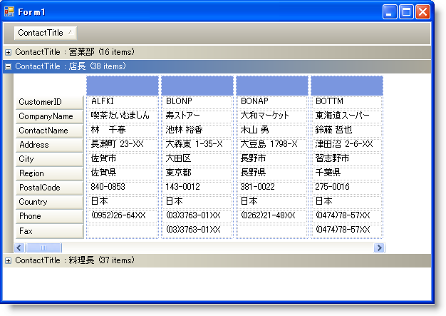
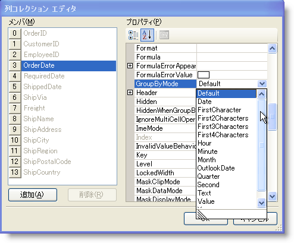
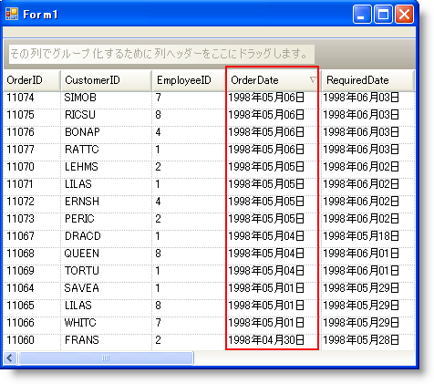
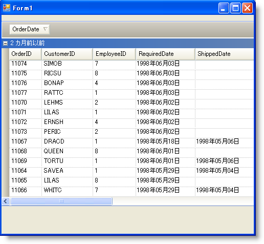

////

|metadata|
{
    "name": "wingrid-groupby-break-behavior",
    "controlName": ["WinGrid"],
    "tags": ["Grids","Grouping"],
    "guid": "{2C33B3E2-7104-40EB-9BAA-56780B36F2DF}",  
    "buildFlags": [],
    "createdOn": "0001-01-01T00:00:00Z"
}
|metadata|
////

= グループ化動作

Outlook GroupBy を有効にすると必ず、エンド ユーザーはグループ化領域に列ヘッダーをドラッグ アンド ドロップできます。デフォルトでこのアクションによって WinGrid™ はドラッグした列の値の個別のリストを作成し、それぞれの個別の値が親行になります。それぞれの個別の値に関連付けられる行は、各親の子行として入れ子になったインデント形式で表示されます。

以下のスクリーンショットは、Outlook GroupBy が有効になっている WinGrid を示しています。ユーザーが ContactTitle 列をグループ化領域にドラッグしたことで、WinGrid は ContactTitle 値の個別のリストを作成しました。各値は WinGrid の親行になり、それぞれの関連付けられた行は各親の下に入れ子になります。以下のスクリーンショットの WinGrid コントロールは Default GroupBy Break Behavior を使用しているので、Parent Rows は ContactTitle 値の Distinct List で作成されます。

Column レベルのプロパティを設定してこの動作を変更できます。各列には、複数の列挙体メンバのひとつを受け付ける GroupByMode プロパティを持ちます:Default、Date、FirstCharacter、First2Characters、First3Characters、First4Characters、Hour、Minute、Month、OutlookDate、Quarter、Second、Text、Value および Year。

これらの値のひとつを選択すると、Outlook GroupBy 機能は異なる方法で親行を作成します。たとえば、Hour（DateTime DataType Column のみで動作する）を選択すると、GroupBy は列のデータの Hour 部分のみに基づいて個別の値リストを作成します。First2Characters を選択すると、列のセルにある最初の 2 文字だけが評価されます。OutlookDate は、Outlook Today、Yesterday、Last Week および Older グループ化をエミュレートするリストを作成します。

以下の画像は、プロパティ ウィンドウから WinGrid.DisplayLayout.Bands[0].Columns プロパティにナビゲートすることで OrderDate 列の GroupByMode プロパティを設定する方法を示しています。

これは Outlook GroupBy を実行する前の値です。

これは OrderDate Column で GroupBy を実行後の WinGrid で、OrderDate Column の GroupByMode は OutlookDate に設定されます。

このように、GroupBy 機能に適用したロジックをユーザーは完全にカスタマイズすることができます。