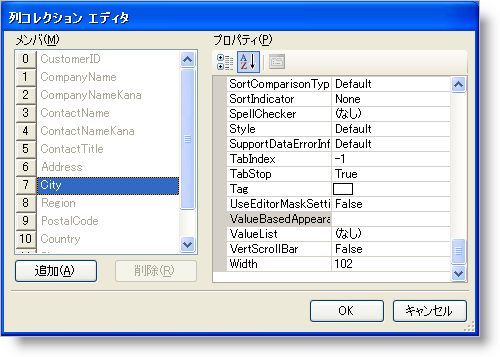
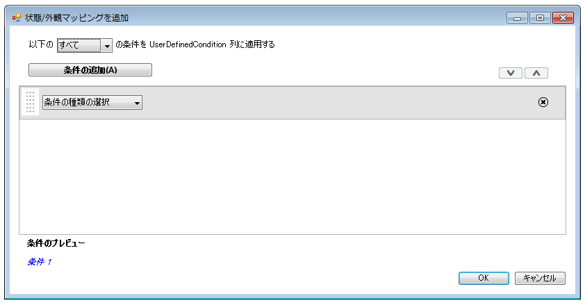
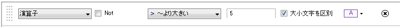

////

|metadata|
{
    "name": "wingrid-implementing-conditional-formatting-at-design-time",
    "controlName": ["WinGrid"],
    "tags": ["Design Environment","Grids","Styling"],
    "guid": "{7D455421-96C7-449D-B6B0-5B704055EBAE}",  
    "buildFlags": [],
    "createdOn": "0001-01-01T00:00:00Z"
}
|metadata|
////

= デザイン タイムで条件フォーマッティングを実装

条件付き書式によって、ルールが True に評価する場合にセルを条件付きで書式設定するルールを WinGrid™ 列に追加することができます。[条件付き書式] ダイアログを使用して、ランタイムの間に WinGrid で条件付き書式ルールを定義できます。このダイアログは、ValueBasedAppearance プロパティによって列コレクション エディターから使用できます。

[NOTE]
====
*注:* デザイン タイムの条件付き書式は、WinGrid の DataSource がデザイン タイムに設定される場合に限り可能です。デザイン タイムの構成は必須であるため、IDE はどの列がデータで定義されるのかを認識しています。そのため ValueBasedAppearance プロパティが設定されるように使用できます。
====

== デザイン タイムに条件フォーマッティング ダイアログを表示

[条件付き書式] ダイアログを表示するには、以下の手順に従ってください。

[start=1]
. フォームで WinGrid を選択して、[プロパティ] ウィンドウで link:{ApiPlatform}win.ultrawingrid{ApiVersion}~infragistics.win.ultrawingrid.ultragridbase~displaylayout.html[DisplayLayout]DisplayLayout オブジェクトを展開します。
[start=2]
. link:{ApiPlatform}win.ultrawingrid{ApiVersion}~infragistics.win.ultrawingrid.ultragridlayout~bands.html[Bands] コレクションにナビゲートし、それを展開します。
[start=3]
. 選択のバンドを展開します。
[start=4]
. link:{ApiPlatform}win.ultrawingrid{ApiVersion}~infragistics.win.ultrawingrid.ultragridband~columns.html[Columns] コレクションを検索し、省略記号をクリックします。列コレクション エディターが表示します。

[start=5]
. link:{ApiPlatform}win.ultrawingrid{ApiVersion}~infragistics.win.ultrawingrid.ultragridcolumn~valuebasedappearance.html[ValueBasedAppearance] プロパティの右の省略記号をクリックします。[条件フォーマッティング] ダイアログ ボックスが表示します。

== 条件を作成

以下の手順では、[条件付き書式] ダイアログによって演算子条件を作成する手順を示します。この例では整数を含む文字列が使用されます。

[start=1]
. [条件タイプを選択] ドロップダウンをクリックして、演算子を選択します。
[start=2]
. [比較演算子] ドロップダウンをクリックして GreaterThanOrEqualTo を選択します。
[start=3]
. エディタで、値 5 を入力します。
[start=4]
. [外観] ドロップダウンを使用して、セルの外観を好みに構成します。条件は以下のようになるはずです。

[start=5]
. [OK] をクリックして [条件フォーマッティング] ダイアログを閉じます。
[start=6]
. [OK] をクリックして列コレクション エディターを終了します。外観条件がグリッドで設定されました。アプリケーションを実行すると、グリッドに条件付き書式が表示されます。

image::images/Win_Implementing_Conditional_Formatting_at_Design_Time_04.png[]

== 関連トピック

* link:wingrid-creating-a-formula-condition.html[数式条件を作成]
* link:wingrid-creating-an-operator-condition.html[演算子条件を作成]
* link:wingrid-combining-multiple-conditions.html[複数の条件を結合]