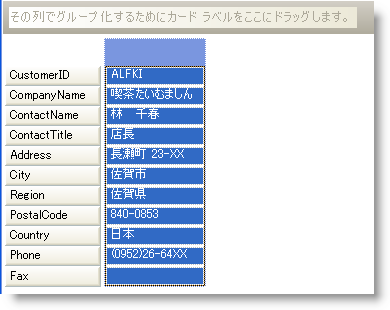

////

|metadata|
{
    "name": "wingrid-limiting-the-amount-of-displayed-cards",
    "controlName": ["WinGrid"],
    "tags": ["Application Scenarios","Grids"],
    "guid": "{DDF75E7D-FDB1-4D0A-A006-EE8C542F3699}",  
    "buildFlags": [],
    "createdOn": "2008-10-04T16:09:42Z"
}
|metadata|
////

= 表示されるカード数を限定

指定した時間に WinGrid™ でどれほどのカードが表示されるかを指定できます。 link:{ApiPlatform}win.ultrawingrid{ApiVersion}~infragistics.win.ultrawingrid.ultragridcardsettings.html[CardSettings] オブジェクトから link:{ApiPlatform}win.ultrawingrid{ApiVersion}~infragistics.win.ultrawingrid.ultragridcardsettings~maxcardareacols.html[MaxCardAreaCols] および link:{ApiPlatform}win.ultrawingrid{ApiVersion}~infragistics.win.ultrawingrid.ultragridcardsettings~maxcardarearows.html[MaxCardAreaRows] プロパティをそれぞれ設定することで、水平方向および垂直方法に表示されるカードの最大数を構成できます。

[NOTE]
====
*注：* MaxCardAreaCols および MaxCardAreaRows プロパティをリセットしたい場合、それらの値を 0 に設定できることに注意してください。
====

以下のコード例は、常に 1 枚のカードだけを WinGrid で表示することを許可するために使用されます：

*Visual Basic の場合：*

----
Me.UltraGrid1.DisplayLayout.Bands(0).CardSettings.MaxCardAreaCols = 1
Me.UltraGrid1.DisplayLayout.Bands(0).CardSettings.MaxCardAreaRows = 1
----

*C# の場合：*

----
this.ultraGrid1.DisplayLayout.Bands[0].CardSettings.MaxCardAreaCols = 1;
this.ultraGrid1.DisplayLayout.Bands[0].CardSettings.MaxCardAreaRows = 1;
----