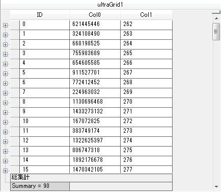
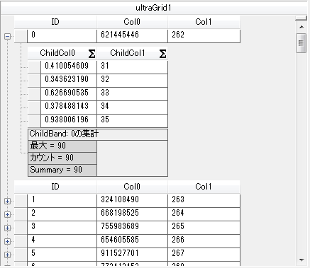

////
|metadata|
{
    "name": "wingrid-performing-external-summary-calculations",
    "controlName": ["WinGrid"],
    "tags": ["Grids","How Do I","Summaries"],
    "guid": "2652de63-ceaf-4a32-ac0d-ed11bbe90d9c",
    "buildFlags": [],
    "createdOn": "2012-03-12T18:38:16.1575048Z"
}
|metadata|
////

= 外部集計計算の実行

== トピックの概要

=== 目的

このトピックでは、UserGrid™ コントロールで外部集計計算を実行する際によく行われるタスクについて、コード例を交えながら説明します。

=== 必要な背景

以下の表に、このトピックを理解するための前提条件として求められるトピックをリストします。

[options="header", cols="a,a"]
|====
|トピック|目的

| link:windatasource-load-data-on-demand.html[オンデマンドでデータの読み込み]
|このトピックでは link:{ApiPlatform}win.ultrawindatasource{ApiVersion}~infragistics.win.ultrawindatasource.ultradatasource~celldatarequested_ev.html[CellDataRequested] イベントで必要に応じてデータの読み込みを行うことををご紹介します。

|====

=== このトピックの構成

このトピックには次のセクションがあります。

* <<External_1,外部集計計算概要>>
* <<External_2,外部集計計算を有効にする>>
** 概要
** プロパティ設定
** コード

* <<_Ref317876774,外部集計計算の実装 - 概念的概要>>
** 概要
** プロパティ設定

* <<_Ref31787690,外部集計計算の実装 - コード例>>
** 説明
** プレビュー
** コード

* <<_Ref317876962,集計計算機での外部集計計算の実装 - 概念的概要>>
** 概要
** プロパティ設定

* <<_Ref317877004,集計計算機での外部集計計算の実装 - コード例>>
** 説明
** プレビュー
** コード
** 関連コンテンツ

[[External_1]]
== 外部集計計算概要

=== 外部集計計算タスクチャート

以下の表は、WinGrid コントロールの設定項目を示しています。詳細については、概要表の下をご覧ください。

[options="header", cols="a,a,a"]
|====
|外部計算タスク|詳細|プロパティ / Enum / メソッド

|外部集計計算を有効にする
|対象バンドの集計コレクションに対し、集計タイプは External に設定されます。
|
link:{ApiPlatform}win.ultrawingrid{ApiVersion}~infragistics.win.ultrawingrid.summarytype.html[SummaryType] - enum 

|外部集計計算を実行する
| link:{ApiPlatform}win.ultrawingrid{ApiVersion}~infragistics.win.ultrawingrid.ultragrid~externalsummaryvaluerequested_ev.html[ExternalSummaryValueRequested] イベントが公開する link:{ApiPlatform}win.ultrawingrid{ApiVersion}~infragistics.win.ultrawingrid.summaryvalue~setexternalsummaryvalue.html[SetExternalSummaryValue] メソッド を使用して、集計値を直接または外部から設定します。
| link:{ApiPlatform}win.ultrawingrid{ApiVersion}~infragistics.win.ultrawingrid.summaryvalue~setexternalsummaryvalue.html[SetExternalSummaryValue] - メソッド

|集計計算機で外部集計計算を実行します
| link:{ApiPlatform}win.ultrawingrid{ApiVersion}~infragistics.win.ultrawingrid.ultragridoverride~useexternalsummarycalculator.html[UseExternalSummaryCalculator] プロパティを True に設定します。
|
link:{ApiPlatform}win.ultrawingrid{ApiVersion}~infragistics.win.ultrawingrid.ultragridoverride~useexternalsummarycalculator.html[UseExternalSummaryCalculator] - プロパティ 

|====

[[External_2]]
== 外部集計計算を有効にする

=== 概要

外部集計計算を有効にするには、特定のバンドの集計コレクションで、集計タイプを External に設定する必要があります。外部集計計算機能を使用すると、UltraGrid コントロールの集計計算ロジックが行コレクションの走査を繰り返して集計値を計算するのをバイパスし、すべてのデータを読み込む必要がなくなります。これにより、UltraGrid コントロールに集計を追加し、必要に応じてデータを読み込むことができます。

=== プロパティ設定

以下の表では、必要な構成をプロパティ設定にマップしています。

[options="header", cols="a,a,a"]
|====
|以下を行うために...|この Enum の使用:|それを次に設定...

|外部集計計算を有効にします
| link:{ApiPlatform}win.ultrawingrid{ApiVersion}~infragistics.win.ultrawingrid.summarytype.html[SummaryType]
|External

|====

=== コード例

以下のサンプル コードは、集計コレクションの追加メソッドを用いて集計タイプを External に設定します。

*Visual Basic の場合:*

[source,vb]
----
Dim band As UltraGridBand = Me.ultraGrid1.DisplayLayout.Bands(0)
' 外部タイプの集計を追加します。
Dim summary As SummarySettings = band.Summaries.Add(SummaryType.External, band.Columns("ID"))
----

*C# の場合:*

[source,csharp]
----
UltraGridBand band = this.ultraGrid1.DisplayLayout.Bands[0];
// 外部タイプの集計を追加します。
SummarySettings summary = band.Summaries.Add( SummaryType.External, band.Columns["ID"] );
----

[[_Code_Example:_ExternalSummaryValueR]]
[[_Implementing_External_Summary]]
[[_Ref317876774]]
== 外部集計計算の実装 - 概念的概要

[[_Overview_1]]

=== 概要

集計タイプを External に設定すると、 link:{ApiPlatform}win.ultrawingrid{ApiVersion}~infragistics.win.ultrawingrid.ultragrid~externalsummaryvaluerequested_ev.html[ExternalSummaryValueRequested] イベントが発生します。このイベントが公開する link:{ApiPlatform}win.ultrawingrid{ApiVersion}~infragistics.win.ultrawingrid.summaryvalue~setexternalsummaryvalue.html[SetExternalSummaryValue] メソッドを使用して、集計値を直接または外部から設定します。呼び出します。

[[_Property_settings_1]]

=== プロパティ設定

以下の表では、必要な構成をプロパティ設定にマップしています。

[options="header", cols="a,a,a"]
|====
|以下を行うために...|このプロパティの使用:|それを次に設定...

|外部集計値を割り当てます
| link:{ApiPlatform}win.ultrawingrid{ApiVersion}~infragistics.win.ultrawingrid.summaryvalue~setexternalsummaryvalue.html[SetExternalSummaryValue]
|希望の値

|====

[[_Example_1]]
[[_Ref31787690]]
== 外部集計計算の実装 - コード例

=== 説明

次のコード例では、UltraGrid コントロールが以下の設定の結果として外部集計値を表示しています。

[options="header", cols="a,a"]
|====
|プロパティ|値

| link:{ApiPlatform}win.ultrawingrid{ApiVersion}~infragistics.win.ultrawingrid.summaryvalue~setexternalsummaryvalue.html[SetExternalSummaryValue]
|90

|====

[[_Preview]]

=== プレビュー

以下は、外部集計値のプレビュー表示で、サンプル コード例を実装した結果です。

[[_Code_1]]

=== コード

以下のサンプル コードでは、Summary を外部で設定、または ExternalSummaryCalculated イベント内部で直接設定しています。

*Visual Basic の場合:*

[source,vb]
----
Private Sub ultraGrid1_ExternalSummaryValueRequested(sender As Object, e As ExternalSummaryValueEventArgs)
e.SummaryValue.SetExternalSummaryValue("90")
End Sub
----

*C# の場合:*

[source,csharp]
----
private void ultraGrid1_ExternalSummaryValueRequested(object sender, ExternalSummaryValueEventArgs e)
{
         e.SummaryValue.SetExternalSummaryValue("90");
}
----

[[_Implementing_External_Summary_1]]
[[_Ref317876962]]
== 集計計算機での外部集計計算の実装 - 概念的概要

[[_Overview_2]]

=== 概要

集計計算機の集計 (Average、Count、Maximum、Minimum および Sum) も外部で計算できます。これを実現するには、 link:{ApiPlatform}win.ultrawingrid{ApiVersion}~infragistics.win.ultrawingrid.ultragridoverride~useexternalsummarycalculator.html[UseExternalSummaryCalculator] プロパティを True に設定します。このプロパティは、`UltraGrid.Override` および特定の `Band.Override` で設定することができます。このプロパティが True に設定された場合、UltraGrid は集計計算を停止して ExternalSummaryValueRequested イベントを発生させ、集計に配置する値を要求します。

[[_Property_settings_2]]

=== プロパティ設定

以下の表では、必要な構成をプロパティ設定にマップしています。

[options="header", cols="a,a,a"]
|====
|以下を行うために...|このプロパティの使用:|それを次に設定...

|集計計算機での外部集計計算を有効にします
| link:{ApiPlatform}win.ultrawingrid{ApiVersion}~infragistics.win.ultrawingrid.ultragridoverride~useexternalsummarycalculator.html[UseExternalSummaryCalculator]
|DefaultableBoolean.True

|集計タイプ _Count_ に外部集計値を割り当てます
| link:{ApiPlatform}win.ultrawingrid{ApiVersion}~infragistics.win.ultrawingrid.summaryvalue~setexternalsummaryvalue.html[SetExternalSummaryValue]
|希望の値

|集計タイプ _Maximum_ に外部集計値を割り当てます
| link:{ApiPlatform}win.ultrawingrid{ApiVersion}~infragistics.win.ultrawingrid.summaryvalue~setexternalsummaryvalue.html[SetExternalSummaryValue]
|希望の値

|====

[[_Ref317877004]]
== 集計計算機での外部集計計算の実装 - コード例

[[_Example]]

=== 説明

このコード例では、以下の設定を適用して UltraGrid コントロールで集計計算機上に外部集計値を表示しています。

[options="header", cols="a,a"]
|====
|プロパティ|値

|SetExternalSummaryValue
|5

|SetExternalSummaryValue
|100

|====

[[_Preview_1]]

=== プレビュー

次のスクリーンショットでは、Example テキスト ブロックの設定によって、UltraGrid が子バンドの集計計算機に外部集計値を表示している状態を示しています。

[[_Code_2]]

=== コード

以下のサンプル コードでは、Summary Calculator を External に設定しています。 link:{ApiPlatform}win.ultrawingrid{ApiVersion}~infragistics.win.ultrawingrid.ultragridoverride~useexternalsummarycalculator.html[UseExternalSummaryCalculator] プロパティが `True` に設定されます。UltraGrid は、子バンドに対する Summary Calculator で外部集計値を表示します。集計値は link:{ApiPlatform}win.ultrawingrid{ApiVersion}~infragistics.win.ultrawingrid.ultragrid~externalsummaryvaluerequested_ev.html[ExternalSummaryValueRequested] イベント内で設定されます。

*Visual Basic の場合:*

[source,vb]
----
' 集計計算機でグリッド全体に対する集計を外部から計算します。 
' this.ultraGrid1.DisplayLayout.Override.UseExternalSummaryCalculator = DefaultableBoolean.True;
' Allows Summary Calculator to calculate summaries externally for a specific band(Bands[1]).
' UltraGrid summary calcuation is stopped and                                    'ultraGrid1_ExternalSummaryValueRequested event is  fired.
Me.ultraGrid1.DisplayLayout.Bands(1).Override.UseExternalSummaryCalculator = Infragistics.Win.DefaultableBoolean.True
Private Sub ultraGrid1_ExternalSummaryValueRequested(sender As Object, e As ExternalSummaryValueEventArgs)
      Select Case e.SummaryValue.SummarySettings.SummaryType.ToString()
            Case "Count"
                  e.SummaryValue.SetExternalSummaryValue(5)
                  Exit Select
            Case "Maximum"
                  e.SummaryValue.SetExternalSummaryValue(100)
                  Exit Select
      End Select
End Sub
----

*C# の場合:*

[source,csharp]
----
// 集計計算機でグリッド // 全体に対する集計を外部から計算します。 
// this.ultraGrid1.DisplayLayout.Override.UseExternalSummaryCalculator = 
// DefaultableBoolean.True;
// Allows Summary Calculator to calculate summaries externally for a specific 
// band(Bands[1]).
// UltraGrid summary calcuation is stopped and 
// ultraGrid1_ExternalSummaryValueRequested event is fired.
this.ultraGrid1.DisplayLayout.Bands[1].Override.UseExternalSummaryCalculator =
Infragistics.Win.DefaultableBoolean.True;
private void ultraGrid1_ExternalSummaryValueRequested(object sender, ExternalSummaryValueEventArgs e)
{
        switch (e.SummaryValue.SummarySettings.SummaryType.ToString())
        {
            case "Count":
            e.SummaryValue.SetExternalSummaryValue(5);
            break;
            case "Maximum":
            e.SummaryValue.SetExternalSummaryValue(100);
            break;
        }
}
----

[[_Related_Content]]
== 関連コンテンツ

=== トピック

以下のトピックでは、このトピックに関連する情報を提供しています。

[options="header", cols="a,a"]
|====
|トピック|目的

| link:wingrid-positioning-column-summaries.html[列集計の配置]
|このトピックでは、列の集計を最下部以外の位置に表示します。

| link:wingrid-displaying-non-scrolling-summaries.html[非スクロール集計を表示]
|このトピックでは、集計値を固定してスクロールしないようにします。

|====