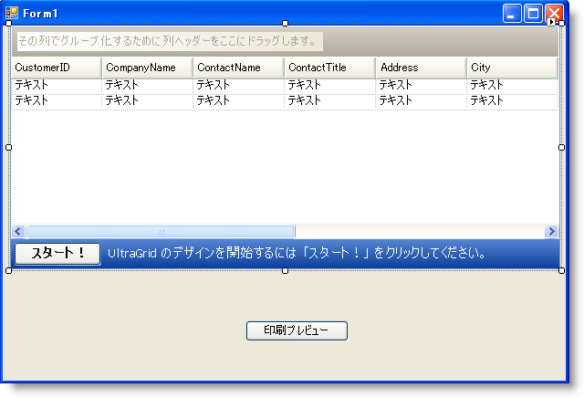
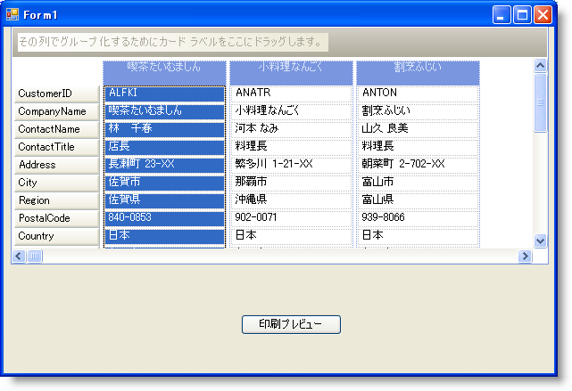
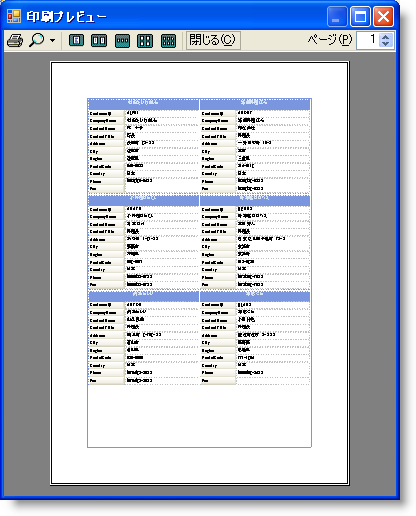

////

|metadata|
{
    "name": "wingrid-printing-wingrid-in-card-view",
    "controlName": ["WinGrid"],
    "tags": ["Application Scenarios","Grids","Printing"],
    "guid": "{AECA10E5-D406-42C0-B57A-275BFAC4FD95}",  
    "buildFlags": [],
    "createdOn": "0001-01-01T00:00:00Z"
}
|metadata|
////

= カード ビューで WinGrid を印刷

== 始める前に

WinGrid™ は Microsoft® Excel® ファイルまたは PDF 文書へのグリッドのエクスポートからグリッドを印刷プレビュー ダイアログまたはプリンタに送る複数の印刷オプションを提供します。WinGrid は、それを印刷またはエクスポートする時にいくつかの視覚的状態にすることができます。ただし、コンピュータ画面の WinGrid のルックは、サイズ制限のため印刷される文書に収まることはほとんどありません。したがって、 link:{ApiPlatform}win.ultrawingrid{ApiVersion}~infragistics.win.ultrawingrid.ultragrid~initializelayout_ev.html[InitializeLayout] イベントでコンピュータ画面に全体を表示するために WinGrid レイアウトを初期化できることを理解することが重要ですが、WinGrid のオリジナルの視覚的状態を変更することなく、 link:{ApiPlatform}win.ultrawingrid{ApiVersion}~infragistics.win.ultrawingrid.ultragrid~initializeprint_ev.html[InitializePrint] または link:{ApiPlatform}win.ultrawingrid{ApiVersion}~infragistics.win.ultrawingrid.ultragrid~initializeprintpreview_ev.html[InitializePrintPreview] イベントで印刷のために WinGrid のレイアウトを初期化することもできます。

== 達成すること

本トピックは、InitializeLayout イベントで link:wingrid-about-card-view.html[カード ビュー]用の WinGrid のレイアウトの初期化をガイドします。次に InitializePrintPreview イベントでレイアウトを変更する方法を学習します。

== 次の手順を実行します

[start=1]
. *フォームを設定します。*

フォームに WinGrid コントロールと WinButton コントロールの両方を配置する必要があります。WinGrid は Northwind データベース（詳細は、 link:wingrid-binding-wingrid-to-a-flat-data-source-clr2.html[「WinGrid をフラット データ ソースにバインドする」]を参照）からデータを保持し、WinButton™ は WinGrid の link:{ApiPlatform}win.ultrawingrid{ApiVersion}~infragistics.win.ultrawingrid.ultragrid~printpreview.html[PrintPreview] メソッドを呼び出します。

.. UltraGrid と UltraButton コントロールの両方を Microsoft® Visual Studio® ツールボックスからフォームにドラッグします。
.. 上記のパラグラフで言及されたトピック（または自分自身のデータを使用できる）を使用して WinGrid を設定します。
.. WinButton の Text プロパティを 'Print Preview' に設定します。

コントロールを配列すると、フォームは以下のスクリーンショットのようになります。

[start=2]
. *カード ビューを使用するために WinGrid のレイアウトを初期化します* 。

WinGrid の InitializeLayout イベントでは、WinGrid のルック アンド フィールを変更するために link:{ApiPlatform}win.ultrawingrid{ApiVersion}~infragistics.win.ultrawingrid.ultragridlayout.html[DisplayLayout] オブジェクトによって公開されたプロパティを設定できます。このイベントでカード ビュー モードをオンにするだけでなく、カードをどのように見せたいかを構成するために複数のプロパティを設定します。カード ビューでの印刷時に設定する重要はプロパティは、 link:{ApiPlatform}win.ultrawingrid{ApiVersion}~infragistics.win.ultrawingrid.ultragridlayout~allowcardprinting.html[AllowCardPrinting] プロパティです。このプロパティのデフォルト設定は Never です。したがって、カード ビューで WinGrid を印刷できるようにするには、AllowCardPrinting を RootBandOnly に設定する必要があります。

WinGrid の任意の場所をダブルクリックすると、Visual Studio は InitializeLayout イベントを生成します。カード ビューで印刷を有効にするために、InitializeLayout イベントに以下のコードを配置します。

*Visual Basic の場合：*

----
'カード ビューで印刷するために、このプロパティを設定する必要があります。
Me.UltraGrid1.DisplayLayout.AllowCardPrinting = _
   Infragistics.Win.UltraWinGrid.AllowCardPrinting.RootBandOnly
'カード ビューで WinGrid を表示します。
Me.UltraGrid1.DisplayLayout.Bands(0).CardView = True
'CompanyName フィールドを使用して各カードにキャプションを設定します。
Me.UltraGrid1.DisplayLayout.Bands(0).CardSettings.CaptionField = "CompanyName"
----

*C# の場合：*

----
//カード ビューで印刷するために、このプロパティを設定する必要があります。
this.ultraGrid1.DisplayLayout.AllowCardPrinting =
   Infragistics.Win.UltraWinGrid.AllowCardPrinting.RootBandOnly;
//カード ビューで WinGrid を表示します。
this.ultraGrid1.DisplayLayout.Bands[0].CardView = true;
//CompanyName フィールドを使用して各カードにキャプションを設定します。
this.ultraGrid1.DisplayLayout.Bands[0].CardSettings.CaptionField = "CompanyName";
----

[start=3]
. *カードを印刷するために WinGrid の印刷レイアウトを初期化します* 。

WinGrid の InitializeLayout イベントでは、WinGrid の ルック アンド フィールを変更するためにプロパティを設定します。WinGrid の InitializePrintPreview イベントでは、WinGrid のルック アンド フィールを変更するためのプロパティも設定しますが、これらの設定は印刷される WinGrid だけに影響します。WinGrid の DisplayLayout を変更する代わりに、EventArgs で公開される PrintLayout を変更します。そうすることで WinGrid のオリジナルのルック アンド フィールを変更せず、印刷される内容だけを変更できます。

.. WinGrid を選択したデザイン ビューで、プロパティ ウィンドウの上に向いている光っているボルトをクリックします。WinGrid プロパティのリストが表示されます。
.. InitializePrintPreview が見えるまでスクロール ダウンしてダブルクリックします。Visual Studio は InitializePrintPreview イベントを生成します。
.. WinGrid がカードを印刷する方法を変更するために、InitializePrintPreview イベントに以下のコードを配置します。

*Visual Basic の場合：*

----
'標準ラベルは、各カードが自立することを簡単にし、
'配布のためにカードを切り離すことを
'ユーザーに許可します。
e.PrintLayout.Bands(0).CardSettings.Style = _
	Infragistics.Win.UltraWinGrid.CardStyle.StandardLabels
'MaxCardAreaCols および MaxCardAreaRows プロパティを設定することで
'ページ当たりのカード数を制限することができます。これらのプロパティを
'3 に設定すると、ページ当たりで 9 枚のカードが提供されます。
e.PrintLayout.Bands(0).CardSettings.MaxCardAreaCols = 3
e.PrintLayout.Bands(0).CardSettings.MaxCardAreaRows = 3
'各カードは使用できる領域に収めるために 
'幅を自動的に増します。
e.PrintLayout.Bands(0).CardSettings.AutoFit = True
----

*C# の場合：*

----
//標準ラベルは、各カードが自立することを簡単にし、
//配布のためにカードを切り離すことを
//ユーザーに許可します。
e.PrintLayout.Bands[0].CardSettings.Style =
	Infragistics.Win.UltraWinGrid.CardStyle.StandardLabels;
//MaxCardAreaCols および MaxCardAreaRows プロパティを設定することで
//ページ当たりのカード数を制限することができます。これらのプロパティを
//3 に設定すると、ページ当たりで 9 枚のカードが提供されます。
e.PrintLayout.Bands[0].CardSettings.MaxCardAreaCols = 3;
e.PrintLayout.Bands[0].CardSettings.MaxCardAreaRows = 3;
//各カードは使用できる領域に収めるために 
//幅を自動的に増します。
e.PrintLayout.Bands[0].CardSettings.AutoFit = true;
----

[start=4]
. *WinGrid の印刷プレビューを表示します* 。

.. デザイン ビューで、WinButton コントロールをダブルクリックします。Visual Studio はボタンの Click イベントを生成します。
.. WinGrid の印刷プレビューを表示するために Click イベントに以下のコードを配置します。

*Visual Basic の場合：*

----
'PrintPreview メソッドを呼び出すと WinGrid の
'印刷プレビュー ダイアログ ボックスが表示されます。
Me.UltraGrid1.PrintPreview()
----

*C# の場合：*

----
//PrintPreview メソッドを呼び出すと WinGrid の
//印刷プレビュー ダイアログ ボックスが表示されます。
this.ultraGrid1.PrintPreview();
----

[start=5]
. *アプリケーションを実行します。*

アプリケーションをビルドして実行すると、結合されたラベルとともにカード ビューに WinGrid が表示されます。アプリケーション ウィンドウの幅を拡張すると、WinGrid は表示可能な領域にできるだけ多くのカードを配置しようとします。

ただし、Print Preview ボタンをクリックすると、WinGrid は InitializePrintPreview イベントの PrintLayout オブジェクトに基づいて新しいカード レイアウトを生成します。

