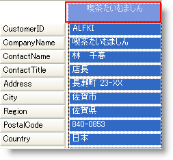

////

|metadata|
{
    "name": "wingrid-setting-a-caption-in-card-view",
    "controlName": ["WinGrid"],
    "tags": ["Grids","How Do I"],
    "guid": "{2036F9F2-339A-44C0-80A9-90A46AFF3C82}",  
    "buildFlags": [],
    "createdOn": "2008-10-04T16:08:35Z"
}
|metadata|
////

= カード ビューにキャプションを設定

デフォルトでは、カード ビューは、WinGrid™ の各行にキャプション領域を表示します。これは、この領域に値を表示するために基本のデータ ソースからどのフィールドを使用するのかをユーザーが指定することを可能にする領域です。以下のコードは、 link:{ApiPlatform}win.ultrawingrid{ApiVersion}~infragistics.win.ultrawingrid.ultragridcardsettings~captionfield.html[CaptionField] プロパティを設定してカード キャプションに基本データ ソースからどのフィールドを使用するのかをプログラムで指定します。キャプションが表示されることを保証するには、 link:{ApiPlatform}win.ultrawingrid{ApiVersion}~infragistics.win.ultrawingrid.ultragridcardsettings~showcaption.html[ShowCaption] プロパティを True に設定します。 

*Visual Basic の場合：*

----
Me.UltraGrid1.DisplayLayout.Bands(0).CardSettings.CaptionField = "CompanyName"
Me.UltraGrid1.DisplayLayout.Bands(0).CardSettings.ShowCaption = True
----

*C# の場合：*

----
this.ultraGrid1.DisplayLayout.Bands[0].CardSettings.CaptionField = "CompanyName";
this.ultraGrid1.DisplayLayout.Bands[0].CardSettings.ShowCaption = true;
----