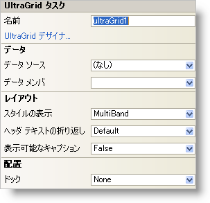

////
|metadata|
{
    "name": "wingrid-smart-tag",
    "controlName": ["WinGrid"],
    "tags": ["Grids"],
    "guid": "{CB30B27B-3AF0-47E4-BF98-7E582EB1B8E7}",
    "buildFlags": [],
    "createdOn": "2005-11-11T00:00:00Z"
}
|metadata|
////

= WinGrid スマート タグ

{ProductName} のすべてのコントロール/コンポーネントが固有のスマート タグを備えています。 コントロール/コンポーネントを選択すると、スマート タグ のアンカーが表示されます。このアンカーをクリックするとポップアップ パネルが表示され、コントロール/コンポーネントの頻繁に使用されるプロパティおよび設定にすばやくアクセスできます。

WinGrid スマート タグには、以下のセクションと共にコントロールの名前が含まれます。

* データ -- コントロールが使用している基になるデータ（データ ソースやデータ メンバなど）を参照します。
* レイアウト -- コントロールをフォームのどこに、どのように配置するかを指定するプロパティがあります。

各セクションの項目（たとえば、フィールド、ドロップダウン リスト、チェックボックス）およびプロパティ グリッドの項目の対応するプロパティの説明については以下を参照してください。

[options="header", cols="a,a,a"]
|====
|データ|説明|対応するプロパティ

|データ メンバ
|有効なデータ ソースを選択した後、このドロップダウンから使用可能なすべてのデータ メンバを選択できます。
| link:{ApiPlatform}win.ultrawingrid{ApiVersion}~infragistics.win.ultrawingrid.ultragridbase~datamember.html[DataMember]

|データ ソース
|ドロップダウンをクリックすると、プロジェクトで使用可能なすべてのデータ ソースが表示されます。データ ソースがまだ設定されていない場合は、[プロジェクト データ ソースの追加...] を選択してデータ ソースを作成できます。
| link:{ApiPlatform}win.ultrawingrid{ApiVersion}~infragistics.win.ultrawingrid.ultragridbase~datasource.html[DataSource]

|====

[options="header", cols="a,a,a"]
|====
|レイアウト|説明|対応するプロパティ

|表示可能なキャプション
|ドロップダウンから True を選択すると、WinGrid の上部にキャプションが表示されます。
| link:{ApiPlatform}win.ultrawingrid{ApiVersion}~infragistics.win.ultrawingrid.ultragridlayout~captionvisible.html[CaptionVisible]

|ドック
|コントロールを上、右、下、左、全体、または「なし」を選択します。
|Dock

|スタイルの表示
|WinGrid のデータを SingleBand と MultiBand のどちらのモードで表示するかを選択します。
| link:{ApiPlatform}win.ultrawingrid{ApiVersion}~infragistics.win.ultrawingrid.ultragridlayout~viewstyle.html[ViewStyle]

|ヘッダ テキストの折り返し
|ヘッダ テキストが長すぎて列に収まらない場合には、ドロップダウンから True を選択すると、列の端で折り返されます。
| link:{ApiPlatform}win.ultrawingrid{ApiVersion}~infragistics.win.ultrawingrid.ultragridoverride~wrapheadertext.html[WrapHeaderText]

|====