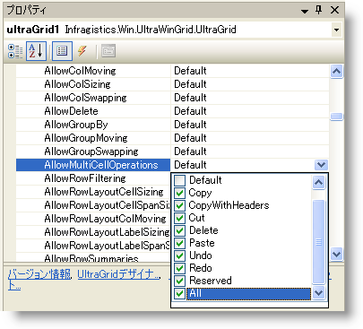

////

|metadata|
{
    "name": "wingrid-turning-on-clipboard-operations",
    "controlName": ["WinGrid"],
    "tags": ["Application Scenarios","Grids"],
    "guid": "{060D0658-62DA-41F8-A3CD-C9E1764CF3D4}",  
    "buildFlags": [],
    "createdOn": "2006-03-02T00:00:00Z"
}
|metadata|
////

= クリップボード操作の起動

WinGrid のクリップボード操作を活用するために設定しなければならないプロパティはひとつです。pick:[win-forms="link:{ApiPlatform}win.ultrawingrid{ApiVersion}~infragistics.win.ultrawingrid.ultragridoverride~allowmulticelloperations.html[AllowMultiCellOperations]"]  プロパティ（[DisplayLayout]、次に [Override] を展開すると表示される [プロパティ] ウィンドウにあります）を pick:[win-forms="link:{ApiPlatform}win.ultrawingrid{ApiVersion}~infragistics.win.ultrawingrid.allowmulticelloperation.html[All]"]  に設定すると、エンド ユーザーは [コピー]、[ヘッダごとコピー]、[切り取り]、[削除]、[貼り付け]、[元に戻す]、[やり直し] を含めたすべてのクリップボード操作を実行できます。

エンド ユーザーが実行できる機能を絞り込むことも可能です。たとえば、エンド ユーザーが WinGrid 間のコピー アンド ペーストを実行できるようにしたいが、データの削除は認めたくない場合は、[コピー] と [貼り付け] のチェックボックスのみを選択し、[削除] のチェックボックスは選択しないままとします。[なし] を選択すると、デフォルト設定と同様に、複数のセルに対する操作を禁止できます。

以下のコードは、AllowMultiCellOperations プロパティを上記の説明に基づいて設定する方法を示したものです。

*Visual Basic の場合：*

----
Imports Infragistics.Win.UltraWinGrid
...
Private Sub Form1_Load(ByVal sender As System.Object, _
  ByVal e As System.EventArgs) Handles MyBase.Load
	' エンド ユーザーがコピー アンド ペーストできるように AllowMultiCellOperations を設定します。
	Me.UltraGrid1.DisplayLayout.Override.AllowMultiCellOperations = _
	  AllowMultiCellOperation.Copy Or AllowMultiCellOperation.Paste
End Sub
----

*C# の場合：*

----
using Infragistics.Win.UltraWinGrid;
...
private void Form1_Load(object sender, System.EventArgs e)
{
	// エンド ユーザーがコピー アンド ペーストできるように AllowMultiCellOperations を設定します。
	this.ultraGrid1.DisplayLayout.Override.AllowMultiCellOperations = 
	  AllowMultiCellOperation.Copy | AllowMultiCellOperation.Paste;
}
----