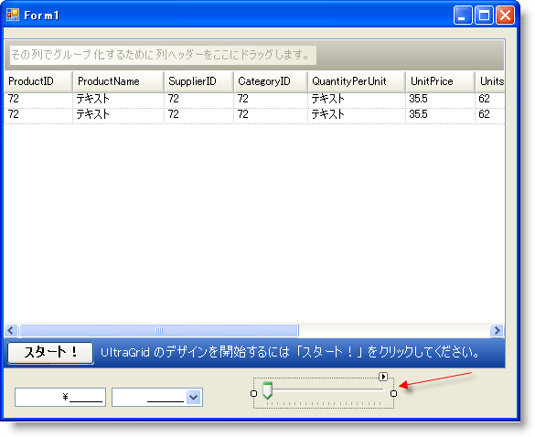
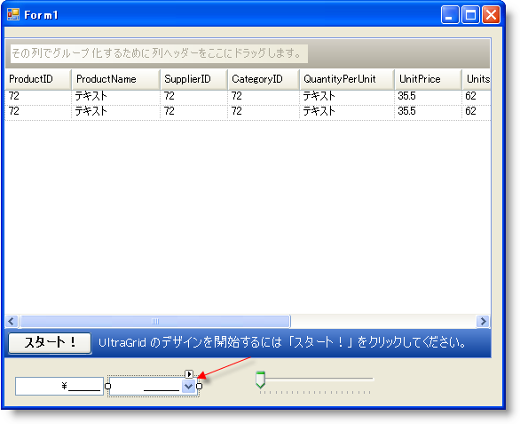
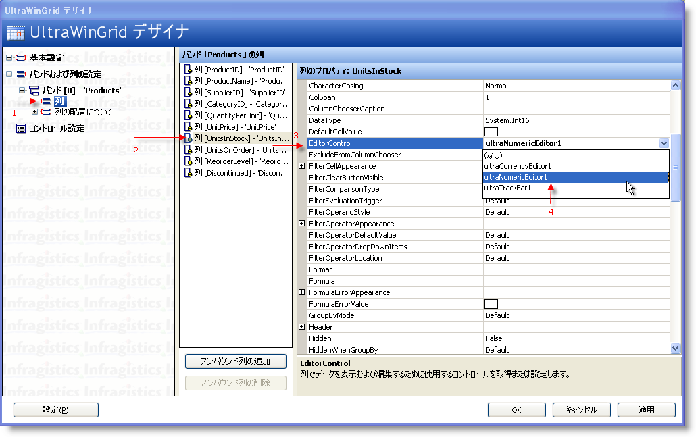
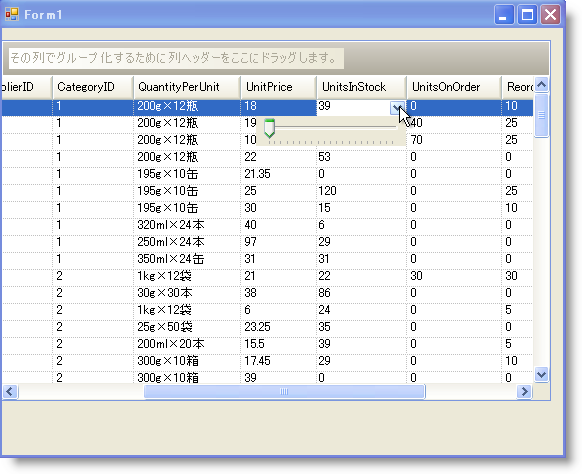
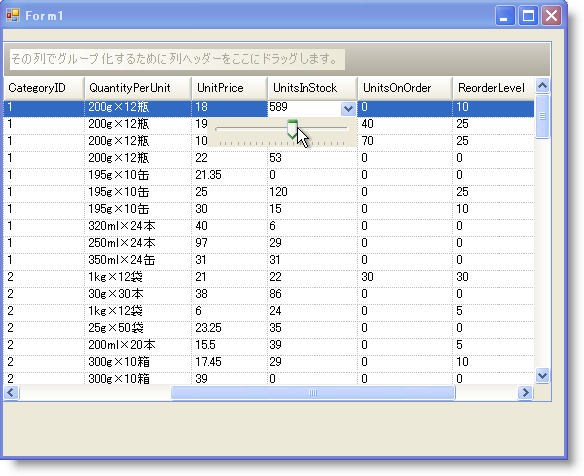

////

|metadata|
{
    "name": "wingrid-using-any-windows-forms-control-as-a-drop-down-inside-wingrid",
    "controlName": ["WinGrid"],
    "tags": ["Application Scenarios","Extending","Grids"],
    "guid": "{C526C026-781A-4227-92CC-EBF8B7CF6998}",  
    "buildFlags": [],
    "createdOn": "0001-01-01T00:00:00Z"
}
|metadata|
////

= WinGrid 内でドロップダウンとして Windows Forms コントロールを使用します

Infragistics エディタと共に提供される最も重要な機能のひとつは、エディタ ボタンを表示する機能です。エディタ ボタンは左側または右側に追加できます。このセクションはこれを使用して、任意の種類の Windows Forms コントロールを含むことができるドロップダウンを含む WinGrid コントロールで UI を作成する方法を説明します。以下の手順は適切なデータ アダプタまたはテーブルアダプタを使用して DataTable を移植するためのコードとともに Northwind Products DataTable にバインドされるWinGrid の Form があることが前提となっています。TrackBar をスライドすることによって値を調整できるように、標準の Windows Forms コントロール TrackBar を UnitsInStock Column に追加します。

[start=1]
. 標準の Visual Studio ツールボックス内で、TrackBar コントロールを指定します。そのインスタンスを Form にドラッグ アンド ドロップします:

[start=2]
. Visible プロパティを False に設定します。
[start=3]
. その MinimumValue プロパティを 0 に設定します。
[start=4]
. その MaximumValue プロパティを 1000 に設定します。
[start=5]
. その TickFrequency プロパティを 50 に設定します。
[start=6]
. Infragistics ツールボックスで、UltraNumericEditor を指定してそのインスタンスを Form にドラッグ アンド ドロップします:

[start=7]
. Visible プロパティを False に設定します。
[start=8]
. その NumericType プロパティを Integer に設定します。
[start=9]
. その MinValue プロパティを 0 に設定します。
[start=10]
. その MaxValue プロパティを 1000 に設定します。
[start=11]
. ButtonsRight プロパティを指定して省略記号（E）をクリックし EditorButtonBase コレクション エディタを表示します。
[start=12]
. [追加] ボタンをクリックして、[DropDownEditorButton] を選択します。
[start=13]
. DropDownEditorButton のプロパティ内で、その Key プロパティを "TRACKBAR" に設定します。
[start=14]
. Control プロパティを指定して、そのコンボ ボックスから TrackBar1 を選択します。これは実際的に DropDownButton を TrackBar に接続します。これによってこのボタンをクリックすると、TrackBar が表示します。
[start=15]
. [OK] をクリックして EditorButtonBase コレクション エディタを終了します。
[start=16]
. WinGrid の [スタート] ボタンをクリックして UltraWinGrid デザイナを表示します。
[start=17]
. [バンドおよび列の設定] の下で、Band[0] = ‘Products’ ノードを展開して列ノードをクリックします。これによって製品エンティティで使用可能な列が表示されます。
[start=18]
. UnitsInStock の列を指定してクリックします。EditorControl プロパティを指定して、そのコンボから UltraNumericEditor1 を選択します。

[start=19]
. [適用]、そして [OK] をクリックしてデザイナを終了します。
[start=20]
. アプリケーションを保存および実行すると、以下のように表示されるはずです。

UnitsInStock 列にスクロールして、ドロップダウン ボタンをクリックすると、TrackBar がドロップダウンするので水平にスライドできます。これは見た目がよく、値を調整するための優れた方法をエンド ユーザーに提供しますが、機能的ではありません。これは、操作を提供する小さいコードを記述する必要があるからです。DropDown ボタンは、クリックすると必ずコントロールを表示するという役割を果たすだけです。任意の、またすべての操作コードおよびイベント処理は依然として記述する必要があります。

Infragistics エディタ コントロールは探している機能を実行する支援をすることができる役に立つイベントを公開します。BeforeEditorButtonDropDown イベントは、DropDownButton に関連付けられたコントロールが表示する直前に発生します。このイベントで、現在の WinGrid セルの値を見つけるためにコードを記述して TrackBar をその値に設定することができます。これによって、TrackBar は編集している現在のセルとまったく同じ値を表示することになります。

以下のコードは現在の WinGrid セルの値をチェックして次に TrackBar に指定するために BeforeEditorButtonDropDown イベントを処理する方法を示します:

*Visual Basic の場合：*

----
Private Sub UltraNumericEditor1_BeforeEditorButtonDropDown( _
  ByVal sender As System.Object, _
  ByVal e As BeforeEditorButtonDropDownEventArgs) _
  Handles UltraNumericEditor1.BeforeEditorButtonDropDown
    If e.Button.Key = "TRACKBAR" _
    AndAlso _
    Not Me.UltraGrid1.ActiveCell Is Nothing Then
      Me.TrackBar1.Value = _
        CType(UltraGrid1.ActiveCell.Value, Int16)
    End If
End Sub
----

*C# の場合：*

----
private void ultraNumericEditor1_BeforeEditorButtonDropDown(
  object sender, 
  BeforeEditorButtonDropDownEventArgs e)
{
    if (e.Button.Key == "TRACKBAR" && 
      this.ultraGrid1.ActiveCell != null)
    {
        this.trackBar1.Value = 
          (Int16)this.ultraGrid1.ActiveCell.Value;
    }
}
----

TrackBar コントロールを持つのは、セル値を調整するためにユーザーがスライドすることができるようにするためなので、その機能を同様に有効にするためにコードを記述することも必要です。通常操作中のコントロールで適切なイベントを処理します。TrackBar は処理できる Scroll イベントを持っています。Scroll イベントで、アクティブである有効な WinGrid セルが現在あることを確認するためにテストすることができ、これで TrackBar の値を WinGrid セルに指定することができます。以下の例のコードは実行中のこれを示します:

*Visual Basic の場合：*

----
Private Sub TrackBar1_Scroll( _
  ByVal sender As System.Object, _
  ByVal e As System.EventArgs) _
  Handles TrackBar1.Scroll
    If Not Me.UltraGrid1.ActiveCell Is Nothing Then
      UltraGrid1.ActiveCell.Value = _
        Me.TrackBar1.Value
    End If
End Sub
----

*C# の場合：*

----
private void trackBar1_Scroll(
  object sender, EventArgs e)
{
    if (this.ultraGrid1.ActiveCell != null)
    {
        this.ultraGrid1.ActiveCell.Value = 
          this.trackBar1.Value;
    }
}
----

アプリケーションを実行するときに、UnitsInStock 列から DropDown ボタンをクリックして TrackBar をスライドして値を調整することができます。スクロールするとセルのテキストが即座に変更する方法に注意してください:

Infragistics エディタ コントロールで使用可能なもうひとつの重要なイベントは AfterEditorButtonCloseUp イベントです。このイベントは、DropDown ボタンを再度クリックした後に関連した Windows Forms コントロールが非表示になった直後、またはユーザーが他の場所をクリックしてコントロールがフォーカスを失う時に発生します。このイベントは、関連付けられたコントロールから WinGrid セルに、または Data Model に直接値を記述する必要があるときには必ず役に立ちます。この例は、Checked ListBox を特定の列に関連付ける場合です。エンド ユーザーは ListBox からゼロまたは多くの項目を選択することができます。エンド ユーザーが実行され ListBox がフォーカスを失うと非表示になり AfterEditorButtonCloseUp イベントが発生します。このイベントで、リストで反復し Checked Items を識別することができます。これで Checked Items を表すエンティティを適切なテーブルのバックエンドに追加できます。

この技術を活用してエンドレスな可能性を開きます。コントロールを移植するだけでなく、WinGrid セルを更新するために、適切なコントロールを DropDown Button に指定して、次にさまざまなイベントを処理することによって多くの種類の UI デザインを実装できます。TrackBar と ListBox を使用した例と非常に似たインタラクティブな UI を作成できます。または現在のエンティティのフィールドを表す関連データを示すために DropDown ボタンと WinChart を関連付けるなど、非インタラクティブな UI を作成することもできます。