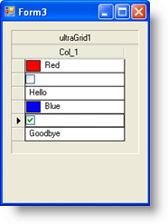

////

|metadata|
{
    "name": "wingrid-using-different-editors-in-individual-cells",
    "controlName": ["WinGrid"],
    "tags": ["Application Scenarios","Extending","Grids"],
    "guid": "{CF4C213D-092A-4CC0-A2FC-87B43B64B28E}",  
    "buildFlags": [],
    "createdOn": "0001-01-01T00:00:00Z"
}
|metadata|
////

= 個別セルで異なるエディタを使用

Column レベルで埋め込みエディタを使用することに加えて、Cell レベルで設定することも可能です。列に対して特定のエディタを指定する場合、その列内のすべてのセルでそのエディタのひとつのインスタンスだけが共有されます。個々のセルでエディタを指定する場合、そのひとつのセルがエディタのそのひとつのインスタンスを使用します。ほとんどの使用事例でひとつのエディタが列全体に指定されることを必要とします。たとえば、その列のセル内に表示するドロップダウン カレンダーからエンド ユーザーが Date 値をナビゲートして選択することができるように、WinCalendarCombo™ を使用するように OrderDate 列を構成することができます。あまり頻繁ではない使用事例ではセル単位で異なるエディタを必要とします。たとえば、異なる種類のデータ タイプを表すことができる値を列が呼び出すようにすることができます。Row 1 は数である値セルを持つことができます。これによってその特定のセルに Numeric エディタを作成および指定することができます。Row 2 の値セルには Date データ タイプを含むことができます。これは WinCalendarCombo のインスタンスを使用して表すことができます。Row 3 の値セルは WinCheckEditor™ コントロールのインスタンスによって表すことができるブール値を表すことができます。いずれの方法でも、WinGrid™ は両方のシナリオをサポートします。

== 複数のデータ タイプに対応

通常複数のデータ タイプに対応するために、複数のデータ タイプに対応できるプロパティを持つデータ モデルを必要とします。以下のコードの例は DataTable を使用するシンプルな実装を示します:

*Visual Basic の場合：*

----
Dim t As New DataTable
t.Columns.Add("Col_1", GetType(Object))
t.Rows.Add(New Object() {Color.Red})
t.Rows.Add(New Object() {False})
t.Rows.Add(New Object() {"Hello"})
t.Rows.Add(New Object() {Color.Blue})
t.Rows.Add(New Object() {True})
t.Rows.Add(New Object() {"Goodbye"})
----

*C# の場合：*

----
DataTable t = new DataTable();
t.Columns.Add("Col_1", typeof(object));
t.Rows.Add(new object[] { Color.Red });
t.Rows.Add(new object[] { false });
t.Rows.Add(new object[] { "Hello" });
t.Rows.Add(new object[] { Color.Blue });
t.Rows.Add(new object[] { true });
t.Rows.Add(new object[] { "Goodbye" });
----

異なるエディタ タイプをテストおよび指定するために適切なイベントは WinGrid の InitializeRow イベントです。このイベントは描画中の各 WinGrid Row に対して 1 回発生します。イベント引数は、イベントに入ってくると各行を公開します。ここでテストを実行でき、結果に応じて異なるエディタを対象のセルに指定することができます。

以下のコードは特定のセル値のデータ タイプをテストして、適切なエディタをそのセルに指定するために InitializeRow イベントが処理される方法を示します。

*Visual Basic の場合：*

----
Private Sub UltraGrid1_InitializeRow( _
    ByVal sender As System.Object, _
    ByVal e As InitializeRowEventArgs) _
    Handles UltraGrid1.InitializeRow
        'Create the Settings Object:
        Dim theSettings As New DefaultEditorOwnerSettings
        'as well as the Editor Owner:
        Dim theOwner As New DefaultEditorOwner(theSettings)
        Dim theEditor As EmbeddableEditorBase = Nothing
        Dim theValue As Object = e.Row.Cells(0).Value
        'Create an appropriate editor based on the
        'Value's Data Type:
        If TypeOf theValue Is Boolean Then
            theSettings.DataType = GetType(Boolean)
            theEditor = New CheckEditor(theOwner)
        ElseIf TypeOf theValue Is Color Then
            theSettings.DataType = GetType(Color)
            theEditor = New ColorPickerEditor(theOwner)
        ElseIf TypeOf theValue Is String Then
            theSettings.DataType = GetType(String)
            theEditor = New EditorWithText(theOwner)
        End If
        'Assign it to the Cell.Editor
        e.Row.Cells(0).Editor = theEditor
End Sub
----

*C# の場合：*

----
private void ultraGrid1_InitializeRow(
    object sender, 
Infragistics.Win.UltraWinGrid.InitializeRowEventArgs e)
{
    //Create the Settings Object:
    DefaultEditorOwnerSettings theSettings = 
        new DefaultEditorOwnerSettings();
    //as well as the Editor Owner:
    DefaultEditorOwner theOwner = new DefaultEditorOwner(theSettings);
    EmbeddableEditorBase theEditor = null;
    object theValue = e.Row.Cells[0].Value;
    //Create an appropriate editor based on the
    //Value's Data Type:
    if (theValue is bool)
    {
        theSettings.DataType = typeof(bool);
        theEditor = new CheckEditor(theOwner);
    }
    else if (theValue is Color)
    {
        theSettings.DataType = typeof(Color);
        theEditor = new ColorPickerEditor(theOwner);
    }
    else if (theValue is string)
    {
        theSettings.DataType = typeof(string);
        theEditor = new EditorWithText(theOwner);
    }
    //Assign it to the Cell.Editor
    e.Row.Cells[0].Editor = theEditor;
}
----

各行が初期化されると、データ タイプを決定するためにセル 0 の値が検討されます。それが Boolean の場合、CheckEditor の新しいインスタンスを作成してそのセルに指定します。それが Color の場合、 Color Picker の新しいインスタンスを作成してそのセルに指定します。最後にそれが String の場合、標準的な EditorWithText を作成してそのセルに指定します。さまざまなデータ タイプだけでなくより複雑なロジックを含むようにこれを作成することができます。実行する時、フォームは以下のようになります:

コードで気づく場合、クラス DefaultEditorOwnerSettings が使用されています。これは、関連付けられたさまざまなエディタ コントロールに適用されるプロパティ設定を含むクラスにすぎません。DefaultEditorOwnerSettings クラスには、マスクの特性、フォーマッティング、データ タイプ、最小および最大文字長だけでなく最小および最大値を構成することができるプロパティが含まれます。セル単位でエディタを指定する時には常にこの例で示したようにより下位でエディタを構成する必要があります。

列およびセルの両レベル エディタを実装する方法を理解すると、これらの使用事例すべてに対応できる UI を構築することができます。