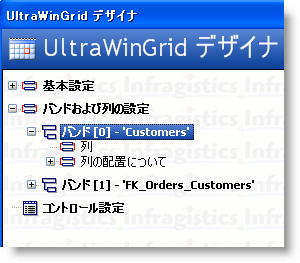
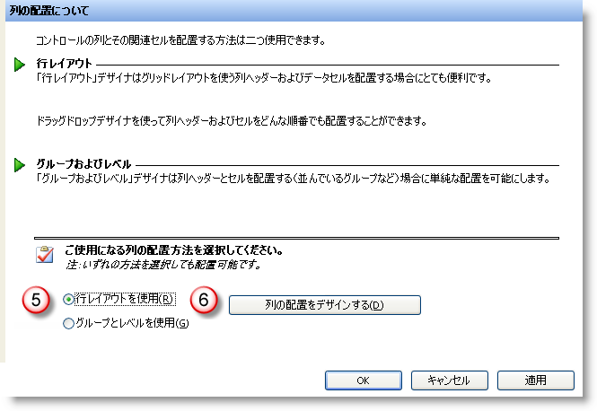
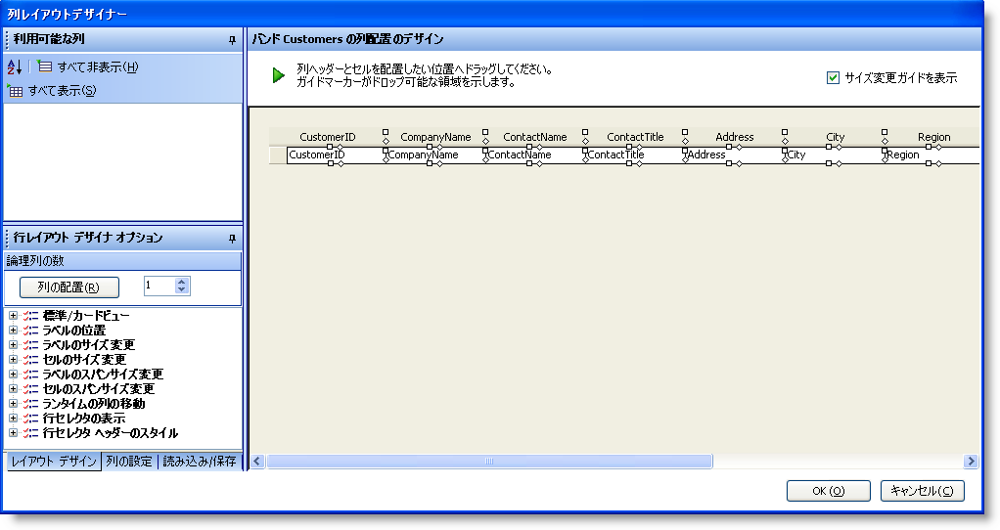
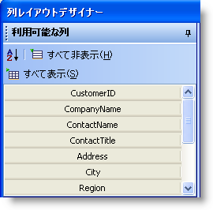
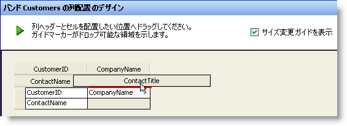
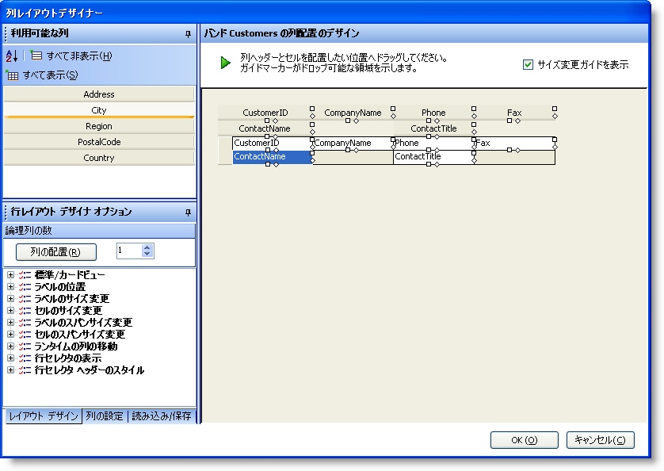
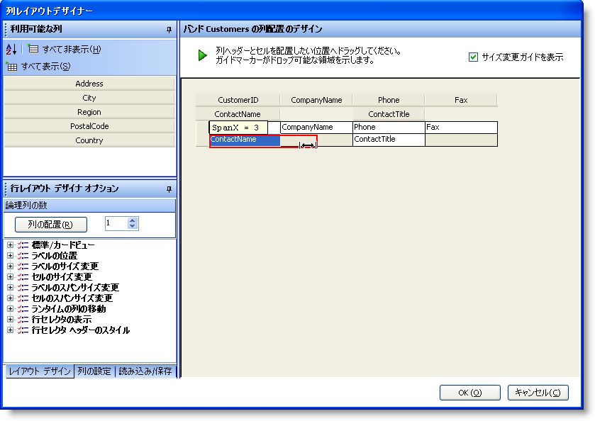
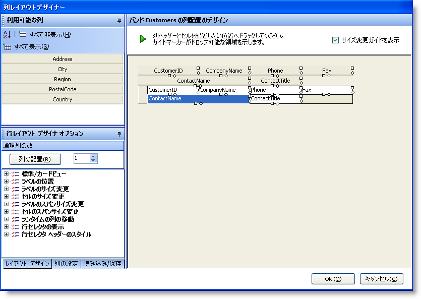
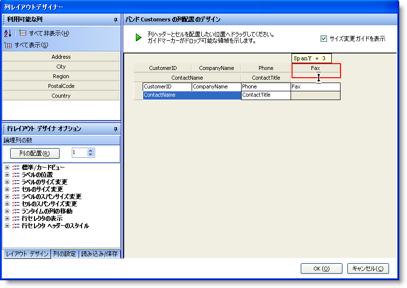
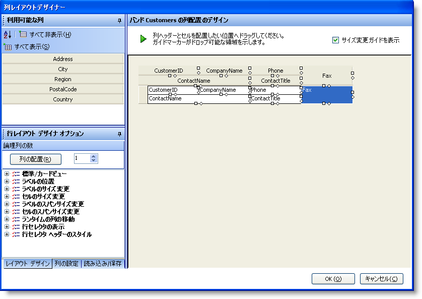

////

|metadata|
{
    "name": "wingrid-using-row-layouts-designer",
    "controlName": ["WinGrid"],
    "tags": ["Application Scenarios","Grids"],
    "guid": "{C16D4E77-9468-430E-B187-0060F375FE42}",  
    "buildFlags": [],
    "createdOn": "0001-01-01T00:00:00Z"
}
|metadata|
////

= 行レイアウト デザイナの使用

== 始める前に

以前、WinGrid™ をカスタマイズして複雑な行をレイアウトするのが困難でした。理想の外観にするためにプロパティの設定およびコードを書くには、行レイアウトの使用方法の理解が必要でした。それを改善するために、インフラジスティックスは多機能で直感的な行レイアウトのデザイナを提供します。このツールを使用して、あっという間に複雑でカスタム レイアウトを作成できます。見た通りのものがすべて結果に反映され、ドラッグ アンド ドロップ インタラクションによって可能になり、列ヘッダをすばやく移動しながら理想の外観を作れます。

== 達成できること

下記の手順は、行レイアウト デザイナを実行する方法の説明です。複数バンド/エンティティのあるデータ ソースで使用できるデザインタイムにバウンドされた WinGriｄ インスタンス付き Windows Form がすでにあることが前提です。

== 次の手順を実行します

[start=1]
. WinGrid の 「スタート」 ボタンをクリックしてください。UltraWinGrid デザイナが実行されます。
[start=2]
. 左側のメニュー ツリーの　「バンドおよび列の設定」 のノードを検索します。これを展開してください。
[start=3]
. WinGrid で有効な各エンティティまたはバンドに 1 つノードがあります。この例では、顧客のバンドを使用します。

[start=4]
. 顧客のバンド展開をして、「列配置の概要」 をクリックしてください。
[start=5]
. デザイナの右に向って、行レイアウトの使用またはグループおよびレベルの使用のオプションがあります。「行レイアウトの使用」 を選択してください。
[start=6]
. 「すぐに列の配置をデザインする」 ボタンをクリックしてください。行レイアウト デザイナーが実行されます。

[start=7]
. この時点で、グリッドおよび顧客のバンドのためのスキーマのカスタマイズができます。はじめに、プレビュー グリッドの各列のヘッダーをダブル クリックするとプレビューからすべての列のヘッダーが消えます。

[NOTE]
====
*注：* 各列ヘッダーをダブルクリックをすると、プレビュー グリッドから消えて利用可能な列の領域に表示します:
====

[start=8]
. 白紙の状態で開始できます。ここから、利用可能な列からプレビュー グリッドへ列をドラッグ アンド ドロップできます。
[start=9]
. 列をドラッグ、ドロップまたは配置して理想の外観を実現できます:

[start=10]
. 各列ヘッダーまたはセルを縁取る小さな 「ハンドル」 または小さな形状があります。サイズ変更ガイドです。これを使用して列ヘッダーまたはセルのサイズ変更したり、垂直方向および水平方向にスパンできます。
[start=11]
. 下記ような配置から始めます:

[start=12]
. ContactName の列ヘッダーの右にあるダイヤ形のサイズ変更ガイドをクリックして、空白の領域が完全に埋まるまでドラッグしてください。

[start=13]
. 完了すると、レイアウトは下記の外観のようになります:

[start=14]
. ContactName の列ヘッダーの水平方向のスパンを設定しました。各列ヘッダーまたはセルが水平および垂直の両方に 2 つの仮想単位を占有します。列ヘッダーを右までドラッグをすることによって、追加 2 つの単位 (合計 4 つ) を占有します。
[start=15]
. Fax 列ヘッダーが垂直方向にスパンする設定するためには、列ヘッダーの下のダイヤ形のサイズ変更ガイドをクリックして、空白の領域が完全に埋まるまで下へドラッグしてください:

[start=16]
. 完了すると、グリッドのレイアウトは下記のようになります:

利用可能な列の領域に残る列ヘッダーは WinGrid に表示されません。「OK」 ボタンをクリックして、WinGrid に直接レイアウトを設定します。このかんたんな手順を理解すると、エンド ユーザーに素晴らしいグリッド ビューの外観を提供できます。多数の列ヘッダーやさまざまな列データ タイプがあるグリッドを配置するには、行レイアウトが最適です。たとえば、テキストの大きな段落からなる 「メモ」 フィールドがある場合があります。普通は、小さな単一セルにこの型のデータを表示するのは実用的ではありません。書式、スクロールバーまたは折り返し付きの大きなテキスト領域のほうが実用的です。行レイアウトを列のビルトイン プロパティと一緒に使用をすることによって、簡単に実現できます。