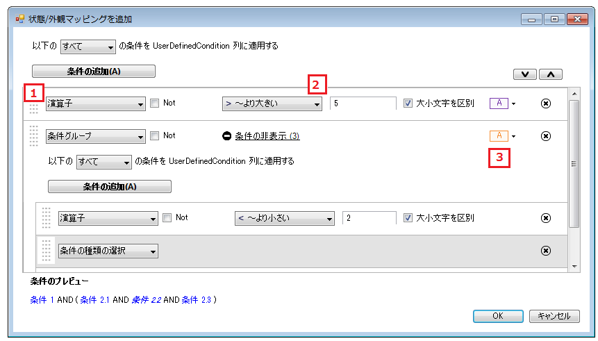

////

|metadata|
{
    "name": "wingrid-using-the-conditional-formatting-dialog-box",
    "controlName": ["WinGrid"],
    "tags": ["Grids","Styling"],
    "guid": "{34AF6C72-C205-4B1B-BC28-2236746898CC}",  
    "buildFlags": [],
    "createdOn": "0001-01-01T00:00:00Z"
}
|metadata|
////

= 条件フォーマッティング ダイアログ ボックスを使用

[条件フォーマッティング] ダイアログ ボックスによって、条件/外観マッピングを簡単に作成できます。特定の列のダイアログ ボックスにアクセスするには、[プロパティ] ウィンドウの DisplayLayout オブジェクトを展開します。Bands オブジェクトでナビゲートし、Columns コレクションに下がります。省略記号をクリックし、列コレクション エディターが表示します。条件/外観マッピングを設定したい列を選択します。[プロパティ] ウィンドウの ValueBasedAppearance プロパティを検索し、その隣にある省略記号をクリックします。[条件フォーマッティング] ダイアログ ボックスが表示します。

== 条件の追加と削除

左のセクション (上記の画像ではセクション 1 とラベル表示されている) によって、演算子および数式条件および条件グループを追加することができます。条件グループは、他の演算子および数式条件の単純なコレクションです。デフォルトでは、一致するすべての条件はその条件の外観が適用されます。条件を削除するには、条件行の右側にある削除ボタンをクリックします。

== 条件を編集

中央のセクション（上記の画像ではセクション 2 とラベル表示されている）は、すべての条件（組み込みおよび数式）および条件グループを表示します。

== 演算子条件

組み込み条件を追加する場合、デフォルト値でこのセクションに表示します。

* *IsComplement* -- IsComplement チェックボックスを選択し、条件を逆に変換します。
* *CaseSensitive* -- CaseSensitive チェックボックスの選択を解除し、文字列の一致ときに列の大文字小文字を無視します。
* *Operator* -- 演算子ドロップダウン リストから演算子を選択し、セル値と条件値の間で評価を実行します。
* *Value* -- エディタ タイプは、[DataSource] 列と同じタイプです。DataSource のデータ タイプが整数の場合、エディタに数値をおくことだけが可能になります。DataSource のデータ タイプが文字列の場合、任意のテキストを入力できますが、エディタに数値を置いても文字列として処理されます。この列はセルの値を使用して、選択した演算子でその値に対してテストします。

== 数式条件

数式条件を追加すると、フォーミュラ ビルダー ボタンが付いたエディタが現れます。このボタンをクリックすると、[フォーミュラ ビルダー] ダイアログが開きます。このダイアログ ボックスを通して、多くの複雑な数式を作成できます。フォーミュラ ビルダーの詳細は、 link:using-wincalcmanager-with-wingrid.html[「WinGrid で WinCalcManager を使用」]を参照してください。数式での作業が終了したら、[OK] をクリックして [フォーミュラ ビルダー] ダイアログ ボックスを閉じます。新しい数式がエディタに表示し、数式条件としてそれを識別します。数式条件を再編集するには、エディタで [フォーミュラ ビルダー] ボタンをクリックします。

== 条件グループ

ドロップダウンから [条件グループ] を選択すると、新しい条件グループが作成されます。

この選択への追加は論理演算子です。And と Any の 2 つの選択によって、条件 1 と条件 2 または条件 1 または条件 2 をそれぞれ一致させることができます。All 演算子を使用する場合、グループのすべての条件は、一致する外観を適用するために満たされる必要があります。Any 演算子の使用は、どちらかの条件が True を返す外観の一致を適用し、すべての条件に依存するわけではありません。

== 外観の一致

右側の選択 (上記の画像ではセクション 3 とラベル表示されている) は、条件に一致するセルの外観を変更することができるドロップダウンです。各演算子条件、演算子条件、および条件グループは、それに関連する一致する外観オブジェクトを持ちます。