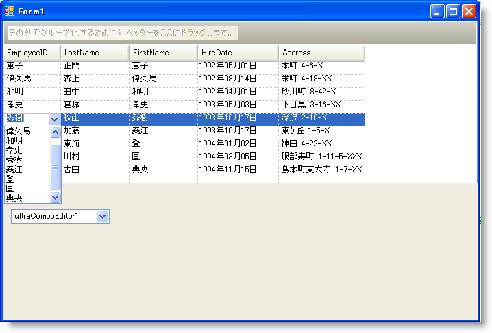

////

|metadata|
{
    "name": "wingrid-using-wincomboeditor-inside-wingrid",
    "controlName": ["WinGrid"],
    "tags": ["Application Scenarios","Data Presentation","Extending","Grids"],
    "guid": "{2299CD73-0A3E-4CFE-BBF2-426594996B4B}",  
    "buildFlags": [],
    "createdOn": "0001-01-01T00:00:00Z"
}
|metadata|
////

= WinGrid 内で WinComboEditor を使用

== 始める前に

このトピックは 2 部から構成される詳細なガイドの第 2 部です。 このトピックの理解を最大限に深めるためには、 link:wingrid-using-windropdown-inside-wingrid.html[「WinGrid 内で WinDropDown を使用」]を参照してください。

== 達成すること

「WinGrid 内で WinDropDown を使用」で作業をしてきた既存の Windows Form サンプルを使用し、WinComboEditor™ を使用して値のシンプルなドロップダウン リストを EmployeeID 列に追加します。これは Orders Entity を Employees Entity に関係づける Foreign Key を表します。

== 次の手順を実行します

[start=1]
. Visual Studio ツールボックスで、UltraComboEditor コントロールを指定して Form にドラッグします。
[start=2]
. DataSource プロパティを Employees DataTable に設定します。
[start=3]
. DisplayMember プロパティを FirstName に設定します。 これはドロップダウン リスト内に表示するためにこのフィールド内でデータを使用するように ComboEditor に通知します。
[start=4]
. その ValueMember プロパティを EmployeeID に設定します。 これは WinGrid の EmployeeID 列に指定するためにこのフィールド内でデータを使用するように ComboEditor に通知します。 つまり、ユーザーがリスト項目を選択すると、その選択された項目からの関連づけられた EmployeeID 値がその行の実際の WinGrid EmployeeID セルに指定されます。 これはその列内の既存の値に基づいてどのリスト項目が自動的に選択されるのかも示します。
[start=5]
. WinGrid の [スタート] ボタンをクリックすることによって UltraWinGrid デザイナーを起動します。
[start=6]
. [バンドおよび列の設定] で、[バンド[0] - 'Orders'] の順にノードを展開し、列ノードをクリックします。
[start=7]
. EmployeeID 列を指定してクリックします。
[start=8]
. ComboEditor を列の pick:[win-forms="link:{ApiPlatform}win.ultrawingrid{ApiVersion}~infragistics.win.ultrawingrid.ultragridcolumn~editorcomponent.html[EditorComponent]"]  プロパティに指定します。 EditorComponent プロパティを指定して、ドロップダウン リストから UltraComboEditor1 を選択します。

image::images/WinGrid_Using_WinComboEditor_inside_WinGrid_01.png[UltraGrid デザイナー]

[start=9]
. 適切な Data Adapters または Table Adapters を使用して Employees DataTable を埋めて生成するためのコードがあることを前提として、アプリケーションを実行すると、WinGrid は以下の画像のようになります。

今回、値の非常にシンプルなドロップダウン リストがどのようにできたかに注目してください。 多数の列を示す DropDown と異なり、ComboEditor は一列の情報しか表示しません。 もうひとつ注目すべきことは、実行する時に ComboEditor が Windows Form にまだ表示されているという事実です。 エンドユーザーに表示されないように Visible プロパティを False に設定する必要があります。 通常、すべての IProvidesEmbeddableEditor の実装では、ランタイムに非表示になるように Visible プロパティを False に設定する必要があります。 このインターフェイスを実装するコントロールは、WinGrid 内に組み込むことも可能であることに加えて、ほとんど常に Windows Form に配置されるスタンドアローンのエディターとして使用できるため、これは通常そうなります。 UltraComboEditor の使用の長所は、データ入力にとって意味がない（読み取り専用）WinGrid があったとしても Foreign Key フィールドに関連づけられたユーザー フレンドリーな文字列を示すためにこの方法をこれまで同様使用できます。 これは、Join to the Lookup Table を含むように SQL ステートメントを変更することによって、オブジェクトの固有のリストを作成することよりも遙かに簡単です。