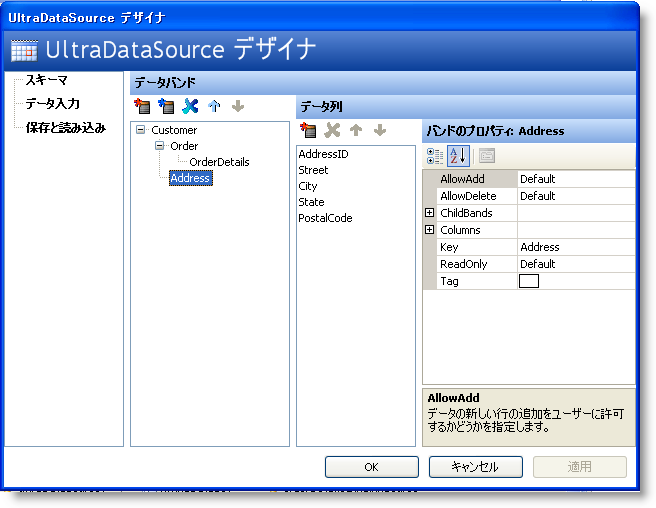

////

|metadata|
{
    "name": "wingrid-using-windatasource",
    "controlName": ["WinGrid"],
    "tags": ["Extending","Grids"],
    "guid": "{255EB302-9753-4EE9-8241-FF7D90E53E91}",  
    "buildFlags": [],
    "createdOn": "0001-01-01T00:00:00Z"
}
|metadata|
////

= WinDataSource を使用

WinGrid™ とユーザーのバインドされていないデータ間の中間レイヤとして動作する DataTable を使用するよりも、Infragistics ツールボックスのもうひとつのツールである WinDataSource™ がこの目的のために存在します。Windows Form に追加されると、WinDataSource は非視覚的なコンポーネントとして Component Tray に置かれます。クイック デザイナを使用してエンティティおよびスキーマを素早く作成できます。以下の画像は、WinDataSource クイック デザイナおよび複雑なデータ モデルを速やかに作成することがいかに簡単かを示しています。

WinDataSource を WinGrid に指定するためにデザイナを使用する場合、どのようにしてすべてのエンティティが使用でき WinGrid スキーマ内で再作成されるかを確認してください。

Customer は親バンドで、Customer には 2 つの子コレクションがあります。Customer が Customer の異なるアドレスのすべてを持つことができるすべての Order を表すそれぞれの Order および Address。Order エンティティは、Order を構成する Line Items を表す子コレクション OrderDetail も持ちます。

WinDataSource およびクイック デザイナを使用すると複雑な階層的なデータ モデルを作成することは速やかに実行できます。IList / IBindingList 機能のすべては自動的に含まれます。