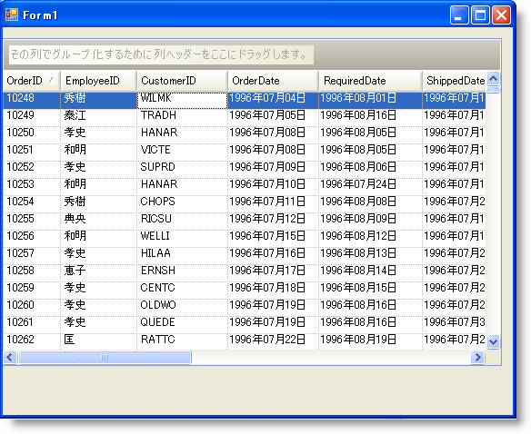
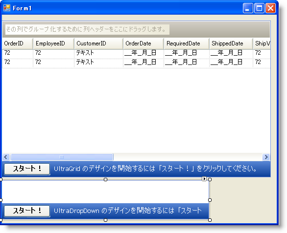
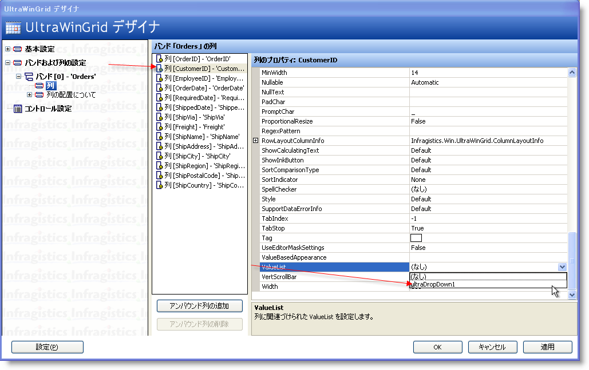
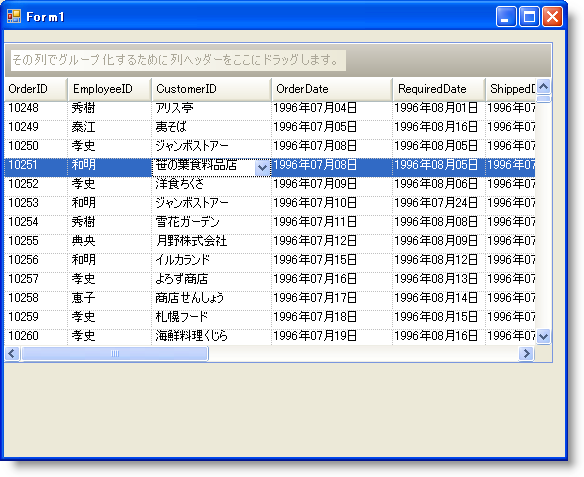

////

|metadata|
{
    "name": "wingrid-using-windropdown-inside-wingrid",
    "controlName": ["WinGrid"],
    "tags": ["Application Scenarios","Data Presentation","Extending","Grids"],
    "guid": "{EF394DF0-A350-4047-B086-EE5DFFEA3AE7}",  
    "buildFlags": [],
    "createdOn": "0001-01-01T00:00:00Z"
}
|metadata|
////

= WinGrid 内で WinDropDown を使用

== 始める前に

データ モデルで作業する時、それが Visual Studio で生成した DataSet であるか、カスタム ビジネス オブジェクト ライブラリであるかにかかわらず、ほとんどの場合もうひとつのテーブルの項目に関連する Key を表すひとつまたは複数のプロパティを含むエンティティを持ちます。これらのプロパティまたはフィールドは通常、Foreign Key オブジェクトを通してデータベースに関連付けられるか、ユーザーのライブラリのビジネス ロジック レイヤーを通して論理的に関連付けることができます。これがどのように実装されようとも、理解すべき点は、WinGrid™ を通してエンド ユーザーに示したいオブジェクトのコレクションを持っており、表示されるこれらの Foreign Key フィールドも持つことになるということです。伝統的に、より意味のある何かをエンド ユーザーに示す方法を思い付く必要がありました。ところが実際は Foreign Key 値はユーザーにとって何ら意味をなしません。もうひとつのジレンマは、エンド ユーザーにレコードの変更を許可することで、そのフィールドのエントリで可能となる値だけを入力するための方法を思い付くことも必要であることを意味します。たとえば、Orders のコレクションがあり、WinGrid にこれをバインドする場合、ユーザーは Order Table を Customer Table に関連付ける Foreign Key に期せずしてなる CustomerID 列を持ちます。このフィールドに入力される CustomerID 値は、Customer テーブルに存在する必要があります。そうでなければ、変更を Database に戻して解決しようとすると必ず例外がスローされます。Infragistics Toolbox で使用可能なツールを使用すれば、この問題を簡単かつ的確に解決できます。以下は、Northwind Database にあるオブジェクトを含む Visual Studio で生成された DataSet を使用することに基づいています。Customers および Orders エンティティで作業します。

== Valuelists

各 WinGrid Column には pick:[win-forms="link:{ApiPlatform}win.ultrawingrid{ApiVersion}~infragistics.win.ultrawingrid.ultragridcolumn~valuelist.html[ValueList]"]  プロパティがあります。ValueList は、ひとつの列または複数列のドロップダウン コンボ ボックスとして表示できる相互排他的な項目のリストにすぎません。Orders DataTable に WinGrid が直接バインドされたケースでは、Customers Entity に関連付けられた CustomerID 列があります。通常、アプリケーションを実行する場合、実際の Foreign Key 値が表示されます。

== 達成すること

この例では、値のドロップダウン リストをエンド ユーザーに提供するために WinDropDown™ コントロールを使用する方法を示します。以下の手順は、Northwind Database にポイントする Visual Studio で生成した DataSet を使用して Customers DataTable にバインドされる WinGrid を持つ Form と共に Windows Forms Application があることを想定しています。これは、正しい Data Adapters または Table Adapters を使用してデータベースからデータで Customers および Orders DataTables を埋めるためにコードを既に記述していることも想定しています。

== 次の手順を実行します

[start=1]
. Visual Studio Toolbox で UltraDropDown コントロールを指定して Form にインスタンスをドラッグします。
[start=2]
. デザインタイムに、UltraDropDown は意味をなさない方法で描画する場合があります。事実、これは WinGrid と似ている場合や以下の画像で示すように表示される場合があります。

[start=3]
. UltraDropDown コントロールをクリックし、[プロパティ] ウィンドウで、その DataSource を Northwind DataSet 内の Customers DataTable に設定します。
[start=4]
. DisplayMember プロパティを指定し、その値を CompanyName に設定します。これはドロップダウンされない時に常にエンド ユーザーに表示するためにドロップダウンが基本データ ソースからどのフィールドを使用しなければならないかをドロップダウンに指示します。
[start=5]
. ValueMember プロパティを指定し、その値を CustomerID に設定します。これは、選択が行われる時に関連する WinGrid Cell に値を指定するために、ドロップダウンが基本データ ソースからどのフィールドを使用しなければならないかをドロップダウンに指示します。
[start=6]
. WinGrid で [スタート] ボタンを直接クリックし、UltraWinGrid デザイナを起動します。
[start=7]
. [バンドおよび列の設定] ノードの下で、Band [0] 'Orders' ノードを展開して列ノードをクリックします。これで Band ‘Orders’ の Columns のリストが表示します。
[start=8]
. CustomerID の列を指定してクリックします。ValueList プロパティを指定します。
[start=9]
. Windows Form に ValueList 実装コントロールを配置しているので、ValueList ドロップダウン ボタンからそれを見ることができます。

[start=10]
. コンボ ボックスから UltraDropDown1 を選択します。
[start=11]
. アプリケーションを保存および実行すると、CustomerID 列の違いが分かります。

実際の外部キー値を示す CustomerID Column の代わりに、UltraDropDown の Data Source から CompanyName フィールド内にあるデータであればどれでも表示します。これによって、エンド ユーザーはこの Order の関連付けられた Customer を識別することが容易になります。もうひとつのメリットは、列に直接 CustomerID を入力しなければならないのではなく、エンド ユーザーは値のドロップダウン リストから簡単に選択できます。UltraDropDown は複数の列の表示をサポートするので、エンド ユーザーはレコードを識別し正しい選択をするために多くの情報を持ちます。

