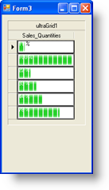

////

|metadata|
{
    "name": "wingrid-using-winprogressbar-inside-wingrid",
    "controlName": ["WinGrid"],
    "tags": ["Application Scenarios","Extending","Grids"],
    "guid": "{7A2DA339-21BF-41BD-B795-B416B7991DC4}",  
    "buildFlags": [],
    "createdOn": "0001-01-01T00:00:00Z"
}
|metadata|
////

= WinGrid 内で WinProgressBar を使用します

WinGrid™ 列に組み込むことができる異なる Infragistics エディタの中で、WinProgressBar™ は数値をグラフィカルで進捗状況のような表示で示す際に非常に役に立ちます。プログレス バーは通常動作するために 3 つのプロパティを必要とします。実際の値だけでなく、最小値、最大値を必要とします。WinGrid で組み込まれる時、WinProgressBar は値としてセル値を使用します。バーの長さを描画する方法がわかるように、最小値と最大値をプログレス バー上に直接設定する必要があります。

WinGrid の pick:[win-forms="link:{ApiPlatform}win.ultrawingrid{ApiVersion}~infragistics.win.ultrawingrid.ultragrid~initializelayout_ev.html[InitializeLayout]"]  イベントを使用してプログレス バーを指定する方法に注意してください。ここで実行しているようにランタイムにコントロールを指定することを選択する場合、これは使用に最適のイベントです。現在、WinGrid の Schema（Columns および Bands）は使用する準備ができているからです。プログレス バーの最小値は 0 であると想定されます。最大値は、列の最大数を表す値に設定すべきです。この特定の例はセールス トランザクションの量を表す数値データにバインドされた WinGrid を示します。設定可能な最小数は 0 で、最大数は BusinessData クラスの GetTopSalesQty メソッドによって返される数であればどれでもかまいません。

以下のコードは、ランタイムに WinProgressBar を数値の WinGrid 列に指定することができる方法を示します（すべての pick:[win-forms="link:{ApiPlatform}win{ApiVersion}~infragistics.win.iprovidesembeddableeditor.html[IProvidesEmbeddableEditor]"]  実装はこのようにランタイムに指定することができます）。

*Visual Basic の場合：*

----
Private Sub UltraGrid1_InitializeLayout( _
  ByVal sender As System.Object, _
  ByVal e As InitializeLayoutEventArgs) _
  Handles UltraGrid1.InitializeLayout
    Me.ultraProgressBar1.Minimum = 0
    Me.ultraProgressBar1.Maximum = BusinessData.GetTopSalesQty()
    e.Layout.Bands(0).Columns("Sales_Quantities ").EditorControl = _
      Me.ultraProgressBar1
End Sub
----

*C# の場合：*

----
private void ultraGrid1_InitializeLayout(
  object sender, 
  InitializeLayoutEventArgs e)
{
    this.ultraProgressBar1.Minimum = 0;
    this.ultraProgressBar1.Maximum = BusinessData.GetTopSalesQty();
    e.Layout.Bands[0].Columns["Sales_Quantities"].EditorControl = 
      this.ultraProgressBar1;
}
----