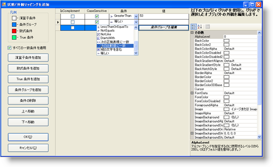

////

|metadata|
{
    "name": "wingrid-you-can-now-conditionally-format-cells-in-a-wingrid-column-whats-new-20071",
    "controlName": [],
    "tags": [],
    "guid": "{7F375A35-6ECE-4DA4-B1A2-A1F576106C1E}",  
    "buildFlags": [],
    "createdOn": "2006-11-12T15:30:59Z"
}
|metadata|
////

= WinGrid 列のセルを条件フォーマットできる

値に基づくセルの外観の変更は面倒な作業でした。pick:[win-forms="link:{ApiPlatform}win.ultrawingrid{ApiVersion}~infragistics.win.ultrawingrid.ultragrid~initializerow_ev.html[InitializeRow]"]  イベント中に各値をテストしなければならなかったからです。このコードは大幅にカスタマイズする必要があり、時間がかかりました。列で異なるセルを条件的にフォーマットするより時間的に効率的な方法を弊社は提供しています。

新しい条件的なフォーマット機能を使用すれば、シンプルなダイアログ ボックスで簡単に条件文を作成できます。行う必要があることは、新しい pick:[win-forms="link:{ApiPlatform}win{ApiVersion}~infragistics.win.operatorcondition.html[OperatorCondition]"]  を作成し、それを列の pick:[win-forms="link:{ApiPlatform}win.ultrawingrid{ApiVersion}~infragistics.win.ultrawingrid.ultragridcolumn~valuebasedappearance.html[ValueBasedAppearance]"]  プロパティにリンクするだけです。ValueBasedAppearance プロパティが設定されたら、列は OperatorCondition を使用して、ユーザーが指定する任意の条件に対して列のセルのすべての値をテストします。

pick:[win-forms="link:{ApiPlatform}win{ApiVersion}~infragistics.win.conditiongroup.html[ConditionGroup]"]  に複数の OperatorConditions を追加することで複数の条件文を使用することもできます。すべての条件が満たされるか、またはひとつだけの条件が満たされる場合、外観が適用されることを選択できます。

== 関連トピック

link:wingrid-using-the-conditional-formatting-dialog-box.html[条件フォーマッティング ダイアログ ボックスを使用]

link:wingrid-creating-an-operator-condition.html[演算子条件を作成]

link:wingrid-creating-a-formula-condition.html[数式条件を作成]

link:wingrid-combining-multiple-conditions.html[複数の条件を結合]

link:wingrid-implementing-conditional-formatting-at-design-time.html[デザイン タイムで条件フォーマッティングを実装]