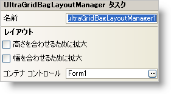

////

|metadata|
{
    "name": "wingridbaglayoutmanager-smart-tag",
    "controlName": [],
    "tags": ["Getting Started"],
    "guid": "{EEBC17EE-FC1E-46F7-9BC7-535E0D7EED1D}",  
    "buildFlags": [],
    "createdOn": "2005-07-11T00:00:00Z"
}
|metadata|
////

= WinGridBagLayoutManager スマート タグ

Visual Studio 2005（.NET Framework 2.0）では、それぞれの {ProductName} コントロール/コンポーネントが固有のスマート タグを備えています。 コントロール/コンポーネントを単に選択すると、Smart Tag のアンカーが表示されます。このアンカーをクリックするとポップアップ パネルが表示され、そこからコントロール/コンポーネントの最もよく使用するプロパティや設定にすばやく簡単にアクセスできます。

WinGridBagLayoutManager スマート タグには、コンポーネントの名前と次のセクションがあります。

* レイアウト -- WinGridBagLayoutManager コンポーネントによって管理されるフォーム上のコントロールをどのように配列するかを指定するプロパティがあります。

各セクションの項目（たとえば、フィールド、ドロップダウン リスト、チェックボックス）およびプロパティ グリッドの項目の対応するプロパティの説明については以下を参照してください。

[options="header", cols="a,a,a"]
|====
|レイアウト|説明|対応するプロパティ

|高さを合わせるために拡大
|このチェックボックスを選択すると、WinGridBagLayoutManager コンポーネントはコンテナの縦方向のスペースが余らないようにすべての論理行のサイズを比例して拡大します。
| link:{ApiPlatform}win.misc{ApiVersion}~infragistics.win.misc.ultragridbaglayoutmanager~expandtofitheight.html[ExpandToFitHeight]

|幅を合わせるために拡大
|このチェックボックスを選択すると、コンテナの横方向のスペースが余らないようにすべての論理列のサイズを比例して拡大します。
| link:{ApiPlatform}win.misc{ApiVersion}~infragistics.win.misc.ultragridbaglayoutmanager~expandtofitwidth.html[ExpandToFitWidth]

|コンテナ コントロール
|たとえば WinGroupBox または WinExpandableGroupBox を使用している場合、WinGridBagLayoutManager はコンテナ コントロールの内部にあるすべての子コントロールのレイアウトを制御します。たとえば、コンテナ コントロールを "ultraGroupBox1" に設定すると（これはプロパティ グリッドの ContainerControl プロパティでも設定できます）、"ultraGroupBox1" の内部にあるコントロールのレイアウトが WinGridBagLayoutManager によって制御されます。
| link:{ApiPlatform}win.misc{ApiVersion}~infragistics.win.misc.controllayoutmanagerbase~containercontrol.html[ContainerControl]

|====