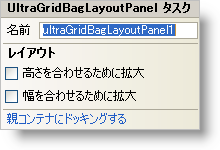

////

|metadata|
{
    "name": "wingridbaglayoutpanel-smart-tag",
    "controlName": ["WinGridBagLayoutPanel"],
    "tags": ["API","Design Environment"],
    "guid": "{B0A04413-3FCD-4F8E-8DD6-F713C5E88653}",  
    "buildFlags": [],
    "createdOn": "0001-01-01T00:00:00Z"
}
|metadata|
////

= WinGridBagLayoutPanel スマート タグ

Visual Studio 2005（.NET Framework 2.0）では、それぞれの {ProductName} コントロール/コンポーネントが固有のスマート タグを備えています。コントロール/コンポーネントを単に選択すると、Smart Tag のアンカーが表示されます。このアンカーをクリックするとポップアップ パネルが表示され、そこからコントロール/コンポーネントの最もよく使用するプロパティや設定にすばやく簡単にアクセスできます。

WinGridBagLayoutPanel スマート タグには、以下のセクションと共にコントロールの名前が含まれます。

* レイアウト -- コントロールをフォームのどこに、どのように配置するかを指定するプロパティがあります。

各セクションの項目（たとえば、フィールド、ドロップダウン リスト、チェックボックス）およびプロパティ グリッドの項目の対応するプロパティの説明については以下を参照してください。

[options="header", cols="a,a,a"]
|====
|レイアウト|説明|対応するプロパティ

|高さを合わせるために拡大
|余分に使用できる高さに合わせるためにすべての管理された項目の高さを拡大します。
| link:{ApiPlatform}win.misc{ApiVersion}~infragistics.win.misc.ultragridbaglayoutpanel~expandtofitheight.html[ExpandToFitHeight]

|幅を合わせるために拡大
|余分に使用できる幅に合わせるためにすべての管理された項目の幅を拡大します。
| link:{ApiPlatform}win.misc{ApiVersion}~infragistics.win.misc.ultragridbaglayoutpanel~expandtofitwidth.html[ExpandToFitWidth]

|親コンテナのドック
|Dock プロパティを Fill に設定します。
|ドック

|====