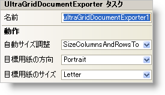

////

|metadata|
{
    "name": "wingriddocumentexporter-smart-tag",
    "controlName": ["WinGridDocumentExporter"],
    "tags": ["Design Environment"],
    "guid": "{B2D436E4-7830-4179-90FC-2DAFC6309522}",  
    "buildFlags": [],
    "createdOn": "0001-01-01T00:00:00Z"
}
|metadata|
////

= WinGridDocumentExporter スマート タグ

Visual Studio 2005（.NET Framework 2.0）では、それぞれの {ProductName} コントロール/コンポーネントが固有のスマート タグを備えています。コントロール/コンポーネントを単に選択すると、Smart Tag のアンカーが表示されます。このアンカーをクリックするとポップアップ パネルが表示され、そこからコントロール/コンポーネントの最もよく使用するプロパティや設定にすばやく簡単にアクセスできます。

WinGridDocumentExporter スマート タグには、以下のセクションと共にコントロールの名前が含まれます。

* 動作 -- フォーム上でのコントロールの動作を制御するプロパティに簡単にアクセスできます。

各セクションの項目（たとえば、フィールド、ドロップダウン リスト、チェックボックス）およびプロパティ グリッドの項目の対応するプロパティの説明については以下を参照してください。

[options="header", cols="a,a,a"]
|====
|動作|説明|対応するプロパティ

|自動サイズ調整
|これによって、WinGridDocumentExporter が自動的に列や行のサイズをコンテンツに調整するかどうかを決定できます。
| link:{ApiPlatform}win.ultrawingrid.documentexport{ApiVersion}~infragistics.win.ultrawingrid.documentexport.ultragriddocumentexporter~autosize.html[AutoSize]

|出力先用紙の向き
|ポートレートまたは風景の向きのいずれかで WinGrid をエクスポートします。
| link:{ApiPlatform}win.ultrawingrid.documentexport{ApiVersion}~infragistics.win.ultrawingrid.documentexport.ultragriddocumentexporter~targetpaperorientation.html[TargetPaperOrientation]

|出力先用紙サイズ
|エクスポートされる WinGrid の事前に定義されたページ サイズから選択します。
| link:{ApiPlatform}win.ultrawingrid.documentexport{ApiVersion}~infragistics.win.ultrawingrid.documentexport.ultragriddocumentexporter~targetpapersize.html[TargetPaperSize]

|====