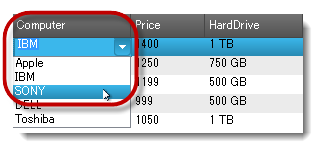
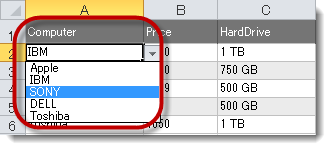

////

|metadata|
{
    "name": "wingridexceledporter-exporting-dropdown-list-to-excel",
    "controlName": ["WinGridExcelExporter"],
    "tags": [],
    "guid": "5e84b2a6-90ab-4f8c-a3c8-212a9a7da503",  
    "buildFlags": [],
    "createdOn": "2013-01-23T16:09:30.828864Z"
}
|metadata|
////

= DropDown リストを Excel にエクスポート

== トピックの概要

=== 目的

このトピックでは、 _WinGrid™_    __コントロール__ のドロップダウン リストを Excel にエクスポートする方法を紹介します。値リストを含む列は Excel にグリッドのように値のリストを含むドロップダウン機能があります。

=== 前提条件

このトピックを理解するためには、以下のトピックを理解しておく必要があります。

[options="header", cols="a,a"]
|====
|トピック|目的

| link:wingridexcelexporter-about-wingridexcelexporter.html[WinGridExcelExporter について]
|このトピックでは、Excel エクスポート プロセスの概要と、関係する要素について説明します。

| link:wingrid-using-windropdown-inside-wingrid.html[WinGrid 内で WinDropDown を使用]
|このトピックでは、 _WinGrid_ にドロップダウン コントロールの埋め込みについての詳細情報を紹介します。

|====

=== このトピックの内容

このトピックは、以下のセクションで構成されます。

* <<_Ref345946088,ドロップダウン リストのエクスポート>>

** <<_Ref341518673,概要とプレビュー>>
** <<_Ref341518679,プロパティ設定>>

* <<_Ref341518687,関連コンテンツ>>

[[_Ref345946088]]
== ドロップダウン リストのエクスポート

[[_Ref341518673]]

=== 概要とプレビュー

_WinGrid_   のデータのドロップダウン リストをエクスポートする機能を追加しました。これは WinGrid に埋め込まれたドロップダウン コントロールに似ています。 _WinComboEditor または WinDropDown_   ( _WinGrid_   に埋め込まれた) などを含む  _WinGrid_   列は、 _WinGridExcelExporter™_   に無効にした場合以外に、エクスポートされる Excel ワークシートにその列でドロップダウン リストを表示します。

以下の 2 つの画像は WinGrid のドロップダウン リストおよび Excel にインポートされるドロップダウン リストを表示します。

Excel にエクスポートする前のドロップダウン値リストを含む  _WinGrid_  。

WinGrid からインポートした後のドロップダウン値リストを含む Excel ワークシート。

[[_Ref341518679]]

=== プロパティ設定

_WinGridExcelExporter_   コンポーネントは、ドロップダウン リストを Excel にエクスポートするために必要な `ExportValueList` プロパティを含みます。デフォルト値は True です。Excel に値リストのエクスポートを無効にするには、このプロパティを  _False_   に設定する必要があります。

[[_Ref341518687]]
== 関連コンテンツ

=== トピック

以下のトピックでは、このトピックに関連する追加情報を提供しています。

[options="header", cols="a,a"]
|====
|トピック|目的

| link:win-wingridexcelexporter-using-wingridexcelexporter.html[WinGridExcelExporter の使用]
|このセクションでは、 _WinGridExcelExporter_ コンポーネントに関連する特定のタスクを実行する方法を簡潔に説明するタスク ベースのトピックを紹介します。

|====