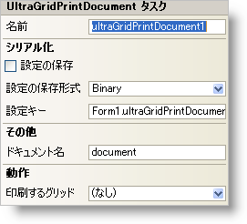

////

|metadata|
{
    "name": "wingridprintdocument-smart-tag",
    "controlName": ["WinGridPrintDocument"],
    "tags": ["Grids"],
    "guid": "{0A7EABB3-955A-4705-8A20-1066E437AA9B}",  
    "buildFlags": [],
    "createdOn": "2005-11-11T00:00:00Z"
}
|metadata|
////

= WinGridPrintDocument スマート タグ

Visual Studio 2005（.NET Framework 2.0）では、それぞれの {ProductName} コントロール/コンポーネントが固有のスマート タグを備えています。 コントロール/コンポーネントを単に選択すると、Smart Tag のアンカーが表示されます。このアンカーをクリックするとポップアップ パネルが表示され、そこからコントロール/コンポーネントの最もよく使用するプロパティや設定にすばやく簡単にアクセスできます。

WinGridPrintDocument スマート タグには、コンポーネントの名前と次のセクションがあります。

* 動作 -- フォーム上でのコントロールの動作を制御するプロパティに簡単にアクセスできます。
* その他 -- コントロールの全体的な外観やパフォーマンスを拡張する各種オプションがあります。
* シリアル化 -- IPersistComponentSettings インタフェースで使用されるプロパティにすばやくアクセスできます。

各セクションの項目（たとえば、フィールド、ドロップダウン リスト、チェックボックス）およびプロパティ グリッドの項目の対応するプロパティの説明については以下を参照してください。

[options="header", cols="a,a,a"]
|====
|動作|説明|対応するプロパティ

|印刷するグリッド
|ドロップダウンをクリックすると、フォーム上にある使用可能なすべての WinGrid が表示されます。印刷する WinGrid を選択します。
| link:{ApiPlatform}win.ultrawingrid{ApiVersion}~infragistics.win.ultrawingrid.ultragridprintdocument~grid.html[Grid]

|====

[options="header", cols="a,a,a"]
|====
|その他|説明|対応するプロパティ

|ドキュメント名
|ユーザーに表示されるドキュメントの名前を入力します。
|DocumentName

|====

[options="header", cols="a,a,a"]
|====
|シリアル化|説明|対応するプロパティ

|設定の保存
|ドロップダウンから True を選択すると、アプリケーションの設定プロパティが自動的に保存されます。
| link:{ApiPlatform}win{ApiVersion}~infragistics.win.printing.ultraprintdocument~savesettings.html[SaveSettings]

|設定の保存形式
|コントロールの設定をバイナリ ファイルと XML ファイルのいずれに保存するかを選択できます。
| link:{ApiPlatform}win{ApiVersion}~infragistics.win.printing.ultraprintdocument~savesettingsformat.html[SaveSettingsFormat]

|設定キー
|コントロールの現在のインスタンスの設定キーを設定できます。
| link:{ApiPlatform}win{ApiVersion}~infragistics.win.printing.ultraprintdocument~settingskey.html[SettingsKey]

|====