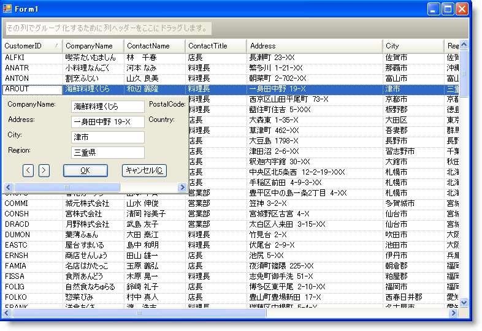

////

|metadata|
{
    "name": "wingridrowedittemplate-about-wingridrowedittemplate",
    "controlName": [],
    "tags": ["Getting Started","Templating"],
    "guid": "{79EC85EC-4550-4D44-9B8D-D15E4ABDD0EB}",  
    "buildFlags": [],
    "createdOn": "0001-01-01T00:00:00Z"
}
|metadata|
////

= WinGridRowEditTemplate について

新しい WinGridRowEditTemplate™ コントロールによって、基本的に WinGrid™ 上にフォーム全体を表示できますが、変更が必要なデータだけをエンド ユーザーに表示します。WinGridRowEditTemplate は 1 行からデータを表示することができるため、エンド ユーザーは現在編集しているデータに集中できます。

行の編集テンプレートの作成は、UltraGridRowEditTemplate ウィザードで簡単になります。フォームに WinGridRowEditTemplate をドロップし、それをバンドに接続すると、ウィザードが表示するので、テンプレートで表示したい列を選択できます。完了すれば、テンプレートが自動的に移植されるので、実行しなければならないのはコントロールを配置することだけです。

WinGridRowEditTemplate は以下の機能を含みます：

* *フル機能のデザイナ* -- WinGridRowEditTemplate には、できるだけ素早くかつ簡単に行の編集テンプレートを作成することを支援するための完全な機能のデザイナが含まれます。
* *WinGridCellProxy* -- WinGridCellProxy は、行の編集テンプレート内で固有のデータ メンバにバインドできる特別なコントロールです。WinGridCellProxy は、どのようなデータが指定した列に存在しても、それが数、テキスト、または DateTime オブジェクトであったとしても、エディタ ロールを実行します。
* *完全にカスタマイズ可能* -- WinGridRowEditTemplate は System.Windows.Forms.Panel から派生するので、Windows Forms オブジェクトをそれに追加できます。
* *Presentation Layer Framework™* -- WinGridRowEditTemplate は PLF からすべての外観とフィルタリング サポートを継承するので、想像できる方法でテンプレートをスタイルすることができます。

