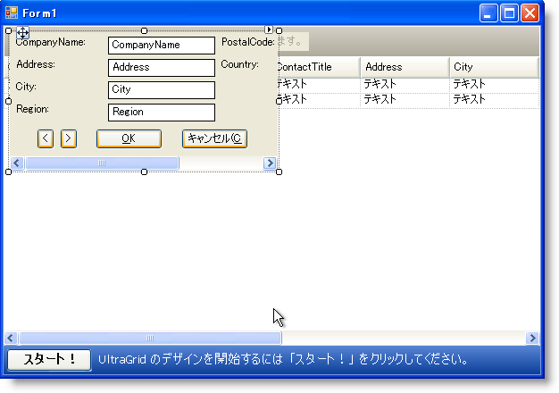
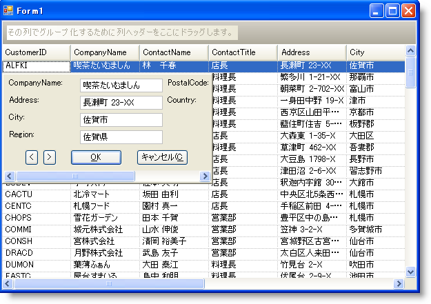

////

|metadata|
{
    "name": "wingridrowedittemplate-adding-buttons-to-wingridrowedittemplates-dialog-box",
    "controlName": [],
    "tags": ["How Do I","Templating"],
    "guid": "{DE23C131-083A-40BF-AED7-FA5E0BD16240}",  
    "buildFlags": [],
    "createdOn": "0001-01-01T00:00:00Z"
}
|metadata|
////

= ボタンを WinGridRowEditTemplate のダイアログボックスに追加

== 始める前に

[NOTE]
====
*注：* このトピックは、 link:wingridrowedittemplate-adding-a-wingridrowedittemplate-dialog-box-to-wingrid.html[「WinGridRowEditTemplate のダイアログ ボックスを WinGrid に追加」]の続きです。作業を継続する前にこのトピックをお読みください。
====

WinGridRowEditTemplate ダイアログ ボックスの WinGrid への追加では、RowEditTemplate と WinGrid バンドを関連付け、行を編集するためにテンプレートを設定する方法を学習しました。ただし、モーダル ダイアログ ボックスとなるテンプレートを使用した場合、ダイアログ ボックスを閉じる前に 1 行しか編集できませんでした。 link:{ApiPlatform}win.ultrawingrid{ApiVersion}~infragistics.win.ultrawingrid.ultragridrowedittemplate~displaymode.html[DisplayMode] プロパティを Modeless に設定することで、この制限を回避することができます。

link:{ApiPlatform}win.ultrawingrid{ApiVersion}~infragistics.win.ultrawingrid.ultragridrowedittemplate.html[UltraGridRowEditTemplate] は System.Windows.Forms.Panel オブジェクトから派生するので、任意のウィンドウ フォーム コントロールをテンプレートに追加したり、データ ソースが階層的である場合は別の WinGrid コントロールを追加できます。したがって、ナビゲーション タイプのアクションを実行するために補足的なボタンを追加できます。

== 達成すること

テンプレートのダイアログ ボックスがモーダレスである場合、エンド ユーザーが基本の WinGrid をナビゲートすることを手助けするために、2 つの WinButton™ コントロールを WinGridRowEditTemplate に追加する方法を学習します。

== 次の手順を実行します

[start=1]
. *WinGridRowEditTemplate のダイアログをモーダレスに変更します。*

WinGridRowEditTemplate のスマート タグを開き、DisplayMode を Modeless に設定します。ダイアログ ボックスをモーダレスに設定することで、ダイアログ ボックスを開いた状態でグリッドをテンプレートからトラバースできます。
[start=2]
. *ボタンをナビゲーションのテンプレートに追加します* 。

.. Microsoft® Visual Studio® ツールボックスから 2 つの link:{ApiPlatform}win.misc{ApiVersion}~infragistics.win.misc.ultrabutton.html[UltraButton] コントロールを RowEditTemplate に ドラッグします。
.. ボタンのひとつに 'btnScrollDown' という名前を付け、もうひとつのボタンに 'btnScrollUp' という名前を付けます。
.. これらの 2 つのボタンの Text プロパティをそれぞれ大なり（>）と小なり（<）に設定します。
.. 両方のボタンの Width プロパティを 20 に設定します。
.. OK ボタンの左に 2 つのボタンを配置すると以下のスクリーンショットのようになります。btnScrollUp が btnScrollDown の左になるようにします。

[start=3]
. *行コレクションでナビゲーションを戻すためのコードを追加します* 。

エンド ユーザーは、バンドの Rows コレクションで後方に順に移動するために btnScrollUp を使用します。WinGrid は link:{ApiPlatform}win.ultrawingrid{ApiVersion}~infragistics.win.ultrawingrid.ultragrid~performaction.html[PerformAction] と呼ばれる非常に役立つメソッドを公開します。メソッドのひとつのパラメータを通して、次の行や前の行に移動するなどの多くの役立つ共通のアクションを実行できます。このパラメータは link:{ApiPlatform}win.ultrawingrid{ApiVersion}~infragistics.win.ultrawingrid.ultragridaction.html[UltraGridAction] 列挙体から値を受け付け、NextRow アクションを実行します。これはバンドで次の行を選択し、それをアクティブ化します。WinGrid がユーザーのために機能する時のエラー テストについて心配する必要はありません（最初の行から前の行に移動する場合、例外を受け取りません）。

デザイン ビューで btnScrollUp ボタンをダブルクリックし、Visual Studio にボタンの Click イベントを生成させます。次のコードをボタンの Click イベントに追加します。

*Visual Basic の場合：*

----
'前の行を選択してアクティブにします。
Me.UltraGrid1.PerformAction _
	(Infragistics.Win.UltraWinGrid.UltraGridAction.PrevRow)
----

*C# の場合：*

----
//前の行を選択してアクティブにします。
this.ultraGrid1.PerformAction
	(Infragistics.Win.UltraWinGrid.UltraGridAction.PrevRow);
----

[start=4]
. *行コレクションで前方にナビゲートするためのコードを追加します* 。

これでエンド ユーザーは行コレクションを後ろに移動できるようになったので、前に移動するできるようにします。デザイン ビューで btnScrollUp ボタンをダブルクリックし、Visual Studio にボタンの Click イベントを生成させます。次のコードをボタンの Click イベントに追加します。

*Visual Basic の場合：*

----
'次の行を選択してアクティブにします。
Me.UltraGrid1.PerformAction _
	(Infragistics.Win.UltraWinGrid.UltraGridAction.NextRow)
----

*C# の場合：*

----
//次の行を選択してアクティブにします。
this.ultraGrid1.PerformAction
	(Infragistics.Win.UltraWinGrid.UltraGridAction.NextRow);
----

[start=5]
. *OK ボタンを変更して変更をコミットしますが、テンプレートは閉じません* 。

行テンプレートの編集をより簡単にするために、OK ボタンのために生成されたコードを変更したい場合があります。デフォルトでは、OK をクリックすると WinGridRowEditTemplate の link:{ApiPlatform}win.ultrawingrid{ApiVersion}~infragistics.win.ultrawingrid.ultragridrowedittemplate~close.html[Close] メソッドを呼び出します。Close メソッドは、データ ソースに変更をコミットするかどうかを決定するブール値を受け付けます。OK とキャンセル ボタンの両方はこのメソッドを呼び出しますが、True（変更をコミット）および False（変更をコミットしない）をそれぞれ渡します。

OK ボタンのために Close メソッドを呼び出す代わりに、 link:{ApiPlatform}win.ultrawingrid{ApiVersion}~infragistics.win.ultrawingrid.ultragridrowedittemplate~commitchanges.html[CommitChanges] メソッドを呼び出すことができます。CommitChanges メソッドは、変更が問題なくコミットされる場合には True を返します。したがって、変更が行われたかどうかをチェックするために IF 文を使用でき、WinGrid の PerformAction メソッドを再使用して次の行に移動します。

コード ビハインドで btnTemplateOk の Click イベントを指定し、コードを以下のコードで置き換えます。

*Visual Basic の場合：*

----
 ' 保留中の変更を保存して次の行に移動します。
If Me.ultraGridRowEditTemplate1.CommitChanges() Then
' 次の行に移動しない場合、この行を削除します。
   Me.UltraGrid1.PerformAction _
     (Infragistics.Win.UltraWinGrid.UltraGridAction.NextRow)
End If
----

*C# の場合：*

----
// 保留中の変更を保存して次の行に移動します。
if(this.ultraGridRowEditTemplate1.CommitChanges())
	// 次の行に移動しない場合、この行を削除します。
	this.ultraGrid1.PerformAction
		(Infragistics.Win.UltraWinGrid.UltraGridAction.NextRow);
----

[start=6]
. *アプリケーションを実行します。*

アプリケーションを実行する場合、行の編集テンプレート ボタンをクリックし、変更された WinGridRowEditTemplate ダイアログ ボックスを確認します。2 つの新しいボタンが表示されます。右ボタンをクリックしてデータを前方に移動し、左ボタンをクリックしてデータを後方に移動します。

