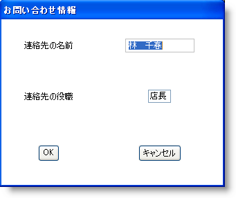

////
|metadata|
{
    "name": "wingridrowedittemplate-creating-a-wingridrowedittemplate-programmatically",
    "controlName": [],
    "tags": ["How Do I","Templating"],
    "guid": "{DB65C4EF-2D4B-4D35-A1B6-D5528262BE05}",
    "buildFlags": [],
    "createdOn": "0001-01-01T00:00:00Z"
}
|metadata|
////

= WinGridRowEditTemplate をプログラムで作成

== 始める前に

WinGridRowEditTemplate™ コントロールは、エンド ユーザー用の強力な編集ツールです。通常の Windows Forms パネルと同じようにテンプレートのレイアウトを管理できます。テンプレートは System.Windows.Forms.Panel から派生するので、ランタイムにテンプレートのレイアウトをコントロールするために弊社のレイアウト マネージャのいずれかを使用できます。ラベル、テキスト ボックス、およびボタンのパネルへの追加では、テンプレートの Controls オブジェクトからの Add メソッドだけが必要です。相応しいパターンでコントロールをレイアウトするには、 link:{ApiPlatform}win.misc{ApiVersion}~infragistics.win.misc.ultragridbaglayoutmanager.html[UltraGridBagLayoutManager] オブジェクトからの link:{ApiPlatform}win.misc{ApiVersion}~infragistics.win.misc.ultragridbaglayoutmanager~setgridbagconstraint.html[SetGridBagConstraint] メソッドだけが必要です。WinGridBagLayoutManager™ コントロールの詳細は、 link:winlayoutmanager-using-the-winlayoutmanager-components.html[「Layout Manager コンポーネントの使用」]を参照してください。

== 達成すること

このトピックの完了で、WinGridRowEditTemplate コントロールのインスタンス化およびラベル、WinGridCellProxy™ コントロール、インボックス TextBox、およびボタンでの移植方法を学習したことになります。WinGridBagLayoutManager コントロールでこれらのコントロールのレイアウトを管理する方法も学習します。

== 次の手順を実行します

[start=1]
. *WinGrid コントロールをフォームに追加し、Northwind の顧客テーブルにバインドします* 。

.. 新しい Windows Forms プロジェクトで、Microsoft® Visual Studio® ツールボックスから link:{ApiPlatform}win.ultrawingrid{ApiVersion}~infragistics.win.ultrawingrid.ultragrid.html[UltraGrid] をダブルクリックします。WinGrid はフォームに追加され、UltraWinGrid クイック スタート ダイアログ ボックスが表示されます。
.. [完了] をクリックしてダイアログ ボックスを閉じます。
.. WinGrid が選択されたままの状態で、[プロパティ] ウィンドウで Dock プロパティを指定して Fill に設定します。
.. WinGrid を Northwind データベースの顧客テーブルにバインドします。詳細は、 link:wingrid-binding-wingrid-to-a-flat-data-source-clr2.html[「WinGrid を フラット データ ソースにバインド」]を参照してください。

[start=2]
. *UltraGridRowEditTemplate オブジェクトの新しいインスタンスを作成します* 。

行の編集テンプレートを使用するには、ひとつのテンプレートを作成し、それをバンドの link:{ApiPlatform}win.ultrawingrid{ApiVersion}~infragistics.win.ultrawingrid.ultragridband~rowedittemplate.html[RowEditTemplate] プロパティに設定する必要があります。コード ビハインドでフォームの Load イベントのすぐ上で、新しい UltraGridRowEditTemplate オブジェクトをインスタンス化します。フォームの Load イベントで、WinGrid の最初のバンドの RowEditTemplate プロパティをインスタンス化したばかりのテンプレートに設定します。次にテンプレートで複数の美しさに関係するプロパティを設定し、それをフォームの Controls コレクションに追加し、テンプレートを WinGrid の最初のバンドに設定します。

*Visual Basic の場合：*
[source,vb]
----
 'UltraGridRowEditTemplate オブジェクトをインスタンス化します。
Dim ret As New Infragistics.Win.UltraWinGrid.UltraGridRowEditTemplate()
Private Sub Form1_Load(sender As Object, e As EventArgs)
   'テンプレートのサイズ、キャプション、背景色を設定し、 
   'それを Controls コレクションに追加します。
   Me.ret.Size = New Size(320, 240)
   Me.ret.DialogSettings.Caption = "Contact Information"
   Me.ret.Appearance.BackColor = Color.White
   Me.ret.Visible = False
   Me.Controls.Add(Me.ret)
   Me.UltraGrid1.DisplayLayout.Bands(0).RowEditTemplate = Me.ret
End Sub 'Form1_Load
----

*C# の場合：*
[source,csharp]
----
//UltraGridRowEditTemplate オブジェクトをインスタンス化します。
Infragistics.Win.UltraWinGrid.UltraGridRowEditTemplate ret = 	new Infragistics.Win.UltraWinGrid.UltraGridRowEditTemplate();
private void Form1_Load(object sender, EventArgs e)
{
	//テンプレートのサイズ、キャプション、背景色を設定し、 
	//それを Controls コレクションに追加します。
	this.ret.Size = new Size(320, 240);
	this.ret.DialogSettings.Caption = "Contact Information";
	this.ret.Appearance.BackColor = Color.White;
	this.ret.Visible = false;
	this.Controls.Add(this.ret);
	this.ultraGrid1.DisplayLayout.Bands[0].RowEditTemplate = this.ret;
}
----

[start=3]
. *WinGridBagLayoutManager で WinGridRowEditTemplate のコントロールを管理します* 。

テンプレートでコントロールを容易に管理するために、WinGridBagLayoutManager コンポーネントを使用できます。WinGridBagLayoutManager によって、グリッドのようなパターンでコンテナ コントロールにコントロールを配置できます。したがって、複数のコントロール（ラベル、テキストボックス、ボタンなど）を使用しているので、それらを管理するための簡単な方法が必要で、各コントロールの位置とサイズを自分で設定する必要はありません。

*Visual Basic の場合：*
[source,vb]
----
'UltraGridBagLayout コンポーネントをインスタンス化します。
Dim gridBag As Infragistics.Win.Misc.UltraGridBagLayoutManager = _
	New Infragistics.Win.Misc.UltraGridBagLayoutManager()
'レイアウトが WinGridBagLayoutManager によって管理される
'コンテナを設定します。
gridBag.ContainerControl = ret
'これらの 2 つのプロパティは、使用できる範囲で均等に
'コントロールを距離をあけて配置します。
gridBag.ExpandToFitHeight = True
gridBag.ExpandToFitWidth = True
----

*C# の場合：*
[source,csharp]
----
//UltraGridBagLayout コンポーネントをインスタンス化します。
Infragistics.Win.Misc.UltraGridBagLayoutManager gridBag = 
	new Infragistics.Win.Misc.UltraGridBagLayoutManager();
//レイアウトが WinGridBagLayoutManager によって管理される
//コンテナを設定します。
gridBag.ContainerControl = ret;
//これらの 2 つのプロパティは、使用できる範囲で均等に
//コントロールを距離をあけて配置します。
gridBag.ExpandToFitHeight = true;
gridBag.ExpandToFitWidth = true;
----

[start=4]
. *ラベルをテンプレートに追加し、レイアウトを管理します* 。

ラベルを追加するとエンド ユーザーはどのフィールドを編集しているかを確認できます。2 つのラベルをインスタンス化し、それらをテンプレートの Controls コレクションに追加し、いくつかの美しさに関係するプロパティを設定します。ラベル自体が設定されれば、グリッド バッグ レイアウトでそれらの配置を設定するために、それらの両方で SetGridBagConstraint を呼び出す必要があります。

*Visual Basic の場合：*
[source,vb]
----
'ラベルを作成し、それらを 
'行の編集テンプレートに追加します。
Dim ultraLabel1 As New Infragistics.Win.Misc.UltraLabel()
ret.Controls.Add(ultraLabel1)
ultraLabel1.Text = "Contact Name"
ultraLabel1.Appearance.TextVAlign = _
   Infragistics.Win.VAlign.Middle
'グリッド バッグ レイアウトの行 1、
'列 1 にラベルを配置します。
gridBag.SetGridBagConstraint(ultraLabel1, _
   New Infragistics.Win.Layout.GridBagConstraint(0, 0, 1, 1))
Dim ultraLabel2 As New Infragistics.Win.Misc.UltraLabel()
ret.Controls.Add(ultraLabel2)
ultraLabel2.Text = "Contact Title"
ultraLabel2.Appearance.TextVAlign = _
   Infragistics.Win.VAlign.Middle
'グリッド バッグ レイアウトの行 2、
'列 1 にラベルを配置します。
gridBag.SetGridBagConstraint(ultraLabel2, _
   New Infragistics.Win.Layout.GridBagConstraint(0, 1, 1, 1))
----

*C# の場合：*
[source,csharp]
----
//ラベルを作成し、それらを 
//行の編集テンプレートに追加します。
Infragistics.Win.Misc.UltraLabel ultraLabel1 = 	new Infragistics.Win.Misc.UltraLabel();
ret.Controls.Add(ultraLabel1);
ultraLabel1.Text = "Contact Name";
ultraLabel1.Appearance.TextVAlign = 
	Infragistics.Win.VAlign.Middle;
//グリッド バッグ レイアウトの行 1、
//列 1 にラベルを配置します。
gridBag.SetGridBagConstraint(
	ultraLabel1, 
	new Infragistics.Win.Layout.GridBagConstraint(0, 0, 1, 1));
Infragistics.Win.Misc.UltraLabel ultraLabel2 = 	new Infragistics.Win.Misc.UltraLabel();
ret.Controls.Add(ultraLabel2);
ultraLabel2.Text = "Contact Title";
ultraLabel2.Appearance.TextVAlign =
	Infragistics.Win.VAlign.Middle;
//グリッド バッグ レイアウトの行 2、
//列 1 にラベルを配置します。
gridBag.SetGridBagConstraint(
	ultraLabel2, 
	new Infragistics.Win.Layout.GridBagConstraint(0, 1, 1, 1));
----

[start=5]
. *WinGridCellProxy コントロールをテンプレートに追加します* 。

WinGridCellProxy コントロールはユニークなテキストボックスで、関連付けられた WinGridRowEditTemplate コントロール内でしか正しく機能しません。WinGridCellProxy は、適切なデータ バインディングを継承するために WinGridRowEditTemplate の Controls コレクションのメンバでなければなりません。Controls コレクションのメンバとなったら、必要なのは WinGridRowEditTemplate の関連付けられたバンドから表示したい列のキーに link:{ApiPlatform}win.ultrawingrid{ApiVersion}~infragistics.win.ultrawingrid.ultragridcellproxy~columnkey.html[ColumnKey] プロパティを設定することだけです。

*Visual Basic の場合：*
[source,vb]
----
'新しい UltraGridCellProxy オブジェクトをインスタンス化します。
Dim proxy1 as Infragistics.Win.UltraWinGrid.UltraGridCellProxy = _	New Infragistics.Win.UltraWinGrid.UltraGridCellProxy()
'ContactName 列からデータを示すためにプロキシーを設定します。
proxy1.ColumnKey = "ContactName"
proxy1.Size = New Size(100, 20)
' プロキシーをテンプレートの Controls コレクションに追加します。
ret.Controls.Add(proxy1)
'グリッド バッグ レイアウトの行 1、列 2 にプロキシーを配置します。
gridBag.SetGridBagConstraint( _
	proxy1, _
	New Infragistics.Win.Layout.GridBagConstraint(1, 0, 1, 1))
----

*C# の場合：*
[source,csharp]
----
//新しい UltraGridCellProxy オブジェクトをインスタンス化します。
Infragistics.Win.UltraWinGrid.UltraGridCellProxy proxy1 = 	new Infragistics.Win.UltraWinGrid.UltraGridCellProxy();
//ContactName 列からデータを示すためにプロキシーを設定します。
proxy1.ColumnKey = "ContactName";
proxy1.Size = new Size(100, 20);
//プロキシーをテンプレートの Controls コレクションに追加します。
ret.Controls.Add(proxy1);
//グリッド バッグ レイアウトの行 1、列 2 にプロキシーを配置します。
gridBag.SetGridBagConstraint(
	proxy1,
	new Infragistics.Win.Layout.GridBagConstraint(1, 0, 1, 1));
----

[start=6]
. *バウンド、インボックス テキストボックスをテンプレートに追加します* 。

WinGridCellProxy コントロールは WinGridRowEditTemplate に特化して設計されているので、行の編集テンプレートで列データを表示するために標準のインボックス テキストボックスも使用できます。TextBox コントロールは DataBindings オブジェクトを公開し、これによって Add メソッドでデータ バインディングを追加できます。Add メソッドには 7 つのオーバーロードが含まれ、2 番目のオーバーロードを使用します。2 番目のオーバーロードは、3 つのパラメータを受け付けます。

** 列データをバインドしたいテキスト ボックスのプロパティ名。
** テキスト ボックスがデータを受け取る元のデータ ソース（このケースでは WinGridRowEditTemplate コントロール）。
** 関連付けられたデータ ソースのデータ メンバ（行の編集テンプレートのケースでは、関連付けられたバンドの列のキー）。

*Visual Basic の場合：*
[source,vb]
----
'新しい TextBox オブジェクトをインスタンス化します。
Dim text1 As TextBox = New TextBox()
' TextBox をテンプレートの Controls コレクションに追加します。
ret.Controls.Add(text1)
'TextBos をテンプレートにバインドし、テキストボックスの ContactTitle 列から
' データを示します。
text1.DataBindings.Add("Text", ret, "ContactTitle")
'グリッド バッグのレイアウトの行 2、列 2 に TextBox を配置します。
gridBag.SetGridBagConstraint( _
	text1, _
	New Infragistics.Win.Layout.GridBagConstraint(1, 1, 1, 1))
----

*C# の場合：*
[source,csharp]
----
//新しい TextBox オブジェクトをインスタンス化します。
TextBox text1 = new TextBox();
//TextBox をテンプレートの Controls コレクションに追加します。
ret.Controls.Add(text1);
//TextBos をテンプレートにバインドし、テキストボックスの ContactTitle 列から
//データを示します。
text1.DataBindings.Add("Text", ret, "ContactTitle");
//グリッド バッグのレイアウトの行 2、列 2 に TextBox を配置します。
gridBag.SetGridBagConstraint(
	text1,
	new Infragistics.Win.Layout.GridBagConstraint(1, 1, 1, 1));
----

[start=7]
. *同意およびキャンセル ボタンをテンプレートに追加します* 。

必要に応じて、エンド ユーザーはデータを更新して変更をキャンセルする方法が必要です。したがって、同意およびキャンセル ボタンとして動作するテンプレートに 2 つのボタンを追加する必要があります。これを行うには、2 つのボタンをインスタンス化し、イベント ハンドラを追加する必要があり、後でテンプレートの link:{ApiPlatform}win.ultrawingrid{ApiVersion}~infragistics.win.ultrawingrid.ultragridrowedittemplate~close.html[Close] メソッドを呼び出し、ボタンに基づき変更を保存またはキャンセルできます。

以下のコード例は 2 つのボタンをインスタンス化し、Click イベントのハンドラを追加し、グリッド バッグのレイアウトにそれらを配置します。

*Visual Basic の場合：*
[source,vb]
----
'新しい UltraButton オブジェクトをインスタンス化します。
Dim accept As Infragistics.Win.Misc.UltraButton = 	New Infragistics.Win.Misc.UltraButton()
'ボタンのテキストを設定します。
accept.Text = "OK"
' ボタンをテンプレートの Controls コレクションに追加します。
ret.Controls.Add(accept)
' 同意ボタンのハンドラを作成します。
AddHandler accept.Click, AddressOf Accept_Click
'グリッド バッグのレイアウトの行 3、列 1 にボタンを配置します。
gridBag.SetGridBagConstraint( _
	accept, _
	New Infragistics.Win.Layout.GridBagConstraint(0, 2, 1, 1))
'新しい UltraButton オブジェクトをインスタンス化します。
Dim cancel As Infragistics.Win.Misc.UltraButton = 	New Infragistics.Win.Misc.UltraButton()
'ボタンのテキストを設定します。
cancel.Text = "Cancel"
' ボタンをテンプレートの Controls コレクションに追加します。
ret.Controls.Add(cancel)
' キャンセル ボタンのハンドラを作成します。
AddHandler cancel.Click, AddressOf Accept_Click
'グリッド バッグのレイアウトの行 3、列 2 にボタンを配置します。
gridBag.SetGridBagConstraint( _
	cancel, _
	New Infragistics.Win.Layout.GridBagConstraint(1, 2, 1, 1))
----

*C# の場合：*
[source,csharp]
----
//新しい UltraButton オブジェクトをインスタンス化します。
Infragistics.Win.Misc.UltraButton accept = 	new Infragistics.Win.Misc.UltraButton();
//ボタンのテキストを設定します。
accept.Text = "OK";
//ボタンをテンプレートの Controls コレクションに追加します。
ret.Controls.Add(accept);
//同意ボタンのハンドラを作成します。
accept.Click += new EventHandler(accept_Click);
//グリッド バッグのレイアウトの行 3、列 1 にボタンを配置します。
gridBag.SetGridBagConstraint(
	accept,
	new Infragistics.Win.Layout.GridBagConstraint(0, 2, 1, 1));
//新しい UltraButton オブジェクトをインスタンス化します。
Infragistics.Win.Misc.UltraButton cancel = 	new Infragistics.Win.Misc.UltraButton();
//ボタンのテキストを設定します。
cancel.Text = "Cancel";
//ボタンをテンプレートの Controls コレクションに追加します。
ret.Controls.Add(cancel);
//キャンセル ボタンのハンドラを作成します。
cancel.Click += new EventHandler(cancel_Click);
//グリッド バッグのレイアウトの行 3、列 2 にボタンを配置します。
gridBag.SetGridBagConstraint(
	cancel,
	new Infragistics.Win.Layout.GridBagConstraint(1, 2, 1, 1));
----

[start=8]
. *同意およびキャンセル ボタンの Click イベントを処理します* 。

WinGridRowEditTemplate コントロールは、すべての保留中の変更を保存するか変更を破棄するかのいずれかのためにブール パラメータによるオプションをユーザーに与える Close メソッドを公開します。パラメータとして True を渡すと変更は保存され、False を渡すとキャンセルされます。渡すパラメータに関係なく、テンプレートは、Close メソッドの呼び出しの結果として閉じられます。

フォームの Load イベントの後に以下のコードを追加します。

*Visual Basic の場合：*
[source,vb]
----
Sub accept_Click(sender As Object, e As EventArgs)
   'テンプレートを閉じて、保留中の変更を保存する。
   Me.ret.Close(True)
End Sub 'accept_Click
Sub cancel_Click(sender As Object, e As EventArgs)
   'テンプレートを閉じて、保留中の変更を破棄する。
   Me.ret.Close(False)
End Sub 'cancel_Click
----

*C# の場合：*
[source,csharp]
----
void accept_Click(object sender, EventArgs e)
{
	//テンプレートを閉じて、保留中の変更を保存する。
	this.ret.Close(true);
}
void cancel_Click(object sender, EventArgs e)
{
	//テンプレートを閉じて、保留中の変更を破棄する。
	this.ret.Close(false);
}
----

[start=9]
. *アプリケーションを実行します。*

アプリケーションを実行すると、Northwind 顧客テーブルに WinGrid がバインドされたことが分かります。各行の左に行編集ボタンが表示されます。行の行編集ボタンをクリックすると、その特定の行の編集テンプレートが表示されます。このテンプレートには両方ともが ContactName および ContactTitle 列 にバインドされた 2 つのテキスト ボックスと 2 つのボタンが含まれており、変更を保存したりキャンセルできます。

